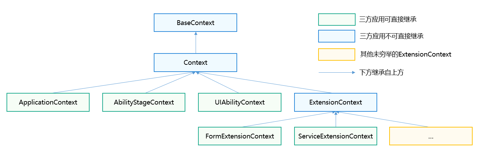

# Context (Stage模型的上下文基类)

Context是Stage模型的上下文基类，主要用于访问特定应用程序的资源，以及执行应用级操作的回调。

 

- 本模块首批接口从API version 9开始支持。后续版本的新增接口，采用上角标单独标记接口的起始版本。
- 本模块接口仅可在Stage模型下使用。

## 不同类型Context的继承和持有关系

- 不同类型Context的继承关系如下：

  
- 不同类型Context的持有关系如下：

  

 

[UIContext](/ref/arkui-api/arkui-arkts/ui/js-apis-arkui-uicontext/arkts-apis-uicontext-uicontext/arkts-apis-uicontext-uicontext)是指UI实例上下文，用于关联窗口与UI页面。与本文档中的应用上下文Context无直接关联，不存在继承或持有关系。

## 导入模块

```
import { common } from '@kit.AbilityKit';
```

## Context

Context提供了ability或application的上下文的能力，包括访问特定应用程序的资源等。

### 属性

****系统能力****：SystemCapability.Ability.AbilityRuntime.Core

| 名称 | 类型 | 只读 | 可选 | 说明 |
| --- | --- | --- | --- | --- |
| resourceManager | resmgr.[ResourceManager](/ref/localization-api/localization-arkts/js-apis-resource-manager/js-apis-resource-manager#resourcemanager) | 否 | 否 | 资源管理对象。  ****元服务API****：从API version 11开始，该接口支持在元服务中使用。 |
| applicationInfo | [ApplicationInfo](/ref/ability-api/ability-arkts/ability-api-interface-depend/bundlemanager/js-apis-bundlemanager-applicationinfo/js-apis-bundlemanager-applicationinfo) | 否 | 否 | 当前应用程序的信息。  ****元服务API****：从API version 11开始，该接口支持在元服务中使用。 |
| cacheDir | string | 否 | 否 | 缓存目录，详情参考[应用沙箱目录](/core-file-kit/app-file/app-sandbox-directory)。  ****元服务API****：从API version 11开始，该接口支持在元服务中使用。 |
| tempDir | string | 否 | 否 | 临时目录，详情参考[应用沙箱目录](/core-file-kit/app-file/app-sandbox-directory)。  ****元服务API****：从API version 11开始，该接口支持在元服务中使用。 |
| resourceDir11+ | string | 否 | 否 | 资源目录。  ****说明****：需要开发者手动在\<module-name>\resource路径下创建resfile目录。创建的resfile目录仅支持以只读方式访问。  ****元服务API****：从API version 11开始，该接口支持在元服务中使用。 |
| filesDir | string | 否 | 否 | 文件目录，详情参考[应用沙箱目录](/core-file-kit/app-file/app-sandbox-directory)。  ****元服务API****：从API version 11开始，该接口支持在元服务中使用。 |
| databaseDir | string | 否 | 否 | 数据库目录，详情参考[应用沙箱目录](/core-file-kit/app-file/app-sandbox-directory)。  ****元服务API****：从API version 11开始，该接口支持在元服务中使用。 |
| preferencesDir | string | 否 | 否 | preferences目录，详情参考[应用沙箱目录](/core-file-kit/app-file/app-sandbox-directory)。  ****元服务API****：从API version 11开始，该接口支持在元服务中使用。 |
| bundleCodeDir | string | 否 | 否 | 安装包目录。不能拼接路径访问资源文件，请使用[资源管理接口](/ref/localization-api/localization-arkts/js-apis-resource-manager/js-apis-resource-manager)访问资源，详情参考[应用沙箱目录](/core-file-kit/app-file/app-sandbox-directory)。  ****元服务API****：从API version 11开始，该接口支持在元服务中使用。 |
| distributedFilesDir | string | 否 | 否 | 分布式文件目录，详情参考[应用沙箱目录](/core-file-kit/app-file/app-sandbox-directory)。  ****元服务API****：从API version 11开始，该接口支持在元服务中使用。 |
| cloudFileDir12+ | string | 否 | 否 | 云文件目录。  ****元服务API****：从API version 12开始，该接口支持在元服务中使用。 |
| logFileDir22+ | string | 否 | 否 | 日志文件目录。  ****元服务API****：从API version 22开始，该接口支持在元服务中使用。 |
| eventHub | [EventHub](/ref/ability-api/ability-arkts/ability-api-interface-depend/ability-arkts-application/js-apis-inner-application-eventhub/js-apis-inner-application-eventhub) | 否 | 否 | 事件中心，提供订阅、取消订阅、触发事件对象。  ****元服务API****：从API version 11开始，该接口支持在元服务中使用。 |
| area | contextConstant.[AreaMode](/ref/ability-api/ability-arkts/stage-model/js-apis-app-ability-contextconstant/js-apis-app-ability-contextconstant#areamode) | 否 | 否 | 文件分区信息，按加密等级[AreaMode](/ref/ability-api/ability-arkts/stage-model/js-apis-app-ability-contextconstant/js-apis-app-ability-contextconstant#areamode) 进行分区。  ****元服务API****：从API version 11开始，该接口支持在元服务中使用。 |
| processName18+ | string | 否 | 否 | 当前应用的进程名。  ****元服务API****：从API version 18开始，该接口支持在元服务中使用。 |

### createModuleContext(deprecated)

createModuleContext(moduleName: string): Context

根据模块名创建上下文。

 

- 仅支持获取本应用中其他Module的Context和应用内HSP的Context，不支持获取其他应用的Context。
- 从API version 9 开始支持，从API version 12 开始废弃，建议使用[application.createModuleContext](/ref/ability-api/ability-arkts/stage-model/js-apis-app-ability-application/js-apis-app-ability-application#applicationcreatemodulecontext)替代，否则可能导致资源获取异常。
- 由于创建模块上下文的过程涉及资源查询与初始化，耗时相对较长，在对应用流畅性要求较高的场景下，不建议频繁或多次调用createModuleContext接口创建多个Context实例，以免影响用户体验。

****元服务API****：从API version 11开始，该接口支持在元服务中使用。

****系统能力****：SystemCapability.Ability.AbilityRuntime.Core

****参数：****

| 参数名 | 类型 | 必填 | 说明 |
| --- | --- | --- | --- |
| moduleName | string | 是 | 模块名。 |

****返回值：****

| 类型 | 说明 |
| --- | --- |
| Context | 模块的上下文。 |

****错误码****：

以下错误码详细介绍请参考[通用错误码](/ref/errorcode-universal/errorcode-universal)。

| 错误码ID | 错误信息 |
| --- | --- |
| 401 | Parameter error. Possible causes: 1.Mandatory parameters are left unspecified. 2.Incorrect parameter types. |

****示例：****

```
import { common, UIAbility } from '@kit.AbilityKit';
import { BusinessError } from '@kit.BasicServicesKit';

export default class EntryAbility extends UIAbility {
  onCreate() {
    console.info('MyAbility onCreate');
    let moduleContext: common.Context;
    try {
      moduleContext = this.context.createModuleContext('entry');
    } catch (error) {
      console.error(`createModuleContext failed, error.code: ${(error as BusinessError).code}, error.message: ${(error as BusinessError).message}`);
    }
  }
}
```

### getApplicationContext

getApplicationContext(): ApplicationContext

获取当前应用上下文。

****元服务API****：从API version 11开始，该接口支持在元服务中使用。

****系统能力****：SystemCapability.Ability.AbilityRuntime.Core

****返回值：****

| 类型 | 说明 |
| --- | --- |
| [ApplicationContext](/ref/ability-api/ability-arkts/ability-api-interface-depend/ability-arkts-application/js-apis-inner-application-applicationcontext/js-apis-inner-application-applicationcontext) | 应用上下文。 |

****错误码****：

以下错误码详细介绍请参考[通用错误码](/ref/errorcode-universal/errorcode-universal)。

| 错误码ID | 错误信息 |
| --- | --- |
| 401 | Parameter error. Possible causes: 1.Mandatory parameters are left unspecified. 2.Incorrect parameter types. |

****示例：****

```
import { common, UIAbility } from '@kit.AbilityKit';
import { BusinessError } from '@kit.BasicServicesKit';

export default class EntryAbility extends UIAbility {
  onCreate() {
    console.info('MyAbility onCreate');
    let applicationContext: common.Context;
    try {
      applicationContext = this.context.getApplicationContext();
    } catch (error) {
      console.error(`getApplicationContext failed, error.code: ${(error as BusinessError).code}, error.message: ${(error as BusinessError).message}`);
    }
  }
}
```

### getGroupDir10+

getGroupDir(dataGroupID: string): Promise&lt;string&gt;

通过应用中的Group ID获取对应的共享目录，使用Promise异步回调。

****元服务API****：从API version 11开始，该接口支持在元服务中使用。

****系统能力****：SystemCapability.Ability.AbilityRuntime.Core

****参数：****

| 参数名 | 类型 | 必填 | 说明 |
| --- | --- | --- | --- |
| [dataGroupID](/ref/arkdata-api/arkdata-arkts/js-apis-data-preferences/js-apis-data-preferences#options10) | string | 是 | 元服务类型的应用创建时，系统会指定分配唯一Group ID。 |

****返回值：****

| 类型 | 说明 |
| --- | --- |
| Promise&lt;string&gt; | Promise对象，返回对应的共享目录。如果不存在则返回为空，仅支持应用el2加密级别。 |

****错误码：****

以下错误码详细介绍请参考[通用错误码](/ref/errorcode-universal/errorcode-universal)和[元能力子系统错误码](/ref/ability-api/ability-arkts-errcode/errorcode-ability/errorcode-ability)。

| 错误码ID | 错误信息 |
| --- | --- |
| 401 | Parameter error. Possible causes: 1.Mandatory parameters are left unspecified. 2.Incorrect parameter types. |
| 16000011 | The context does not exist. |

****示例：****

```
import { common, UIAbility } from '@kit.AbilityKit';
import { BusinessError } from '@kit.BasicServicesKit';

export default class EntryAbility extends UIAbility {
  onCreate() {
    console.info('MyAbility onCreate');
    let groupId = "1";
    let getGroupDirContext: common.Context = this.context;
    try {
      getGroupDirContext.getGroupDir(groupId).then(data => {
        console.info("getGroupDir result:" + data);
      })
    } catch (error) {
      console.error(`getGroupDirContext failed, error.code: ${(error as BusinessError).code}, error.message: ${(error as BusinessError).message}`);
    }
  }
}
```

### getGroupDir10+

getGroupDir(dataGroupID: string, callback: AsyncCallback&lt;string&gt;): void

通过应用中的Group ID获取对应的共享目录，使用callback异步回调。

****元服务API****：从API version 11开始，该接口支持在元服务中使用。

****系统能力****：SystemCapability.Ability.AbilityRuntime.Core

****参数：****

| 参数名 | 类型 | 必填 | 说明 |
| --- | --- | --- | --- |
| [dataGroupID](/ref/arkdata-api/arkdata-arkts/js-apis-data-preferences/js-apis-data-preferences#options10) | string | 是 | 元服务类型的应用创建时，系统会指定分配唯一Group ID。 |
| callback | AsyncCallback&lt;string&gt; | 是 | 回调函数。当获取共享目录成功，err为undefined，data为对应的共享目录，如果不存在则返回为空；否则为错误对象。  ****说明****：仅支持应用el2加密级别。 |

****错误码：****

以下错误码详细介绍请参考[通用错误码](/ref/errorcode-universal/errorcode-universal)和[元能力子系统错误码](/ref/ability-api/ability-arkts-errcode/errorcode-ability/errorcode-ability)。

| 错误码ID | 错误信息 |
| --- | --- |
| 401 | Parameter error. Possible causes: 1.Mandatory parameters are left unspecified. 2.Incorrect parameter types. |
| 16000011 | The context does not exist. |

****示例：****

```
import { common, UIAbility } from '@kit.AbilityKit';
import { BusinessError } from '@kit.BasicServicesKit';

export default class EntryAbility extends UIAbility {
  onCreate() {
    console.info('MyAbility onCreate');
    let getGroupDirContext: common.Context = this.context;

    getGroupDirContext.getGroupDir("1", (err: BusinessError, data) => {
      if (err) {
        console.error(`getGroupDir failed, err: ${JSON.stringify(err)}`);
      } else {
        console.info(`getGroupDir result is: ${JSON.stringify(data)}`);
      }
    });
  }
}
```

### createAreaModeContext18+

createAreaModeContext(areaMode: contextConstant.AreaMode): Context

创建特定数据加密级别的应用上下文。开发者可以调用该接口创建不同加密级别的上下文，从而获取对应的沙箱路径。

****元服务API****：从API version 18开始，该接口支持在元服务中使用。

****系统能力****：SystemCapability.Ability.AbilityRuntime.Core

****参数：****

| 参数名 | 类型 | 必填 | 说明 |
| --- | --- | --- | --- |
| areaMode | [contextConstant.AreaMode](/ref/ability-api/ability-arkts/stage-model/js-apis-app-ability-contextconstant/js-apis-app-ability-contextconstant#areamode) | 是 | 指定的数据加密等级。 |

****返回值：****

| 类型 | 说明 |
| --- | --- |
| Context | 指定数据加密等级的上下文。 |

****示例：****

```
import { common, UIAbility, contextConstant } from '@kit.AbilityKit';
import { hilog } from '@kit.PerformanceAnalysisKit';

export default class EntryAbility extends UIAbility {
  onCreate() {
    hilog.info(0x0000, 'testTag', '%{public}s', 'Ability onCreate');
    let areaMode: contextConstant.AreaMode = contextConstant.AreaMode.EL2;
    let areaModeContext: common.Context;
    try {
      areaModeContext = this.context.createAreaModeContext(areaMode);
    } catch (error) {
      hilog.error(0x0000, 'testTag', 'createAreaModeContext error is:%{public}s', JSON.stringify(error));
    }
  }
}
```

### createDisplayContext15+

createDisplayContext(displayId: number): Context

根据指定的物理屏幕ID创建带有屏幕信息（包括屏幕密度[ScreenDensity](/ref/localization-api/localization-arkts/js-apis-resource-manager/js-apis-resource-manager#screendensity)和屏幕方向[Direction](/ref/localization-api/localization-arkts/js-apis-resource-manager/js-apis-resource-manager#direction)）的应用上下文。

****元服务API****：从API version 15开始，该接口支持在元服务中使用。

****系统能力****：SystemCapability.Ability.AbilityRuntime.Core

****参数：****

| 参数名 | 类型 | 必填 | 说明 |
| --- | --- | --- | --- |
| [displayId](/ref/arkui-api/arkui-arkts/window-manager-api/js-apis-window/arkts-apis-window-i/arkts-apis-window-i#windowproperties) | number | 是 | 物理屏幕ID。 |

****返回值：****

| 类型 | 说明 |
| --- | --- |
| [Context](#context) | 带有指定物理屏幕信息的上下文。 |

****错误码：****

以下错误码详细介绍请参考[通用错误码](/ref/errorcode-universal/errorcode-universal)。

| 错误码ID | 错误信息 |
| --- | --- |
| 401 | Parameter error. Possible causes: 1.Mandatory parameters are left unspecified. 2.Incorrect parameter types. |

****示例：****

```
import { common, UIAbility } from '@kit.AbilityKit';
import { hilog } from '@kit.PerformanceAnalysisKit';

export default class EntryAbility extends UIAbility {
  onCreate() {
    hilog.info(0x0000, 'testTag', '%{public}s', 'Ability onCreate');
    let displayContext: common.Context;
    try {
      displayContext = this.context.createDisplayContext(0);
    } catch (error) {
      hilog.error(0x0000, 'testTag', 'createDisplayContext error is:%{public}s', JSON.stringify(error));
    }
  }
}
```
