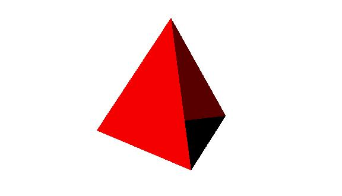

# XComponentNode

提供XComponent节点XComponentNode，表示组件树中的[XComponent](/ref/arkui-api/arkui-declarative-comp/rendering-drawing/ts-basic-components-xcomponent/ts-basic-components-xcomponent)组件，用于[EGL](/ref/egl/egl)/[OpenGL ES](/ref/opengles/opengles)和媒体数据写入，并支持动态修改节点渲染类型。

 

从API version 12开始废弃，建议使用[类型为XComponent的typeNode](/ref/arkui-api/arkui-arkts/ui/ui-interface-arkui/js-apis-arkui-framenode/js-apis-arkui-framenode#xcomponent12)的方式实现。

本模块首批接口从API version 11开始支持。后续版本的新增接口，采用上角标单独标记接口的起始版本。

当前不支持在预览器中使用XComponentNode。

## 导入模块

```
import { XComponentNode } from "@kit.ArkUI";
```

## XComponentNode(deprecated)

### constructor(deprecated)

constructor(uiContext: UIContext, options: RenderOptions, id: string, type: XComponentType, libraryName?: string)

XComponentNode的构造函数。

 

从API version 11开始支持，从API version 12开始废弃，建议使用[createNode](/ref/arkui-api/arkui-arkts/ui/ui-interface-arkui/js-apis-arkui-framenode/js-apis-arkui-framenode#createnodexcomponent12)替代。

****系统能力：**** SystemCapability.ArkUI.ArkUI.Full

****参数：****

| 参数名 | 类型 | 必填 | 说明 |
| --- | --- | --- | --- |
| uiContext | [UIContext](/ref/arkui-api/arkui-arkts/ui/js-apis-arkui-uicontext/arkts-apis-uicontext-uicontext/arkts-apis-uicontext-uicontext) | 是 | UI上下文，获取方式可参考[UIContext获取方法](/ref/arkui-api/arkui-arkts/ui/js-apis-arkui-node/js-apis-arkui-node#uicontext获取方法)。 |
| options | [RenderOptions](/ref/arkui-api/arkui-arkts/ui/ui-interface-arkui/js-apis-arkui-buildernode/js-apis-arkui-buildernode#renderoptions) | 是 | XComponentNode的构造可选参数。 |
| id | string | 是 | XComponent的唯一标识，支持最大的字符串长度128。详见[XComponent](/ref/arkui-api/arkui-declarative-comp/rendering-drawing/ts-basic-components-xcomponent/ts-basic-components-xcomponent)组件。 |
| type | [XComponentType](/ref/arkui-api/arkui-declarative-comp/common-definitions/ts-appendix-enums/ts-appendix-enums#xcomponenttype10) | 是 | 用于指定XComponent组件类型。详见[XComponent](/ref/arkui-api/arkui-declarative-comp/rendering-drawing/ts-basic-components-xcomponent/ts-basic-components-xcomponent)组件。 |
| libraryName | string | 否 | Native层编译输出动态库名称。详见[XComponent](/ref/arkui-api/arkui-declarative-comp/rendering-drawing/ts-basic-components-xcomponent/ts-basic-components-xcomponent)组件。 |

 

需要显式指定[RenderOptions](/ref/arkui-api/arkui-arkts/ui/ui-interface-arkui/js-apis-arkui-buildernode/js-apis-arkui-buildernode#renderoptions)中的selfIdealSize，否则XComponentNode内容大小为空，不显示任何内容。

### onCreate(deprecated)

onCreate(event?: Object): void

XComponentNode加载完成时触发该回调。

 

从API version 11开始支持，从API version 12开始废弃，建议使用[onLoad](/ref/arkui-api/arkui-declarative-comp/rendering-drawing/ts-basic-components-xcomponent/ts-basic-components-xcomponent#onload)替代。

****系统能力：**** SystemCapability.ArkUI.ArkUI.Full

****参数：****

| 参数名 | 类型 | 必填 | 说明 |
| --- | --- | --- | --- |
| event | Object | 否 | 获取XComponent实例对象的context，context上挂载的方法由开发者在C++层定义。 |

### onDestroy(deprecated)

onDestroy(): void

XComponentNode销毁时触发该回调。

 

从API version 11开始支持，从API version 12开始废弃，建议使用[onDestroy](/ref/arkui-api/arkui-declarative-comp/rendering-drawing/ts-basic-components-xcomponent/ts-basic-components-xcomponent#ondestroy)替代。

****系统能力：**** SystemCapability.ArkUI.ArkUI.Full

### changeRenderType(deprecated)

changeRenderType(type: NodeRenderType): boolean

修改XComponentNode的渲染类型。

 

从API version 11开始支持，从API version 12开始废弃，建议使用[appendChild](/ref/arkui-api/arkui-arkts/ui/ui-interface-arkui/js-apis-arkui-framenode/js-apis-arkui-framenode#appendchild12)替代。

****系统能力：**** SystemCapability.ArkUI.ArkUI.Full

****参数：****

| 参数名 | 类型 | 必填 | 说明 |
| --- | --- | --- | --- |
| type | [NodeRenderType](/ref/arkui-api/arkui-arkts/ui/ui-interface-arkui/js-apis-arkui-buildernode/js-apis-arkui-buildernode#noderendertype) | 是 | 需要修改的渲染类型。 |

****返回值：****

| 类型 | 说明 |
| --- | --- |
| boolean | 修改渲染类型是否成功。  true：修改渲染类型成功；false：修改渲染类型失败。 |

## 示例

```
import { NodeController, FrameNode, XComponentNode, NodeRenderType, UIContext} from '@kit.ArkUI'

class XComponentNodeController extends NodeController {
  private xComponentNode: MyXComponentNode | null = null;
  private soName: string = "tetrahedron_napi" // 该 so 由开发者通过 NAPI 编写并生成

  constructor() {
    super();
  }

  makeNode(context: UIContext): FrameNode | null {
    this.xComponentNode = new MyXComponentNode(context, {
      selfIdealSize: { width: 200, height: 200 }
    }, "xComponentId", XComponentType.SURFACE, this.soName);
    return this.xComponentNode;
  }

  changeRenderType(renderType: NodeRenderType): void {
    if (this.xComponentNode) {
      this.xComponentNode.changeRenderType(renderType);
    }
  }
}

class MyXComponentNode extends XComponentNode {
  onCreate(event: Object) {
    // do something when XComponentNode has created
  }

  onDestroy() {
    // do something when XComponentNode is destroying
  }
}

@Entry
@Component
struct Index {
  build() {
    Row() {
      Column() {
        NodeContainer(new XComponentNodeController())
      }
      .width('100%')
      .height('100%')
    }
    .height('100%')
  }
}
```


