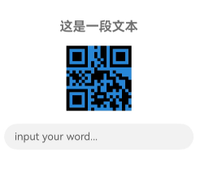

# @ohos.arkui.theme(主题换肤)

支持自定义主题风格，实现App组件风格跟随Theme切换。

 

本模块首批接口从API version 12开始支持。后续版本的新增接口，采用上角标单独标记接口的起始版本。

## 导入模块

```
import { Theme, ThemeControl, CustomColors, Colors, CustomTheme, CustomDarkColors } from '@kit.ArkUI';
```

## Theme

当前生效的主题风格对象，可从[onWillApplyTheme](/ref/arkui-api/arkui-declarative-comp/custom-comp/ts-custom-component-lifecycle/ts-custom-component-lifecycle#onwillapplytheme12)中获取。

****元服务API：**** 从API version 12开始，该接口支持在元服务中使用。

****系统能力：**** SystemCapability.ArkUI.ArkUI.Full

| 名称 | 类型 | 只读 | 可选 | 说明 |
| --- | --- | --- | --- | --- |
| colors | [Colors](#colors) | 否 | 否 | 主题颜色资源。 |

## Colors

主题颜色资源。

****元服务API：**** 从API version 12开始，该接口支持在元服务中使用。

****系统能力：**** SystemCapability.ArkUI.ArkUI.Full

 

颜色对应的组件可参考[文本色与图标色](https://developer.huawei.com/consumer/cn/doc/design-guides/color-0000001776857164#section137153164914)。

| 名称 | 类型 | 只读 | 可选 | 说明 |
| --- | --- | --- | --- | --- |
| brand | [ResourceColor](/ref/arkui-api/arkui-declarative-comp/common-definitions/ts-types/ts-types#resourcecolor) | 否 | 否 | 品牌色。  ****影响组件：**** [TextInput](/ref/arkui-api/arkui-declarative-comp/text-and-input/ts-basic-components-textinput/ts-basic-components-textinput)、[Search](/ref/arkui-api/arkui-declarative-comp/text-and-input/ts-basic-components-search/ts-basic-components-search) |
| warning | [ResourceColor](/ref/arkui-api/arkui-declarative-comp/common-definitions/ts-types/ts-types#resourcecolor) | 否 | 否 | 一级警示色。  ****影响组件：**** [TipsDialog](/ref/arkui-api/arkui-declarative-comp/dialog-boxes/ohos-arkui-advanced-dialog/ohos-arkui-advanced-dialog#tipsdialog)、[AlertDialog](/ref/arkui-api/arkui-declarative-comp/dialog-boxes/ohos-arkui-advanced-dialog/ohos-arkui-advanced-dialog#alertdialog)、[CustomContentDialog](/ref/arkui-api/arkui-declarative-comp/dialog-boxes/ohos-arkui-advanced-dialog/ohos-arkui-advanced-dialog#customcontentdialog12)、  [Badge](/ref/arkui-api/arkui-declarative-comp/information-display/ts-container-badge/ts-container-badge)、[Button](/ref/arkui-api/arkui-declarative-comp/buttons-and-selections/ts-basic-components-button/ts-basic-components-button) |
| alert | [ResourceColor](/ref/arkui-api/arkui-declarative-comp/common-definitions/ts-types/ts-types#resourcecolor) | 否 | 否 | 二级提示色。  ****影响组件：**** 暂无组件使用。 |
| confirm | [ResourceColor](/ref/arkui-api/arkui-declarative-comp/common-definitions/ts-types/ts-types#resourcecolor) | 否 | 否 | 确认色。  ****影响组件：**** 暂无组件使用。 |
| fontPrimary | [ResourceColor](/ref/arkui-api/arkui-declarative-comp/common-definitions/ts-types/ts-types#resourcecolor) | 否 | 否 | 一级文本字体颜色。  ****影响组件：**** [EditableTitleBar](/ref/arkui-api/arkui-declarative-comp/system-preset-ui-component-library/ohos-arkui-advanced-editabletitlebar/ohos-arkui-advanced-editabletitlebar)、[LoadingDialog](/ref/arkui-api/arkui-declarative-comp/dialog-boxes/ohos-arkui-advanced-dialog/ohos-arkui-advanced-dialog#loadingdialog)、[TipsDialog](/ref/arkui-api/arkui-declarative-comp/dialog-boxes/ohos-arkui-advanced-dialog/ohos-arkui-advanced-dialog#tipsdialog)、  [ConfirmDialog](/ref/arkui-api/arkui-declarative-comp/dialog-boxes/ohos-arkui-advanced-dialog/ohos-arkui-advanced-dialog#confirmdialog)、[AlertDialog](/ref/arkui-api/arkui-declarative-comp/dialog-boxes/ohos-arkui-advanced-dialog/ohos-arkui-advanced-dialog#alertdialog)、[SelectDialog](/ref/arkui-api/arkui-declarative-comp/dialog-boxes/ohos-arkui-advanced-dialog/ohos-arkui-advanced-dialog#selectdialog)、  [CustomContentDialog](/ref/arkui-api/arkui-declarative-comp/dialog-boxes/ohos-arkui-advanced-dialog/ohos-arkui-advanced-dialog#customcontentdialog12)、[Swiper](/ref/arkui-api/arkui-declarative-comp/scroll-and-swipe/ts-container-swiper/ts-container-swiper)、[Text](/ref/arkui-api/arkui-declarative-comp/text-and-input/ts-basic-components-text/ts-basic-components-text)、  [SubHeader](/ref/arkui-api/arkui-declarative-comp/system-preset-ui-component-library/ohos-arkui-advanced-subheader/ohos-arkui-advanced-subheader)、[ProgressButton](/ref/arkui-api/arkui-declarative-comp/system-preset-ui-component-library/ohos-arkui-advanced-progressbutton/ohos-arkui-advanced-progressbutton)、[AlphabetIndexer](/ref/arkui-api/arkui-declarative-comp/information-display/ts-container-alphabet-indexer/ts-container-alphabet-indexer)、  [Popup](/ref/arkui-api/arkui-declarative-comp/system-preset-ui-component-library/ohos-arkui-advanced-popup/ohos-arkui-advanced-popup)、[Select](/ref/arkui-api/arkui-declarative-comp/buttons-and-selections/ts-basic-components-select/ts-basic-components-select)、[Chip](/ref/arkui-api/arkui-declarative-comp/system-preset-ui-component-library/ohos-arkui-advanced-chip/ohos-arkui-advanced-chip)、  [ToolBar](/ref/arkui-api/arkui-declarative-comp/system-preset-ui-component-library/ohos-arkui-advanced-toolbar/ohos-arkui-advanced-toolbar)、[Menu](/ref/arkui-api/arkui-declarative-comp/menus/ts-basic-components-menu/ts-basic-components-menu)、[TextInput](/ref/arkui-api/arkui-declarative-comp/text-and-input/ts-basic-components-textinput/ts-basic-components-textinput)、  [Search](/ref/arkui-api/arkui-declarative-comp/text-and-input/ts-basic-components-search/ts-basic-components-search)、[Counter](/ref/arkui-api/arkui-declarative-comp/information-display/ts-container-counter/ts-container-counter)、[TimePicker](/ref/arkui-api/arkui-declarative-comp/buttons-and-selections/ts-basic-components-timepicker/ts-basic-components-timepicker)、[DatePicker](/ref/arkui-api/arkui-declarative-comp/buttons-and-selections/ts-basic-components-datepicker/ts-basic-components-datepicker)、  [TextPicker](/ref/arkui-api/arkui-declarative-comp/buttons-and-selections/ts-basic-components-textpicker/ts-basic-components-textpicker)、[ComposeListItem](/ref/arkui-api/arkui-declarative-comp/system-preset-ui-component-library/ohos-arkui-advanced-composelistitem/ohos-arkui-advanced-composelistitem)、[TreeView](/ref/arkui-api/arkui-declarative-comp/system-preset-ui-component-library/ohos-arkui-advanced-treeview/ohos-arkui-advanced-treeview) |
| fontSecondary | [ResourceColor](/ref/arkui-api/arkui-declarative-comp/common-definitions/ts-types/ts-types#resourcecolor) | 否 | 否 | 二级文本字体颜色。  ****影响组件：**** [EditableTitleBar](/ref/arkui-api/arkui-declarative-comp/system-preset-ui-component-library/ohos-arkui-advanced-editabletitlebar/ohos-arkui-advanced-editabletitlebar)、[AlertDialog](/ref/arkui-api/arkui-declarative-comp/dialog-boxes/ohos-arkui-advanced-dialog/ohos-arkui-advanced-dialog#alertdialog)、[CustomContentDialog](/ref/arkui-api/arkui-declarative-comp/dialog-boxes/ohos-arkui-advanced-dialog/ohos-arkui-advanced-dialog#customcontentdialog12)、  [SubHeader](/ref/arkui-api/arkui-declarative-comp/system-preset-ui-component-library/ohos-arkui-advanced-subheader/ohos-arkui-advanced-subheader)、[AlphabetIndexer](/ref/arkui-api/arkui-declarative-comp/information-display/ts-container-alphabet-indexer/ts-container-alphabet-indexer)、[Popup](/ref/arkui-api/arkui-declarative-comp/system-preset-ui-component-library/ohos-arkui-advanced-popup/ohos-arkui-advanced-popup)、  [TextInput](/ref/arkui-api/arkui-declarative-comp/text-and-input/ts-basic-components-textinput/ts-basic-components-textinput)、[Search](/ref/arkui-api/arkui-declarative-comp/text-and-input/ts-basic-components-search/ts-basic-components-search)、[ComposeListItem](/ref/arkui-api/arkui-declarative-comp/system-preset-ui-component-library/ohos-arkui-advanced-composelistitem/ohos-arkui-advanced-composelistitem)、  [TreeView](/ref/arkui-api/arkui-declarative-comp/system-preset-ui-component-library/ohos-arkui-advanced-treeview/ohos-arkui-advanced-treeview) |
| fontTertiary | [ResourceColor](/ref/arkui-api/arkui-declarative-comp/common-definitions/ts-types/ts-types#resourcecolor) | 否 | 否 | 三级文本字体颜色。  ****影响组件：**** [ComposeListItem](/ref/arkui-api/arkui-declarative-comp/system-preset-ui-component-library/ohos-arkui-advanced-composelistitem/ohos-arkui-advanced-composelistitem) |
| fontFourth | [ResourceColor](/ref/arkui-api/arkui-declarative-comp/common-definitions/ts-types/ts-types#resourcecolor) | 否 | 否 | 四级文本字体颜色。  ****影响组件：**** 暂无组件使用。 |
| fontEmphasize | [ResourceColor](/ref/arkui-api/arkui-declarative-comp/common-definitions/ts-types/ts-types#resourcecolor) | 否 | 否 | 高亮字体颜色。  ****影响组件：**** [TipsDialog](/ref/arkui-api/arkui-declarative-comp/dialog-boxes/ohos-arkui-advanced-dialog/ohos-arkui-advanced-dialog#tipsdialog)、[ConfirmDialog](/ref/arkui-api/arkui-declarative-comp/dialog-boxes/ohos-arkui-advanced-dialog/ohos-arkui-advanced-dialog#confirmdialog)、[AlertDialog](/ref/arkui-api/arkui-declarative-comp/dialog-boxes/ohos-arkui-advanced-dialog/ohos-arkui-advanced-dialog#alertdialog)、  [SelectDialog](/ref/arkui-api/arkui-declarative-comp/dialog-boxes/ohos-arkui-advanced-dialog/ohos-arkui-advanced-dialog#selectdialog)、[CustomContentDialog](/ref/arkui-api/arkui-declarative-comp/dialog-boxes/ohos-arkui-advanced-dialog/ohos-arkui-advanced-dialog#customcontentdialog12)、[SubHeader](/ref/arkui-api/arkui-declarative-comp/system-preset-ui-component-library/ohos-arkui-advanced-subheader/ohos-arkui-advanced-subheader)、  [AlphabetIndexer](/ref/arkui-api/arkui-declarative-comp/information-display/ts-container-alphabet-indexer/ts-container-alphabet-indexer)、[Popup](/ref/arkui-api/arkui-declarative-comp/system-preset-ui-component-library/ohos-arkui-advanced-popup/ohos-arkui-advanced-popup)、[Button](/ref/arkui-api/arkui-declarative-comp/buttons-and-selections/ts-basic-components-button/ts-basic-components-button)、  [Select](/ref/arkui-api/arkui-declarative-comp/buttons-and-selections/ts-basic-components-select/ts-basic-components-select)、[ToolBar](/ref/arkui-api/arkui-declarative-comp/system-preset-ui-component-library/ohos-arkui-advanced-toolbar/ohos-arkui-advanced-toolbar)、[Search](/ref/arkui-api/arkui-declarative-comp/text-and-input/ts-basic-components-search/ts-basic-components-search)、  [TimePicker](/ref/arkui-api/arkui-declarative-comp/buttons-and-selections/ts-basic-components-timepicker/ts-basic-components-timepicker)、[DatePicker](/ref/arkui-api/arkui-declarative-comp/buttons-and-selections/ts-basic-components-datepicker/ts-basic-components-datepicker)、[TextPicker](/ref/arkui-api/arkui-declarative-comp/buttons-and-selections/ts-basic-components-textpicker/ts-basic-components-textpicker) |
| fontOnPrimary | [ResourceColor](/ref/arkui-api/arkui-declarative-comp/common-definitions/ts-types/ts-types#resourcecolor) | 否 | 否 | 一级文本反转颜色，用于彩色背景。  ****影响组件：**** [Badge](/ref/arkui-api/arkui-declarative-comp/information-display/ts-container-badge/ts-container-badge)、[Button](/ref/arkui-api/arkui-declarative-comp/buttons-and-selections/ts-basic-components-button/ts-basic-components-button)、[Chip](/ref/arkui-api/arkui-declarative-comp/system-preset-ui-component-library/ohos-arkui-advanced-chip/ohos-arkui-advanced-chip) |
| fontOnSecondary | [ResourceColor](/ref/arkui-api/arkui-declarative-comp/common-definitions/ts-types/ts-types#resourcecolor) | 否 | 否 | 二级文本反转颜色，用于彩色背景。  ****影响组件：**** 暂无组件使用。 |
| fontOnTertiary | [ResourceColor](/ref/arkui-api/arkui-declarative-comp/common-definitions/ts-types/ts-types#resourcecolor) | 否 | 否 | 三级文本反转颜色，用于彩色背景。  ****影响组件：**** 暂无组件使用。 |
| fontOnFourth | [ResourceColor](/ref/arkui-api/arkui-declarative-comp/common-definitions/ts-types/ts-types#resourcecolor) | 否 | 否 | 四级文本反转颜色，用于彩色背景。  ****影响组件：**** 暂无组件使用。 |
| iconPrimary | [ResourceColor](/ref/arkui-api/arkui-declarative-comp/common-definitions/ts-types/ts-types#resourcecolor) | 否 | 否 | 一级图标颜色。  ****影响组件：**** [EditableTitleBar](/ref/arkui-api/arkui-declarative-comp/system-preset-ui-component-library/ohos-arkui-advanced-editabletitlebar/ohos-arkui-advanced-editabletitlebar)、[Swiper](/ref/arkui-api/arkui-declarative-comp/scroll-and-swipe/ts-container-swiper/ts-container-swiper)、[ToolBar](/ref/arkui-api/arkui-declarative-comp/system-preset-ui-component-library/ohos-arkui-advanced-toolbar/ohos-arkui-advanced-toolbar)、  [TreeView](/ref/arkui-api/arkui-declarative-comp/system-preset-ui-component-library/ohos-arkui-advanced-treeview/ohos-arkui-advanced-treeview) |
| iconSecondary | [ResourceColor](/ref/arkui-api/arkui-declarative-comp/common-definitions/ts-types/ts-types#resourcecolor) | 否 | 否 | 二级图标颜色。  ****影响组件：**** [LoadingDialog](/ref/arkui-api/arkui-declarative-comp/dialog-boxes/ohos-arkui-advanced-dialog/ohos-arkui-advanced-dialog#loadingdialog)、[SubHeader](/ref/arkui-api/arkui-declarative-comp/system-preset-ui-component-library/ohos-arkui-advanced-subheader/ohos-arkui-advanced-subheader)、[LoadingProgress](/ref/arkui-api/arkui-declarative-comp/information-display/ts-basic-components-loadingprogress/ts-basic-components-loadingprogress)、  [Popup](/ref/arkui-api/arkui-declarative-comp/system-preset-ui-component-library/ohos-arkui-advanced-popup/ohos-arkui-advanced-popup)、[Chip](/ref/arkui-api/arkui-declarative-comp/system-preset-ui-component-library/ohos-arkui-advanced-chip/ohos-arkui-advanced-chip)、[Search](/ref/arkui-api/arkui-declarative-comp/text-and-input/ts-basic-components-search/ts-basic-components-search)、  [TreeView](/ref/arkui-api/arkui-declarative-comp/system-preset-ui-component-library/ohos-arkui-advanced-treeview/ohos-arkui-advanced-treeview) |
| iconTertiary | [ResourceColor](/ref/arkui-api/arkui-declarative-comp/common-definitions/ts-types/ts-types#resourcecolor) | 否 | 否 | 三级图标颜色。  ****影响组件：**** [SubHeader](/ref/arkui-api/arkui-declarative-comp/system-preset-ui-component-library/ohos-arkui-advanced-subheader/ohos-arkui-advanced-subheader) |
| iconFourth | [ResourceColor](/ref/arkui-api/arkui-declarative-comp/common-definitions/ts-types/ts-types#resourcecolor) | 否 | 否 | 四级图标颜色。  ****影响组件：**** [Checkbox](/ref/arkui-api/arkui-declarative-comp/buttons-and-selections/ts-basic-components-checkbox/ts-basic-components-checkbox)、[CheckboxGroup](/ref/arkui-api/arkui-declarative-comp/buttons-and-selections/ts-basic-components-checkboxgroup/ts-basic-components-checkboxgroup)、[Radio](/ref/arkui-api/arkui-declarative-comp/buttons-and-selections/ts-basic-components-radio/ts-basic-components-radio) |
| iconEmphasize | [ResourceColor](/ref/arkui-api/arkui-declarative-comp/common-definitions/ts-types/ts-types#resourcecolor) | 否 | 否 | 高亮图标颜色。  ****影响组件：**** [ToolBar](/ref/arkui-api/arkui-declarative-comp/system-preset-ui-component-library/ohos-arkui-advanced-toolbar/ohos-arkui-advanced-toolbar) |
| iconSubEmphasize | [ResourceColor](/ref/arkui-api/arkui-declarative-comp/common-definitions/ts-types/ts-types#resourcecolor) | 否 | 否 | 高亮辅助图标颜色。  ****影响组件：**** 暂无组件使用。 |
| iconOnPrimary | [ResourceColor](/ref/arkui-api/arkui-declarative-comp/common-definitions/ts-types/ts-types#resourcecolor) | 否 | 否 | 一级图标反转颜色，用于彩色背景。  ****影响组件：**** [Checkbox](/ref/arkui-api/arkui-declarative-comp/buttons-and-selections/ts-basic-components-checkbox/ts-basic-components-checkbox)、[CheckboxGroup](/ref/arkui-api/arkui-declarative-comp/buttons-and-selections/ts-basic-components-checkboxgroup/ts-basic-components-checkboxgroup)、[Radio](/ref/arkui-api/arkui-declarative-comp/buttons-and-selections/ts-basic-components-radio/ts-basic-components-radio) |
| iconOnSecondary | [ResourceColor](/ref/arkui-api/arkui-declarative-comp/common-definitions/ts-types/ts-types#resourcecolor) | 否 | 否 | 二级图标反转颜色，用于彩色背景。  ****影响组件：**** [Chip](/ref/arkui-api/arkui-declarative-comp/system-preset-ui-component-library/ohos-arkui-advanced-chip/ohos-arkui-advanced-chip) |
| iconOnTertiary | [ResourceColor](/ref/arkui-api/arkui-declarative-comp/common-definitions/ts-types/ts-types#resourcecolor) | 否 | 否 | 三级图标反转颜色，用于彩色背景。  ****影响组件：**** 暂无组件使用。 |
| iconOnFourth | [ResourceColor](/ref/arkui-api/arkui-declarative-comp/common-definitions/ts-types/ts-types#resourcecolor) | 否 | 否 | 四级图标反转颜色，用于彩色背景。  ****影响组件：**** [ProgressButton](/ref/arkui-api/arkui-declarative-comp/system-preset-ui-component-library/ohos-arkui-advanced-progressbutton/ohos-arkui-advanced-progressbutton) |
| backgroundPrimary | [ResourceColor](/ref/arkui-api/arkui-declarative-comp/common-definitions/ts-types/ts-types#resourcecolor) | 否 | 否 | 一级背景颜色（实色，不透明）。  ****影响组件：**** [TextInput](/ref/arkui-api/arkui-declarative-comp/text-and-input/ts-basic-components-textinput/ts-basic-components-textinput)、[QRCode](/ref/arkui-api/arkui-declarative-comp/information-display/ts-basic-components-qrcode/ts-basic-components-qrcode) |
| backgroundSecondary | [ResourceColor](/ref/arkui-api/arkui-declarative-comp/common-definitions/ts-types/ts-types#resourcecolor) | 否 | 否 | 二级背景颜色（实色，不透明）。  ****影响组件：**** 暂无组件使用。 |
| backgroundTertiary | [ResourceColor](/ref/arkui-api/arkui-declarative-comp/common-definitions/ts-types/ts-types#resourcecolor) | 否 | 否 | 三级背景颜色（实色，不透明）。  ****影响组件：**** 暂无组件使用。 |
| backgroundFourth | [ResourceColor](/ref/arkui-api/arkui-declarative-comp/common-definitions/ts-types/ts-types#resourcecolor) | 否 | 否 | 四级背景颜色（实色，不透明）。  ****影响组件：**** 暂无组件使用。 |
| backgroundEmphasize | [ResourceColor](/ref/arkui-api/arkui-declarative-comp/common-definitions/ts-types/ts-types#resourcecolor) | 否 | 否 | 高亮背景颜色（实色，不透明）。  ****影响组件：**** [Progress](/ref/arkui-api/arkui-declarative-comp/information-display/ts-basic-components-progress/ts-basic-components-progress)、[Button](/ref/arkui-api/arkui-declarative-comp/buttons-and-selections/ts-basic-components-button/ts-basic-components-button)、[Slider](/ref/arkui-api/arkui-declarative-comp/buttons-and-selections/ts-basic-components-slider/ts-basic-components-slider) |
| compForegroundPrimary | [ResourceColor](/ref/arkui-api/arkui-declarative-comp/common-definitions/ts-types/ts-types#resourcecolor) | 否 | 否 | 前背景。  ****影响组件：**** [QRCode](/ref/arkui-api/arkui-declarative-comp/information-display/ts-basic-components-qrcode/ts-basic-components-qrcode) |
| compBackgroundPrimary | [ResourceColor](/ref/arkui-api/arkui-declarative-comp/common-definitions/ts-types/ts-types#resourcecolor) | 否 | 否 | 白色背景。  ****影响组件：**** 暂无组件使用。 |
| compBackgroundPrimaryTran | [ResourceColor](/ref/arkui-api/arkui-declarative-comp/common-definitions/ts-types/ts-types#resourcecolor) | 否 | 否 | 白色透明背景。  ****影响组件：**** 暂无组件使用。 |
| compBackgroundPrimaryContrary | [ResourceColor](/ref/arkui-api/arkui-declarative-comp/common-definitions/ts-types/ts-types#resourcecolor) | 否 | 否 | 常亮背景。  ****影响组件：**** [Toggle](/ref/arkui-api/arkui-declarative-comp/buttons-and-selections/ts-basic-components-toggle/ts-basic-components-toggle)、[Slider](/ref/arkui-api/arkui-declarative-comp/buttons-and-selections/ts-basic-components-slider/ts-basic-components-slider) |
| compBackgroundGray | [ResourceColor](/ref/arkui-api/arkui-declarative-comp/common-definitions/ts-types/ts-types#resourcecolor) | 否 | 否 | 灰色背景。  ****影响组件：**** 暂无组件使用。 |
| compBackgroundSecondary | [ResourceColor](/ref/arkui-api/arkui-declarative-comp/common-definitions/ts-types/ts-types#resourcecolor) | 否 | 否 | 二级背景。  ****影响组件：**** [Swiper](/ref/arkui-api/arkui-declarative-comp/scroll-and-swipe/ts-container-swiper/ts-container-swiper)、[Slider](/ref/arkui-api/arkui-declarative-comp/buttons-and-selections/ts-basic-components-slider/ts-basic-components-slider) |
| compBackgroundTertiary | [ResourceColor](/ref/arkui-api/arkui-declarative-comp/common-definitions/ts-types/ts-types#resourcecolor) | 否 | 否 | 三级背景。  ****影响组件：**** [EditableTitleBar](/ref/arkui-api/arkui-declarative-comp/system-preset-ui-component-library/ohos-arkui-advanced-editabletitlebar/ohos-arkui-advanced-editabletitlebar)、[Progress](/ref/arkui-api/arkui-declarative-comp/information-display/ts-basic-components-progress/ts-basic-components-progress)、[AlphabetIndexer](/ref/arkui-api/arkui-declarative-comp/information-display/ts-container-alphabet-indexer/ts-container-alphabet-indexer)、  [Button](/ref/arkui-api/arkui-declarative-comp/buttons-and-selections/ts-basic-components-button/ts-basic-components-button)、[Select](/ref/arkui-api/arkui-declarative-comp/buttons-and-selections/ts-basic-components-select/ts-basic-components-select)、[Toggle](/ref/arkui-api/arkui-declarative-comp/buttons-and-selections/ts-basic-components-toggle/ts-basic-components-toggle)、  [Chip](/ref/arkui-api/arkui-declarative-comp/system-preset-ui-component-library/ohos-arkui-advanced-chip/ohos-arkui-advanced-chip)、[TextInput](/ref/arkui-api/arkui-declarative-comp/text-and-input/ts-basic-components-textinput/ts-basic-components-textinput)、[Search](/ref/arkui-api/arkui-declarative-comp/text-and-input/ts-basic-components-search/ts-basic-components-search) |
| compBackgroundEmphasize | [ResourceColor](/ref/arkui-api/arkui-declarative-comp/common-definitions/ts-types/ts-types#resourcecolor) | 否 | 否 | 高亮背景。  ****影响组件：**** [Swiper](/ref/arkui-api/arkui-declarative-comp/scroll-and-swipe/ts-container-swiper/ts-container-swiper)、[Toggle](/ref/arkui-api/arkui-declarative-comp/buttons-and-selections/ts-basic-components-toggle/ts-basic-components-toggle)、[Chip](/ref/arkui-api/arkui-declarative-comp/system-preset-ui-component-library/ohos-arkui-advanced-chip/ohos-arkui-advanced-chip)、  [Checkbox](/ref/arkui-api/arkui-declarative-comp/buttons-and-selections/ts-basic-components-checkbox/ts-basic-components-checkbox)、[CheckboxGroup](/ref/arkui-api/arkui-declarative-comp/buttons-and-selections/ts-basic-components-checkboxgroup/ts-basic-components-checkboxgroup)、[Radio](/ref/arkui-api/arkui-declarative-comp/buttons-and-selections/ts-basic-components-radio/ts-basic-components-radio) |
| compBackgroundNeutral | [ResourceColor](/ref/arkui-api/arkui-declarative-comp/common-definitions/ts-types/ts-types#resourcecolor) | 否 | 否 | 黑色中性高亮背景颜色。  ****影响组件：**** [PatternLock](/ref/arkui-api/arkui-declarative-comp/information-display/ts-basic-components-patternlock/ts-basic-components-patternlock) |
| compEmphasizeSecondary | [ResourceColor](/ref/arkui-api/arkui-declarative-comp/common-definitions/ts-types/ts-types#resourcecolor) | 否 | 否 | 20%高亮背景颜色。  ****影响组件：**** [Progress](/ref/arkui-api/arkui-declarative-comp/information-display/ts-basic-components-progress/ts-basic-components-progress)、[ProgressButton](/ref/arkui-api/arkui-declarative-comp/system-preset-ui-component-library/ohos-arkui-advanced-progressbutton/ohos-arkui-advanced-progressbutton)、[AlphabetIndexer](/ref/arkui-api/arkui-declarative-comp/information-display/ts-container-alphabet-indexer/ts-container-alphabet-indexer)、  [Select](/ref/arkui-api/arkui-declarative-comp/buttons-and-selections/ts-basic-components-select/ts-basic-components-select)、[Toggle](/ref/arkui-api/arkui-declarative-comp/buttons-and-selections/ts-basic-components-toggle/ts-basic-components-toggle) |
| compEmphasizeTertiary | [ResourceColor](/ref/arkui-api/arkui-declarative-comp/common-definitions/ts-types/ts-types#resourcecolor) | 否 | 否 | 10%高亮背景颜色。  ****影响组件：**** 暂无组件使用。 |
| compDivider | [ResourceColor](/ref/arkui-api/arkui-declarative-comp/common-definitions/ts-types/ts-types#resourcecolor) | 否 | 否 | 通用分割线颜色。  ****影响组件：**** [SelectDialog](/ref/arkui-api/arkui-declarative-comp/dialog-boxes/ohos-arkui-advanced-dialog/ohos-arkui-advanced-dialog#selectdialog)、[PatternLock](/ref/arkui-api/arkui-declarative-comp/information-display/ts-basic-components-patternlock/ts-basic-components-patternlock)、[Divider](/ref/arkui-api/arkui-declarative-comp/blank-and-divider/ts-basic-components-divider/ts-basic-components-divider) |
| compCommonContrary | [ResourceColor](/ref/arkui-api/arkui-declarative-comp/common-definitions/ts-types/ts-types#resourcecolor) | 否 | 否 | 通用反转颜色。  ****影响组件：**** 暂无组件使用。 |
| compBackgroundFocus | [ResourceColor](/ref/arkui-api/arkui-declarative-comp/common-definitions/ts-types/ts-types#resourcecolor) | 否 | 否 | 获焦态背景颜色。  ****影响组件：**** 暂无组件使用。 |
| compFocusedPrimary | [ResourceColor](/ref/arkui-api/arkui-declarative-comp/common-definitions/ts-types/ts-types#resourcecolor) | 否 | 否 | 获焦态一级反转颜色。  ****影响组件：**** 暂无组件使用。 |
| compFocusedSecondary | [ResourceColor](/ref/arkui-api/arkui-declarative-comp/common-definitions/ts-types/ts-types#resourcecolor) | 否 | 否 | 获焦态二级反转颜色。  ****影响组件：**** 暂无组件使用。 |
| compFocusedTertiary | [ResourceColor](/ref/arkui-api/arkui-declarative-comp/common-definitions/ts-types/ts-types#resourcecolor) | 否 | 否 | 获焦态三级反转颜色。  ****影响组件：**** [Scroll](/ref/arkui-api/arkui-declarative-comp/scroll-and-swipe/ts-container-scroll/ts-container-scroll) |
| interactiveHover | [ResourceColor](/ref/arkui-api/arkui-declarative-comp/common-definitions/ts-types/ts-types#resourcecolor) | 否 | 否 | 通用悬停交互式颜色。  ****影响组件：**** [EditableTitleBar](/ref/arkui-api/arkui-declarative-comp/system-preset-ui-component-library/ohos-arkui-advanced-editabletitlebar/ohos-arkui-advanced-editabletitlebar)、[Chip](/ref/arkui-api/arkui-declarative-comp/system-preset-ui-component-library/ohos-arkui-advanced-chip/ohos-arkui-advanced-chip)、[TreeView](/ref/arkui-api/arkui-declarative-comp/system-preset-ui-component-library/ohos-arkui-advanced-treeview/ohos-arkui-advanced-treeview) |
| interactivePressed | [ResourceColor](/ref/arkui-api/arkui-declarative-comp/common-definitions/ts-types/ts-types#resourcecolor) | 否 | 否 | 通用按压交互式颜色。  ****影响组件：**** [EditableTitleBar](/ref/arkui-api/arkui-declarative-comp/system-preset-ui-component-library/ohos-arkui-advanced-editabletitlebar/ohos-arkui-advanced-editabletitlebar)、[Chip](/ref/arkui-api/arkui-declarative-comp/system-preset-ui-component-library/ohos-arkui-advanced-chip/ohos-arkui-advanced-chip)、[TreeView](/ref/arkui-api/arkui-declarative-comp/system-preset-ui-component-library/ohos-arkui-advanced-treeview/ohos-arkui-advanced-treeview) |
| interactiveFocus | [ResourceColor](/ref/arkui-api/arkui-declarative-comp/common-definitions/ts-types/ts-types#resourcecolor) | 否 | 否 | 通用获焦交互式颜色。  ****影响组件：**** [EditableTitleBar](/ref/arkui-api/arkui-declarative-comp/system-preset-ui-component-library/ohos-arkui-advanced-editabletitlebar/ohos-arkui-advanced-editabletitlebar)、[Chip](/ref/arkui-api/arkui-declarative-comp/system-preset-ui-component-library/ohos-arkui-advanced-chip/ohos-arkui-advanced-chip)、[TreeView](/ref/arkui-api/arkui-declarative-comp/system-preset-ui-component-library/ohos-arkui-advanced-treeview/ohos-arkui-advanced-treeview) |
| interactiveActive | [ResourceColor](/ref/arkui-api/arkui-declarative-comp/common-definitions/ts-types/ts-types#resourcecolor) | 否 | 否 | 通用激活交互式颜色。  ****影响组件：**** [TreeView](/ref/arkui-api/arkui-declarative-comp/system-preset-ui-component-library/ohos-arkui-advanced-treeview/ohos-arkui-advanced-treeview) |
| interactiveSelect | [ResourceColor](/ref/arkui-api/arkui-declarative-comp/common-definitions/ts-types/ts-types#resourcecolor) | 否 | 否 | 通用选择交互式颜色。  ****影响组件：**** [TreeView](/ref/arkui-api/arkui-declarative-comp/system-preset-ui-component-library/ohos-arkui-advanced-treeview/ohos-arkui-advanced-treeview) |
| interactiveClick | [ResourceColor](/ref/arkui-api/arkui-declarative-comp/common-definitions/ts-types/ts-types#resourcecolor) | 否 | 否 | 通用点击交互式颜色。  ****影响组件：**** 暂无组件使用。 |

## CustomTheme

自定义主题风格对象。

****系统能力：**** SystemCapability.ArkUI.ArkUI.Full

| 名称 | 类型 | 只读 | 可选 | 说明 |
| --- | --- | --- | --- | --- |
| colors | [CustomColors](#customcolors) | 否 | 是 | 自定义浅色主题颜色资源。  ****元服务API：**** 从API version 12开始，该接口支持在元服务中使用。 |
| darkColors20+ | [CustomDarkColors](#customdarkcolors20) | 否 | 是 | 自定义深色主题颜色资源。  ****说明****：如果未设置darkColors，颜色值将与浅色模式下的colors配置相同，并且不会随着颜色模式的变化而变化，除非该颜色是通过dark目录下的资源进行设置的。  ****元服务API：**** 从API version 20开始，该接口支持在元服务中使用。 |

## CustomColors

type CustomColors = Partial&lt;Colors&gt;

自定义主题颜色资源类型。

****元服务API：**** 从API version 12开始，该接口支持在元服务中使用。

****系统能力：**** SystemCapability.ArkUI.ArkUI.Full

| 类型 | 说明 |
| --- | --- |
| Partial&lt;[Colors](#colors)&gt; | 自定义主题颜色资源类型。 |

## CustomDarkColors20+

type CustomDarkColors = Partial&lt;Colors&gt;

自定义深色主题颜色资源类型。

****元服务API：**** 从API version 20开始，该接口支持在元服务中使用。

****系统能力：**** SystemCapability.ArkUI.ArkUI.Full

| 类型 | 说明 |
| --- | --- |
| Partial&lt;[Colors](#colors)&gt; | 自定义深色主题颜色资源类型。 |

## ThemeControl

ThemeControl将自定义Theme应用于App组件内，实现App组件风格跟随Theme切换。

****元服务API：**** 从API version 12开始，该接口支持在元服务中使用。

****系统能力：**** SystemCapability.ArkUI.ArkUI.Full

### setDefaultTheme

setDefaultTheme(theme: [CustomTheme](#customtheme)): void

将用户自定义Theme设置应用级默认主题，以实现应用风格跟随Theme切换。若在页面中使用此接口设置应用级默认主题，需确保该接口在页面build前执行。若在UIAbility中使用此接口设置应用级默认主题，需确保该接口在onWindowStageCreate阶段里windowStage.[loadContent](/ref/arkui-api/arkui-arkts/window-manager-api/js-apis-window/arkts-apis-window-windowstage/arkts-apis-window-windowstage#loadcontent9)接口调用完成的回调函数中执行。详细代码可参考[设置应用内组件自定义主题色](/arkui/arkts-ui-development/arkts-theme/theme_skinning#设置应用内组件自定义主题色)。

****元服务API：**** 从API version 12开始，该接口支持在元服务中使用。

****系统能力：**** SystemCapability.ArkUI.ArkUI.Full

****参数：****

| 参数名 | 类型 | 必填 | 说明 |
| --- | --- | --- | --- |
| theme | [CustomTheme](#customtheme) | 是 | 表示设置的自定义主题风格。 |

****示例****

```
import { CustomTheme, CustomColors, ThemeControl } from '@kit.ArkUI';
// 自定义主题颜色
class BlueColors implements CustomColors {
  fontPrimary = "#FF707070";
  backgroundPrimary = "#FF2787D9";
  brand = "#FFEEAAFF"; // 品牌色
}

class PageCustomTheme implements CustomTheme {
  colors?: CustomColors;

  constructor(colors: CustomColors) {
    this.colors = colors;
  }
}
// 创建实例
const BlueColorsTheme = new PageCustomTheme(new BlueColors());
// 在页面build之前执行ThemeControl.setDefaultTheme，设置App默认样式风格为BlueColorsTheme。
ThemeControl.setDefaultTheme(BlueColorsTheme);

@Entry
@Component
struct Index {

  build() {
    Row() {
      Column() {
        // 文本颜色应用fontPrimary
        Text('这是一段文本')
          .fontSize(30)
          .fontWeight(FontWeight.Bold)
          .margin('5%')
        // 二维码背景色应用backgroundPrimary
        QRCode('Hello')
          .width(100)
          .height(100)
        // 输入框光标颜色应用brand
        TextInput({placeholder: 'input your word...'})
          .width('80%')
          .height(40)
          .margin(20)
      }
      .width('100%')
    }
    .height('100%')
  }
}
```




