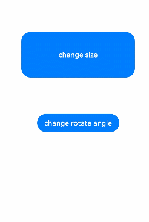

# 属性动画 (animation)

组件的某些通用属性变化时，可以通过属性动画实现渐变过渡效果，提升用户体验。支持的属性包括[width](/ref/arkui-api/arkui-declarative-comp/ts-component-general-attributes/layout-property/ts-universal-attributes-size/ts-universal-attributes-size#width)、[height](/ref/arkui-api/arkui-declarative-comp/ts-component-general-attributes/layout-property/ts-universal-attributes-size/ts-universal-attributes-size#height)、[backgroundColor](/ref/arkui-api/arkui-declarative-comp/ts-component-general-attributes/basic-property/ts-universal-attributes-background/ts-universal-attributes-background#backgroundcolor)、[opacity](/ref/arkui-api/arkui-declarative-comp/ts-component-general-attributes/visual-effect-property/ts-universal-attributes-opacity/ts-universal-attributes-opacity#opacity)、[scale](/ref/arkui-api/arkui-declarative-comp/ts-component-general-attributes/visual-effect-property/ts-universal-attributes-transformation/ts-universal-attributes-transformation#scale)、[rotate](/ref/arkui-api/arkui-declarative-comp/ts-component-general-attributes/visual-effect-property/ts-universal-attributes-transformation/ts-universal-attributes-transformation#rotate)、[translate](/ref/arkui-api/arkui-declarative-comp/ts-component-general-attributes/visual-effect-property/ts-universal-attributes-transformation/ts-universal-attributes-transformation#translate)等。对于改变布局类属性（如宽高）的动画，内容通常会直接跳转到最终状态，例如文字或[Canvas](/ref/arkui-api/arkui-declarative-comp/canvas-drawing/ts-components-canvas-canvas/ts-components-canvas-canvas)中的内容。如果希望内容跟随宽高变化，可以使用[renderFit](/ref/arkui-api/arkui-declarative-comp/ts-component-general-attributes/visual-effect-property/ts-universal-attributes-renderfit/ts-universal-attributes-renderfit#renderfit)属性进行配置。

 

从API version 7开始支持。后续版本如有新增内容，则采用上角标单独标记该内容的起始版本。

## animation

animation(value:AnimateParam): T

设置组件的属性动画。

 

- 在单一页面上存在大量应用动效的组件时，可以使用[renderGroup](/ref/arkui-api/arkui-declarative-comp/ts-component-general-attributes/visual-effect-property/ts-universal-attributes-image-effect/ts-universal-attributes-image-effect#rendergroup10)方法来解决卡顿问题，从而提升动画性能。最佳实践请参考[动画使用指导-使用renderGroup](https://developer.huawei.com/consumer/cn/doc/best-practices/bpta-fair-use-animation#section1223162922415)。
- 该接口不支持在[attributeModifier](/ref/arkui-api/arkui-declarative-comp/ts-component-general-attributes/attribute-modifier-property/ts-universal-attributes-attribute-modifier/ts-universal-attributes-attribute-modifier#attributemodifier)中调用。

****卡片能力：**** 从API version 9开始，该接口支持在ArkTS卡片中使用。

****元服务API：**** 从API version 11开始，该接口支持在元服务中使用。

****系统能力：**** SystemCapability.ArkUI.ArkUI.Full

****参数：****

| 参数名 | 类型 | 必填 | 说明 |
| --- | --- | --- | --- |
| value | [AnimateParam](/ref/arkui-api/arkui-declarative-comp/animation/ts-explicit-animation/ts-explicit-animation#animateparam对象说明) | 是 | 设置动画效果相关参数。 |

****返回值：****

| 类型 | 说明 |
| --- | --- |
| T | 返回当前组件。 |

属性动画只对写在animation前面的属性生效，且对组件构造器的属性不生效。

```
@Entry
@Component
struct AnimationExample {
  @State widthSize: number = 250;
  @State heightSize: number = 100;
  @State rotateAngle: number = 0;
  @State flag: boolean = true;
  @State space: number = 10;
  
  build() {
    Column() {
      Column({ space: this.space }) // 改变Column构造器中的space动画不生效
        .onClick(() => {
          if (this.flag) {
            this.widthSize = 150;
            this.heightSize = 60;
            this.space = 20; // 改变this.space动画不生效
          } else {
            this.widthSize = 250;
            this.heightSize = 100;
            this.space = 10; // 改变this.space动画不生效
          }
          this.flag = !this.flag;
        })
        .backgroundColor(Color.Black)
        .margin(30)
        .width(this.widthSize) // 只有写在animation前面才生效
        .height(this.heightSize) // 只有写在animation前面才生效
        .animation({
          duration: 2000,
          curve: Curve.EaseOut,
          iterations: 3,
          playMode: PlayMode.Normal
        })
        // .width(this.widthSize) // 动画不生效
        // .height(this.heightSize) // 动画不生效
    }
  }
}
```

## 示例

该示例通过animation实现了组件的属性动画。

```
// xxx.ets
@Entry
@Component
struct AttrAnimationExample {
  @State widthSize: number = 250
  @State heightSize: number = 100
  @State rotateAngle: number = 0
  @State flag: boolean = true

  build() {
    Column() {
      Button('change size')
        .onClick(() => {
          if (this.flag) {
            this.widthSize = 150
            this.heightSize = 60
          } else {
            this.widthSize = 250
            this.heightSize = 100
          }
          this.flag = !this.flag
        })
        .margin(30)
        .width(this.widthSize)
        .height(this.heightSize)
        .animation({
          duration: 2000,
          curve: Curve.EaseOut,
          iterations: 3,
          playMode: PlayMode.Normal
        })
      Button('change rotate angle')
        .onClick(() => {
          this.rotateAngle = 90
        })
        .margin(50)
        .rotate({ angle: this.rotateAngle })
        .animation({
          duration: 1200,
          curve: Curve.Friction,
          delay: 500,
          iterations: -1, // 设置-1表示动画无限循环
          playMode: PlayMode.Alternate,
          expectedFrameRateRange: {
            min: 20,
            max: 120,
            expected: 90,
          }
        })
    }.width('100%').margin({ top: 20 })
  }
}
```


