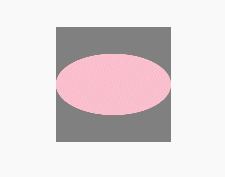

# 点击控制

设置组件是否可以响应点击事件、触摸事件等手指交互事件。

 

本模块首批接口从API version 7开始支持。后续版本的新增接口，采用上角标单独标记接口的起始版本。

## touchable(deprecated)

touchable(value: boolean): T

设置当前组件是否可以响应点击事件、触摸事件等手指交互事件。

 

从API version 7开始支持，从API version 9开始废弃，建议使用[hitTestBehavior](/ref/arkui-api/arkui-declarative-comp/ts-component-general-attributes/interaction-property/touch-interactions/ts-universal-attributes-hit-test-behavior/ts-universal-attributes-hit-test-behavior#hittestbehavior)替代。

****系统能力：**** SystemCapability.ArkUI.ArkUI.Full

****参数：****

| 参数名 | 类型 | 必填 | 说明 |
| --- | --- | --- | --- |
| value | boolean | 是 | 设置当前组件是否可以响应点击事件、触摸事件等手指交互事件。  默认值：true，可以响应交互事件。设置为false时，不可以响应交互事件。 |

****返回值：****

| 类型 | 说明 |
| --- | --- |
| T | 返回当前组件。 |

## 示例

```
// xxx.ets
@Entry
@Component
struct TouchAbleExample {
  @State text1: string = ''
  @State text2: string = ''

  build() {
    Stack() {
      Rect()
        .fill(Color.Gray).width(150).height(150)
        .onClick(() => {
          console.info(this.text1 = 'Rect Clicked')
        })
        .overlay(this.text1, { align: Alignment.Bottom, offset: { x: 0, y: 20 } })
      Ellipse()
        .fill(Color.Pink).width(150).height(80)
        .touchable(false) // 点击Ellipse区域，不会打印 “Ellipse Clicked”
        .onClick(() => {
          console.info(this.text2 = 'Ellipse Clicked')
        })
        .overlay(this.text2, { align: Alignment.Bottom, offset: { x: 0, y: 20 } })
    }.margin(100)
  }
}
```


