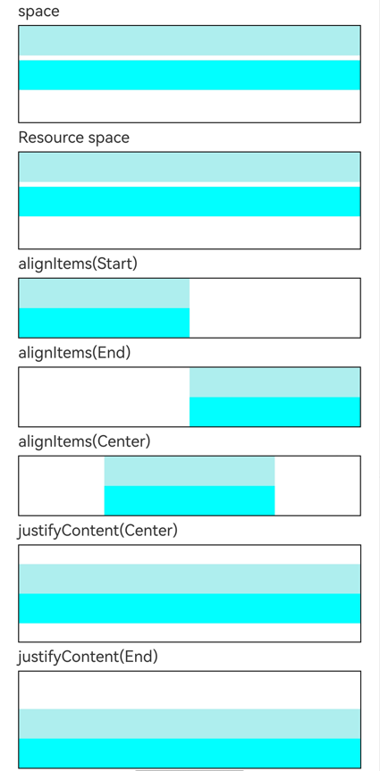

# Column

沿垂直方向布局的容器。

 

该组件从API version 7开始支持。后续版本如有新增内容，则采用上角标单独标记该内容的起始版本。

Column未设置高度或宽度时，在主轴或交叉轴方向上自适应子组件大小。

## 子组件

可以包含子组件。

## 接口

### Column

Column(options?: ColumnOptions)

创建垂直方向线性布局容器，可以设置子组件的间距。

 

在复杂界面中使用多组件嵌套时，若布局组件的嵌套层数过深或嵌套的组件数量过多，将会产生额外开销。建议通过移除冗余节点、利用布局边界减少布局计算、合理采用渲染控制语法及布局组件方法来优化性能。最佳实践请参考[布局优化指导](https://developer.huawei.com/consumer/cn/doc/best-practices/bpta-improve-layout-performance)。

****卡片能力：**** 从API version 9开始，该接口支持在ArkTS卡片中使用。

****元服务API：**** 从API version 11开始，该接口支持在元服务中使用。

****系统能力：**** SystemCapability.ArkUI.ArkUI.Full

****参数：****

| 参数名 | 类型 | 必填 | 说明 |
| --- | --- | --- | --- |
| options18+ | [ColumnOptions](#columnoptions18对象说明) | 否 | 纵向布局元素垂直方向间距，支持设置number或string类型。 |

### Column18+

Column(options?: ColumnOptions | ColumnOptionsV2)

创建垂直方向线性布局容器，可以设置子组件的间距。

****卡片能力：**** 从API version 18开始，该接口支持在ArkTS卡片中使用。

****元服务API：**** 从API version 18开始，该接口支持在元服务中使用。

****系统能力：**** SystemCapability.ArkUI.ArkUI.Full

****参数：****

| 参数名 | 类型 | 必填 | 说明 |
| --- | --- | --- | --- |
| options | [ColumnOptions](#columnoptions18对象说明) | [ColumnOptionsV2](#columnoptionsv218对象说明) | 否 | 纵向布局元素垂直方向间距，支持设置number、string或Resource类型。 |

## ColumnOptions18+对象说明

设置Column组件的子组件间距属性。

 

为规范匿名对象的定义，API 18版本修改了此处的元素定义。其中，保留了历史匿名对象的起始版本信息，会出现外层元素@since版本号高于内层元素版本号的情况，但这不影响接口的使用。

****卡片能力：**** 从API version 18开始，该接口支持在ArkTS卡片中使用。

****元服务API：**** 从API version 18开始，该接口支持在元服务中使用。

****系统能力：**** SystemCapability.ArkUI.ArkUI.Full

| 名称 | 类型 | 只读 | 可选 | 说明 |
| --- | --- | --- | --- | --- |
| space7+ | string | number | 否 | 是 | 纵向布局元素垂直方向间距。  space为负数或者[justifyContent](/ref/arkui-api/arkui-declarative-comp/rows-columns-and-stacking/ts-container-column/ts-container-column#justifycontent8)设置为FlexAlign.SpaceBetween、FlexAlign.SpaceAround、FlexAlign.SpaceEvenly时，space不生效。  默认值：0  非法值：按默认值处理。  单位：vp  ****说明：****  space取值是大于等于0的数字，或者可以转换为数字的字符串。  ****卡片能力：**** 从API version 9开始，该接口支持在ArkTS卡片中使用。  ****元服务API：**** 从API version 11开始，该接口支持在元服务中使用。 |

## ColumnOptionsV218+对象说明

设置Column组件的子组件间距属性。间距类型SpaceType支持number、string或Resource类型。

****卡片能力：**** 从API version 18开始，该接口支持在ArkTS卡片中使用。

****元服务API：**** 从API version 18开始，该接口支持在元服务中使用。

****系统能力：**** SystemCapability.ArkUI.ArkUI.Full

| 名称 | 类型 | 只读 | 可选 | 说明 |
| --- | --- | --- | --- | --- |
| space | [SpaceType](#spacetype18) | 否 | 是 | 纵向布局元素垂直方向间距。  space为负数或者justifyContent设置为FlexAlign.SpaceBetween、FlexAlign.SpaceAround、FlexAlign.SpaceEvenly时，space不生效。  默认值：0  单位：vp  非法值：按默认值处理。  ****说明：****  space取值是大于等于0的数字，或者可以转换为数字的字符串，或者可以转换为数字的Resource类型数据。 |

## SpaceType18+

type SpaceType = string | number | Resource

Column组件构造函数中space支持的数据类型，取值类型为下表类型中的并集。

****卡片能力：**** 从API version 18开始，该接口支持在ArkTS卡片中使用。

****元服务API：**** 从API version 18开始，该接口支持在元服务中使用。

****系统能力：**** SystemCapability.ArkUI.ArkUI.Full

| 类型 | 说明 |
| --- | --- |
| number | 表示类型为数字，可取任意值。 |
| string | 表示值类型为字符串，可取任意值。 |
| [Resource](/ref/arkui-api/arkui-declarative-comp/common-definitions/ts-types/ts-types#resource) | 表示值为资源引用类型，取值为从系统资源或者应用资源中引入的数据值。 |

## 属性

除支持[通用属性](https://developer.huawei.com/consumer/cn/doc/harmonyos-references/ts-component-general-attributes)外，还支持以下属性：

### alignItems

alignItems(value: HorizontalAlign)

设置子组件在水平方向上的对齐格式。

****卡片能力：**** 从API version 9开始，该接口支持在ArkTS卡片中使用。

****元服务API：**** 从API version 11开始，该接口支持在元服务中使用。

****系统能力：**** SystemCapability.ArkUI.ArkUI.Full

****参数：****

| 参数名 | 类型 | 必填 | 说明 |
| --- | --- | --- | --- |
| value | [HorizontalAlign](/ref/arkui-api/arkui-declarative-comp/common-definitions/ts-appendix-enums/ts-appendix-enums#horizontalalign) | 是 | 子组件在水平方向上的对齐格式。  默认值：HorizontalAlign.Center |

### justifyContent8+

justifyContent(value: FlexAlign)

设置子组件在垂直方向上的对齐格式。

****卡片能力：**** 从API version 9开始，该接口支持在ArkTS卡片中使用。

****元服务API：**** 从API version 11开始，该接口支持在元服务中使用。

****系统能力：**** SystemCapability.ArkUI.ArkUI.Full

****参数：****

| 参数名 | 类型 | 必填 | 说明 |
| --- | --- | --- | --- |
| value | [FlexAlign](/ref/arkui-api/arkui-declarative-comp/common-definitions/ts-appendix-enums/ts-appendix-enums#flexalign) | 是 | 子组件在垂直方向上的对齐格式。  默认值：FlexAlign.Start |

 

Column布局时若子组件不设置[flexShrink](/ref/arkui-api/arkui-declarative-comp/ts-component-general-attributes/layout-property/ts-universal-attributes-flex-layout/ts-universal-attributes-flex-layout#flexshrink)则默认不会压缩子组件，即所有子组件主轴大小累加可超过容器主轴，此时FlexAlign.Center和FlexAlign.End会失效。

### reverse12+

reverse(isReversed: Optional&lt;boolean&gt;)

设置子组件在垂直方向上的排列是否反转。

****卡片能力：**** 从API version 12开始，该接口支持在ArkTS卡片中使用。

****元服务API：**** 从API version 12开始，该接口支持在元服务中使用。

****系统能力：**** SystemCapability.ArkUI.ArkUI.Full

****参数：****

| 参数名 | 类型 | 必填 | 说明 |
| --- | --- | --- | --- |
| isReversed | [Optional](/ref/arkui-api/arkui-declarative-comp/ts-component-general-attributes/attribute-modifier-property/ts-universal-attributes-custom-property/ts-universal-attributes-custom-property#optionalt)<boolean> | 是 | 子组件在垂直方向上的排列是否反转。  默认值：true，设置true表示子组件在垂直方向上反转排列，设置false表示子组件在垂直方向上正序排列。 |

 

若未设置reverse属性，主轴方向不反转；若设置了reverse属性，且参数值为undefined，则视为默认值true，主轴方向反转。

通用属性direction只能改变Column交叉轴方向，不改变Column主轴方向，因此与reverse属性互不影响。

## 事件

支持[通用事件](https://developer.huawei.com/consumer/cn/doc/harmonyos-references/ts-component-general-events)。

## 示例

### 示例1（设置Column组件的布局属性）

本示例展示设置Column组件的布局属性，如间距、对齐方式等属性后的效果。

```
// resources/base/element/string.json
{
  "string": [
    {
      "name": "stringSpace",
      "value": "5"
    }
  ]
}
```

```
// xxx.ets
@Entry
@Component
struct ColumnExample {
  build() {
    Scroll() {
      Column({ space: 5 }) {
        // 设置子元素垂直方向间距为5
        Text('space').width('90%')
        Column({ space: 5 }) {
          Column().width('100%').height(30).backgroundColor(0xAFEEEE)
          Column().width('100%').height(30).backgroundColor(0x00FFFF)
        }.width('90%').height(100).border({ width: 1 })

        // 通过资源引用方式设置子元素垂直方向间距
        Text('Resource space').width('90%')
        Column({ space: $r('app.string.stringSpace') }) {
          Column().width('100%').height(30).backgroundColor(0xAFEEEE)
          Column().width('100%').height(30).backgroundColor(0x00FFFF)
        }.width('90%').height(100).border({ width: 1 })

        // 设置子元素水平方向对齐方式
        Text('alignItems(Start)').width('90%')
        Column() {
          Column().width('50%').height(30).backgroundColor(0xAFEEEE)
          Column().width('50%').height(30).backgroundColor(0x00FFFF)
        }.alignItems(HorizontalAlign.Start).width('90%').border({ width: 1 })

        Text('alignItems(End)').width('90%')
        Column() {
          Column().width('50%').height(30).backgroundColor(0xAFEEEE)
          Column().width('50%').height(30).backgroundColor(0x00FFFF)
        }.alignItems(HorizontalAlign.End).width('90%').border({ width: 1 })

        Text('alignItems(Center)').width('90%')
        Column() {
          Column().width('50%').height(30).backgroundColor(0xAFEEEE)
          Column().width('50%').height(30).backgroundColor(0x00FFFF)
        }.alignItems(HorizontalAlign.Center).width('90%').border({ width: 1 })

        // 设置子元素垂直方向的对齐方式
        Text('justifyContent(Center)').width('90%')
        Column() {
          Column().width('90%').height(30).backgroundColor(0xAFEEEE)
          Column().width('90%').height(30).backgroundColor(0x00FFFF)
        }.height(100).border({ width: 1 }).justifyContent(FlexAlign.Center)

        Text('justifyContent(End)').width('90%')
        Column() {
          Column().width('90%').height(30).backgroundColor(0xAFEEEE)
          Column().width('90%').height(30).backgroundColor(0x00FFFF)
        }.height(100).border({ width: 1 }).justifyContent(FlexAlign.End)
      }.width('100%').padding({ top: 5 })
    }.width('100%').height('100%')
  }
}
```



### 示例2（设置反转属性）

本示例展示设置Column组件的reverse属性后的效果。

```
@Entry
@Component
struct ColumnReverseSample {
  build() {
    Column() {
      Text("1")
        .width(50)
        .height(100)
        .backgroundColor(0xAFEEEE)

      Text("2")
        .width(50)
        .height(100)
        .backgroundColor(0x00FFFF)
    }
    .height(300)
    .width(100)
    .border({ width: 1 })
    .reverse(true)
  }
}
```


