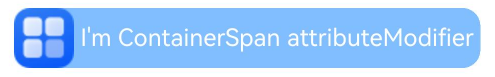

# ContainerSpan

[Text](/ref/arkui-api/arkui-declarative-comp/text-and-input/ts-basic-components-text/ts-basic-components-text)组件的子组件，用于统一管理多个[Span](/ref/arkui-api/arkui-declarative-comp/text-and-input/ts-basic-components-span/ts-basic-components-span)、[ImageSpan](/ref/arkui-api/arkui-declarative-comp/text-and-input/ts-basic-components-imagespan/ts-basic-components-imagespan)的背景色及圆角弧度。

 

该组件从API version 11开始支持。后续版本如有新增内容，则采用上角标单独标记该内容的起始版本。

## 子组件

可以包含[Span](/ref/arkui-api/arkui-declarative-comp/text-and-input/ts-basic-components-span/ts-basic-components-span)、[ImageSpan](/ref/arkui-api/arkui-declarative-comp/text-and-input/ts-basic-components-imagespan/ts-basic-components-imagespan) 子组件。

## 接口

ContainerSpan()

****元服务API：**** 从API version 12开始，该接口支持在元服务中使用。

****系统能力：**** SystemCapability.ArkUI.ArkUI.Full

## 属性

仅支持以下属性：

### textBackgroundStyle

textBackgroundStyle(style: TextBackgroundStyle)

设置文本背景样式。子组件在不设置该属性时，将继承此属性值。

 

从API version 12开始，该接口支持在[attributeModifier](/ref/arkui-api/arkui-declarative-comp/ts-component-general-attributes/attribute-modifier-property/ts-universal-attributes-attribute-modifier/ts-universal-attributes-attribute-modifier#attributemodifier)中调用。

****元服务API：**** 从API version 12开始，该接口支持在元服务中使用。

****系统能力：**** SystemCapability.ArkUI.ArkUI.Full

****参数：****

| 参数名 | 类型 | 必填 | 说明 |
| --- | --- | --- | --- |
| style | [TextBackgroundStyle](/ref/arkui-api/arkui-declarative-comp/text-and-input/ts-basic-components-span/ts-basic-components-span#textbackgroundstyle11对象说明) | 是 | 文本背景样式。  默认值：  {  color: Color.Transparent,  radius: 0  } |

### attributeModifier12+

attributeModifier(modifier: AttributeModifier&lt;ContainerSpanAttribute&gt;)

设置组件的动态属性。

****元服务API：**** 从API version 12开始，该接口支持在元服务中使用。

****系统能力：**** SystemCapability.ArkUI.ArkUI.Full

****参数：****

| 参数名 | 类型 | 必填 | 说明 |
| --- | --- | --- | --- |
| modifier | [AttributeModifier](/ref/arkui-api/arkui-declarative-comp/ts-component-general-attributes/attribute-modifier-property/ts-universal-attributes-attribute-modifier/ts-universal-attributes-attribute-modifier#attributemodifiert)<ContainerSpanAttribute> | 是 | 动态设置组件的属性。 |

## 事件

不支持[通用事件](https://developer.huawei.com/consumer/cn/doc/harmonyos-references/ts-component-general-events)。

## 示例

### 示例1（设置背景样式）

从API version 11开始，该示例通过[textBackgroundStyle](#textbackgroundstyle)属性展示了文本设置背景样式的效果。

```
// xxx.ets
@Component
@Entry
struct Index {
  build() {
    Column() {
      Text() {
        ContainerSpan() {
          // $r('app.media.app_icon')需要替换为开发者所需的图像资源文件。
          ImageSpan($r('app.media.app_icon'))
            .width('40vp')
            .height('40vp')
            .verticalAlign(ImageSpanAlignment.CENTER)
          Span('   Hello World !   ').fontSize('16fp').fontColor(Color.White)
        }
        .textBackgroundStyle({
          color: "#7F007DFF",
          radius: {
            topLeft: 12,
            topRight: 12,
            bottomLeft: 12,
            bottomRight: 12
          }
        })
      }
    }.width('100%').alignItems(HorizontalAlign.Center)
  }
}
```


### 示例2（通过attributeModifier设置背景样式）

从API version 12开始，该示例通过[attributeModifier](#attributemodifier12)属性展示了文本设置背景样式的效果。

```
import { ContainerSpanModifier } from '@kit.ArkUI';

class MyContainerSpanModifier extends ContainerSpanModifier {
  applyNormalAttribute(instance: ContainerSpanAttribute): void {
    super.applyNormalAttribute?.(instance);
    this.textBackgroundStyle({ color: "#7F007DFF", radius: "12vp" });
  }
}

@Entry
@Component
struct ContainerSpanModifierExample {
  @State containerSpanModifier: ContainerSpanModifier = new MyContainerSpanModifier();

  build() {
    Column() {
      Text() {
        ContainerSpan() {
          // $r('app.media.startIcon')需要替换为开发者所需的图像资源文件。
          ImageSpan($r('app.media.startIcon'))
            .width('40vp')
            .height('40vp')
            .verticalAlign(ImageSpanAlignment.CENTER)
          Span(' I\'m ContainerSpan attributeModifier ').fontSize('16fp').fontColor(Color.White)
        }.attributeModifier(this.containerSpanModifier as MyContainerSpanModifier)
      }
    }.width('100%').alignItems(HorizontalAlign.Center)
  }
}
```


