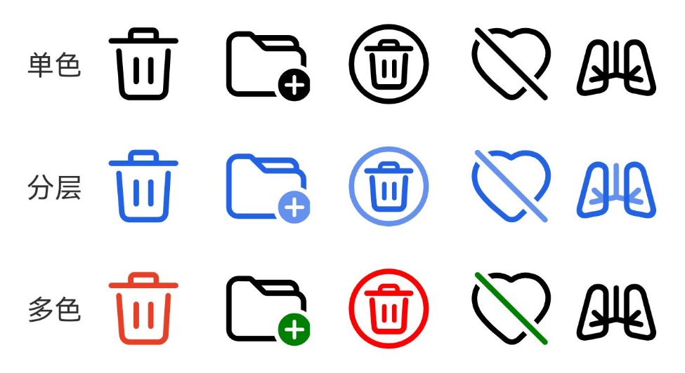
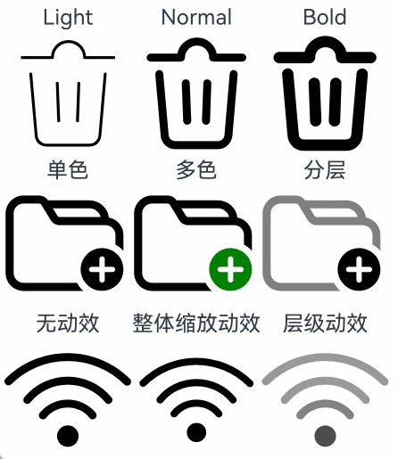
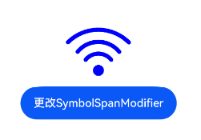

# SymbolSpan

作为Text组件的子组件，用于显示图标小符号的组件。

 

- 该组件从API version 11开始支持。后续版本如有新增内容，则采用上角标单独标记该内容的起始版本。
- 该组件支持继承父组件Text的属性，即如果子组件未设置属性且父组件设置属性，则继承父组件设置的全部属性。
- SymbolSpan拖拽不会置灰显示。

## 子组件

不支持子组件。

## 接口

SymbolSpan(value: Resource)

****卡片能力：**** 从API version 12开始，该接口支持在ArkTS卡片中使用。

****元服务API：**** 从API version 12开始，该接口支持在元服务中使用。

****系统能力：**** SystemCapability.ArkUI.ArkUI.Full

****参数：****

| 参数名 | 类型 | 必填 | 说明 |
| --- | --- | --- | --- |
| value | [Resource](/ref/arkui-api/arkui-declarative-comp/common-definitions/ts-types/ts-types#resource) | 是 | SymbolSpan组件的资源名，如 $r('sys.symbol.ohos\_wifi')。 |

 

$r('sys.symbol.ohos\_wifi')中引用的资源为系统预置，SymbolSpan仅支持系统预置的symbol资源名，引用非symbol资源将显示异常。

## 属性

不支持[通用属性](https://developer.huawei.com/consumer/cn/doc/harmonyos-references/ts-component-general-attributes)，支持以下属性：

### fontColor

fontColor(value: Array&lt;ResourceColor&gt;)

设置SymbolSpan组件颜色。

 

从API version 12开始，该接口支持在[attributeModifier](/ref/arkui-api/arkui-declarative-comp/ts-component-general-attributes/attribute-modifier-property/ts-universal-attributes-attribute-modifier/ts-universal-attributes-attribute-modifier#attributemodifier)中调用。

****卡片能力：**** 从API version 12开始，该接口支持在ArkTS卡片中使用。

****元服务API：**** 从API version 12开始，该接口支持在元服务中使用。

****系统能力：**** SystemCapability.ArkUI.ArkUI.Full

****参数：****

| 参数名 | 类型 | 必填 | 说明 |
| --- | --- | --- | --- |
| value | Array&lt;[ResourceColor](/ref/arkui-api/arkui-declarative-comp/common-definitions/ts-types/ts-types#resourcecolor)&gt; | 是 | SymbolSpan组件颜色。  默认值：不同渲染策略下默认值不同。 |

### fontSize

fontSize(value: number | string | Resource)

设置SymbolSpan组件大小。设置string类型时，支持number类型取值的字符串形式，可以附带单位，例如"10"、"10fp"。

 

从API version 12开始，该接口支持在[attributeModifier](/ref/arkui-api/arkui-declarative-comp/ts-component-general-attributes/attribute-modifier-property/ts-universal-attributes-attribute-modifier/ts-universal-attributes-attribute-modifier#attributemodifier)中调用。

****卡片能力：**** 从API version 12开始，该接口支持在ArkTS卡片中使用。

****元服务API：**** 从API version 12开始，该接口支持在元服务中使用。

****系统能力：**** SystemCapability.ArkUI.ArkUI.Full

****参数：****

| 参数名 | 类型 | 必填 | 说明 |
| --- | --- | --- | --- |
| value | number | string | [Resource](/ref/arkui-api/arkui-declarative-comp/common-definitions/ts-types/ts-types#resource) | 是 | SymbolSpan组件大小。  默认值：16fp  单位：[fp](/ref/arkui-api/arkui-declarative-comp/common-definitions/ts-pixel-units/ts-pixel-units) |

### fontWeight

fontWeight(value: number | FontWeight | string)

设置SymbolSpan组件粗细。number类型取值[100,900]，取值间隔为100，默认为400，取值越大，字体越粗。string类型仅支持number类型取值的字符串形式，例如“400”，以及“bold”、“bolder”、“lighter”、“regular” 、“medium”分别对应FontWeight中相应的枚举值。

sys.symbol.ohos\_lungs图标不支持设置fontWeight。

 

从API version 12开始，该接口支持在[attributeModifier](/ref/arkui-api/arkui-declarative-comp/ts-component-general-attributes/attribute-modifier-property/ts-universal-attributes-attribute-modifier/ts-universal-attributes-attribute-modifier#attributemodifier)中调用。

****卡片能力：**** 从API version 12开始，该接口支持在ArkTS卡片中使用。

****元服务API：**** 从API version 12开始，该接口支持在元服务中使用。

****系统能力：**** SystemCapability.ArkUI.ArkUI.Full

****参数：****

| 参数名 | 类型 | 必填 | 说明 |
| --- | --- | --- | --- |
| value | number | [FontWeight](/ref/arkui-api/arkui-declarative-comp/common-definitions/ts-appendix-enums/ts-appendix-enums#fontweight) | string | 是 | SymbolSpan组件粗细。  默认值：FontWeight.Normal |

### renderingStrategy

renderingStrategy(value: SymbolRenderingStrategy)

设置SymbolSpan渲染策略。

 

从API version 12开始，该接口支持在[attributeModifier](/ref/arkui-api/arkui-declarative-comp/ts-component-general-attributes/attribute-modifier-property/ts-universal-attributes-attribute-modifier/ts-universal-attributes-attribute-modifier#attributemodifier)中调用。

****卡片能力：**** 从API version 12开始，该接口支持在ArkTS卡片中使用。

****元服务API：**** 从API version 12开始，该接口支持在元服务中使用。

****系统能力：**** SystemCapability.ArkUI.ArkUI.Full

****参数：****

| 参数名 | 类型 | 必填 | 说明 |
| --- | --- | --- | --- |
| value | [SymbolRenderingStrategy](/ref/arkui-api/arkui-declarative-comp/text-and-input/ts-basic-components-symbolglyph/ts-basic-components-symbolglyph#symbolrenderingstrategy11枚举说明) | 是 | SymbolSpan渲染策略。  默认值：SymbolRenderingStrategy.SINGLE |

不同渲染策略效果可参考以下示意图。



### effectStrategy

effectStrategy(value: SymbolEffectStrategy)

设置SymbolSpan动效策略。

 

从API version 12开始，该接口支持在[attributeModifier](/ref/arkui-api/arkui-declarative-comp/ts-component-general-attributes/attribute-modifier-property/ts-universal-attributes-attribute-modifier/ts-universal-attributes-attribute-modifier#attributemodifier)中调用。

****卡片能力：**** 从API version 12开始，该接口支持在ArkTS卡片中使用。

****元服务API：**** 从API version 12开始，该接口支持在元服务中使用。

****系统能力：**** SystemCapability.ArkUI.ArkUI.Full

****参数：****

| 参数名 | 类型 | 必填 | 说明 |
| --- | --- | --- | --- |
| value | [SymbolEffectStrategy](/ref/arkui-api/arkui-declarative-comp/text-and-input/ts-basic-components-symbolglyph/ts-basic-components-symbolglyph#symboleffectstrategy11枚举说明) | 是 | SymbolSpan动效策略。  默认值：SymbolEffectStrategy.NONE |

### attributeModifier12+

attributeModifier(modifier: AttributeModifier&lt;SymbolSpanAttribute&gt;)

设置组件的动态属性。

****元服务API：**** 从API version 12开始，该接口支持在元服务中使用。

****系统能力：**** SystemCapability.ArkUI.ArkUI.Full

****参数：****

| 参数名 | 类型 | 必填 | 说明 |
| --- | --- | --- | --- |
| modifier | [AttributeModifier](/ref/arkui-api/arkui-declarative-comp/ts-component-general-attributes/attribute-modifier-property/ts-universal-attributes-attribute-modifier/ts-universal-attributes-attribute-modifier#attributemodifiert)<SymbolSpanAttribute> | 是 | 动态设置组件的属性。 |

## 事件

不支持[通用事件](https://developer.huawei.com/consumer/cn/doc/harmonyos-references/ts-component-general-events)。

## 示例

### 示例1（设置渲染和动效策略）

从API version 11开始，该示例通过[renderingStrategy](#renderingstrategy)、[effectStrategy](#effectstrategy)属性展示了不同的渲染和动效策略。

```
// xxx.ets
@Entry
@Component
struct Index {
  build() {
    Column() {
      Row() {
        Column() {
          Text("Light")
          Text() {
            SymbolSpan($r('sys.symbol.ohos_trash'))
              .fontWeight(FontWeight.Lighter)
              .fontSize(96)
          }
        }

        Column() {
          Text("Normal")
          Text() {
            SymbolSpan($r('sys.symbol.ohos_trash'))
              .fontWeight(FontWeight.Normal)
              .fontSize(96)
          }
        }

        Column() {
          Text("Bold")
          Text() {
            SymbolSpan($r('sys.symbol.ohos_trash'))
              .fontWeight(FontWeight.Bold)
              .fontSize(96)
          }
        }
      }

      Row() {
        Column() {
          Text("单色")
          Text() {
            SymbolSpan($r('sys.symbol.ohos_folder_badge_plus'))
              .fontSize(96)
              .renderingStrategy(SymbolRenderingStrategy.SINGLE)
              .fontColor([Color.Black, Color.Green, Color.White])
          }
        }

        Column() {
          Text("多色")
          Text() {
            SymbolSpan($r('sys.symbol.ohos_folder_badge_plus'))
              .fontSize(96)
              .renderingStrategy(SymbolRenderingStrategy.MULTIPLE_COLOR)
              .fontColor([Color.Black, Color.Green, Color.White])
          }
        }

        Column() {
          Text("分层")
          Text() {
            SymbolSpan($r('sys.symbol.ohos_folder_badge_plus'))
              .fontSize(96)
              .renderingStrategy(SymbolRenderingStrategy.MULTIPLE_OPACITY)
              .fontColor([Color.Black, Color.Green, Color.White])
          }
        }
      }

      Row() {
        Column() {
          Text("无动效")
          Text() {
            SymbolSpan($r('sys.symbol.ohos_wifi'))
              .fontSize(96)
              .effectStrategy(SymbolEffectStrategy.NONE)
          }
        }

        Column() {
          Text("整体缩放动效")
          Text() {
            SymbolSpan($r('sys.symbol.ohos_wifi'))
              .fontSize(96)
              .effectStrategy(SymbolEffectStrategy.SCALE)
          }
        }

        Column() {
          Text("层级动效")
          Text() {
            SymbolSpan($r('sys.symbol.ohos_wifi'))
              .fontSize(96)
              .effectStrategy(SymbolEffectStrategy.HIERARCHICAL)
          }
        }
      }
    }
  }
}
```



### 示例2（设置动态属性）

从API version 12开始，该示例通过[attributeModifier](#attributemodifier12)属性创建指定样式图标。

```
import { SymbolSpanModifier } from '@kit.ArkUI';

@Entry
@Component
struct Index {
  @State modifier: SymbolSpanModifier =
    new SymbolSpanModifier($r("sys.symbol.ohos_wifi")).fontColor([Color.Blue]).fontSize(100);

  build() {
    Row() {
      Column() {
        Text() {
          SymbolSpan(undefined).attributeModifier(this.modifier)
        }

        Button('更改SymbolSpanModifier')
          .onClick(() => {
            this.modifier = new SymbolSpanModifier($r("sys.symbol.ohos_trash")).fontColor([Color.Red]).fontSize(100);
          })
      }
      .width('100%')
    }
    .height('100%')
  }
}
```


