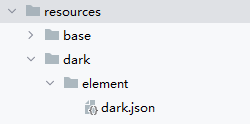
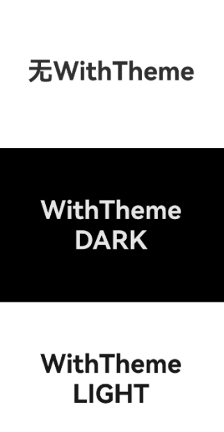
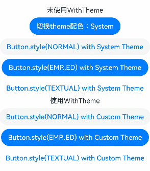

# WithTheme

WithTheme组件用于设置应用局部页面自定义主题风格，可设置子组件深浅色模式和自定义配色。

 

该组件从API version 12开始支持。后续版本如有新增内容，则采用上角标单独标记该内容的起始版本。

WithTheme支持的系统组件如下：[TextInput](/ref/arkui-api/arkui-declarative-comp/text-and-input/ts-basic-components-textinput/ts-basic-components-textinput)、[Search](/ref/arkui-api/arkui-declarative-comp/text-and-input/ts-basic-components-search/ts-basic-components-search)、[Button](/ref/arkui-api/arkui-declarative-comp/buttons-and-selections/ts-basic-components-button/ts-basic-components-button)、[Badge](/ref/arkui-api/arkui-declarative-comp/information-display/ts-container-badge/ts-container-badge)、[Swiper](/ref/arkui-api/arkui-declarative-comp/scroll-and-swipe/ts-container-swiper/ts-container-swiper)、[Text](/ref/arkui-api/arkui-declarative-comp/text-and-input/ts-basic-components-text/ts-basic-components-text)、[Select](/ref/arkui-api/arkui-declarative-comp/buttons-and-selections/ts-basic-components-select/ts-basic-components-select)、[Menu](/ref/arkui-api/arkui-declarative-comp/menus/ts-basic-components-menu/ts-basic-components-menu)、[TimePicker](/ref/arkui-api/arkui-declarative-comp/buttons-and-selections/ts-basic-components-timepicker/ts-basic-components-timepicker)、[DatePicker](/ref/arkui-api/arkui-declarative-comp/buttons-and-selections/ts-basic-components-datepicker/ts-basic-components-datepicker)、[TextPicker](/ref/arkui-api/arkui-declarative-comp/buttons-and-selections/ts-basic-components-textpicker/ts-basic-components-textpicker)、[Checkbox](/ref/arkui-api/arkui-declarative-comp/buttons-and-selections/ts-basic-components-checkbox/ts-basic-components-checkbox)、[CheckboxGroup](/ref/arkui-api/arkui-declarative-comp/buttons-and-selections/ts-basic-components-checkboxgroup/ts-basic-components-checkboxgroup)、[Radio](/ref/arkui-api/arkui-declarative-comp/buttons-and-selections/ts-basic-components-radio/ts-basic-components-radio)、[Slider](/ref/arkui-api/arkui-declarative-comp/buttons-and-selections/ts-basic-components-slider/ts-basic-components-slider)、[Progress](/ref/arkui-api/arkui-declarative-comp/information-display/ts-basic-components-progress/ts-basic-components-progress)、[QRCode](/ref/arkui-api/arkui-declarative-comp/information-display/ts-basic-components-qrcode/ts-basic-components-qrcode)、[Toggle](/ref/arkui-api/arkui-declarative-comp/buttons-and-selections/ts-basic-components-toggle/ts-basic-components-toggle)、[PatternLock](/ref/arkui-api/arkui-declarative-comp/information-display/ts-basic-components-patternlock/ts-basic-components-patternlock)、[Divider](/ref/arkui-api/arkui-declarative-comp/blank-and-divider/ts-basic-components-divider/ts-basic-components-divider)

WithTheme相关使用指导请参考[设置应用内主题换肤](/arkui/arkts-ui-development/arkts-theme/theme_skinning)。

## 子组件

支持单个子组件。

## 接口

WithTheme(options: WithThemeOptions)

设置应用局部页面自定义主题风格。

****元服务API：**** 从API version 12开始，该接口支持在元服务中使用。

****系统能力：**** SystemCapability.ArkUI.ArkUI.Full

****参数：****

| 参数名 | 类型 | 必填 | 说明 |
| --- | --- | --- | --- |
| options | [WithThemeOptions](#withthemeoptions) | 是 | 设置作用域内组件配色。 |

## 属性

不支持[通用属性](https://developer.huawei.com/consumer/cn/doc/harmonyos-references/ts-component-general-attributes)。

## 事件

不支持[通用事件](https://developer.huawei.com/consumer/cn/doc/harmonyos-references/ts-component-general-events)。

## WithThemeOptions

设置WithTheme作用域内组件缺省样式及深浅色模式。

****元服务API：**** 从API version 12开始，该接口支持在元服务中使用。

****系统能力：**** SystemCapability.ArkUI.ArkUI.Full

| 名称 | 类型 | 只读 | 可选 | 说明 |
| --- | --- | --- | --- | --- |
| theme | [CustomTheme](#customtheme) | 否 | 是 | 用于自定义WithTheme作用域内组件缺省配色。  默认值：undefined，缺省样式跟随系统[token默认样式](/arkui/arkts-ui-development/arkts-theme/theme_skinning#系统缺省token色值)。 |
| colorMode | [ThemeColorMode](/ref/arkui-api/arkui-declarative-comp/ts-component-general-attributes/visual-effect-property/ts-universal-attributes-foreground-blur-style/ts-universal-attributes-foreground-blur-style#themecolormode枚举说明) | 否 | 是 | 用于指定WithTheme作用域内组件配色深浅色模式。  默认值：ThemeColorMode.SYSTEM |

## CustomTheme

type CustomTheme = CustomTheme

自定义配色。

****元服务API：**** 从API version 12开始，该接口支持在元服务中使用。

****系统能力：**** SystemCapability.ArkUI.ArkUI.Full

| 类型 | 说明 |
| --- | --- |
| [CustomTheme](/ref/arkui-api/arkui-arkts/ui/js-apis-arkui-theme/js-apis-arkui-theme#customtheme) | 自定义WithTheme作用域内组件缺省配色。 |

## 示例

设置局部深浅色时，需要添加dark.json资源文件，深浅色模式才会生效。



dark.json数据示例：

```
  {
    "color": [
      {
        "name": "start_window_background",
        "value": "#000000"
      }
    ]
  }
```

### 示例1（指定局部深浅色模式）

```
// 指定局部深浅色模式
@Entry
@Component
struct Index {
  build() {
    Column() {
    // 系统默认
      Column() {
        Text('无WithTheme')
          .fontSize(40)
          .fontWeight(FontWeight.Bold)
      }
      .justifyContent(FlexAlign.Center)
      .width('100%')
      .height('33%')
      .backgroundColor($r('app.color.start_window_background'))
      // 设置组件为深色模式
      WithTheme({ colorMode: ThemeColorMode.DARK }) {
        Column() {
          Text('WithTheme')
            .fontSize(40)
            .fontWeight(FontWeight.Bold)
          Text('DARK')
            .fontSize(40)
            .fontWeight(FontWeight.Bold)
        }
        .justifyContent(FlexAlign.Center)
        .width('100%')
        .height('33%')
        .backgroundColor($r('sys.color.background_primary'))
      }
      // 设置组件为浅色模式
      WithTheme({ colorMode: ThemeColorMode.LIGHT }) {
        Column() {
          Text('WithTheme')
            .fontSize(40)
            .fontWeight(FontWeight.Bold)
          Text('LIGHT')
            .fontSize(40)
            .fontWeight(FontWeight.Bold)
        }
        .justifyContent(FlexAlign.Center)
        .width('100%')
        .height('33%')
        .backgroundColor($r('sys.color.background_primary'))
      }
    }
    .height('100%')
    .expandSafeArea([SafeAreaType.SYSTEM], [SafeAreaEdge.TOP, SafeAreaEdge.END, SafeAreaEdge.BOTTOM, SafeAreaEdge.START])
  }
}
```



### 示例2（自定义WithTheme作用域内组件缺省配色）

```
// 自定义WithTheme作用域内组件缺省配色
import { CustomTheme, CustomColors } from '@kit.ArkUI';

class GreenColors implements CustomColors {
  fontPrimary = '#ff049404';
  fontEmphasize = '#FF00541F';
  fontOnPrimary = '#FFFFFFFF';
  compBackgroundTertiary = '#1111FF11';
  backgroundEmphasize = '#FF00541F';
  compEmphasizeSecondary = '#3322FF22';
}

class RedColors implements CustomColors {
  fontPrimary = '#fff32b3c';
  fontEmphasize = '#FFD53032';
  fontOnPrimary = '#FFFFFFFF';
  compBackgroundTertiary = '#44FF2222';
  backgroundEmphasize = '#FFD00000';
  compEmphasizeSecondary = '#33FF1111';
}

class PageCustomTheme implements CustomTheme {
  colors?: CustomColors

  constructor(colors: CustomColors) {
    this.colors = colors
  }
}

@Entry
@Component
struct IndexPage {
  static readonly themeCount = 3;
  themeNames: string[] = ['System', 'Custom (green)', 'Custom (red)'];
  themeArray: (CustomTheme | undefined)[] = [
    undefined, // System
    new PageCustomTheme(new GreenColors()),
    new PageCustomTheme(new RedColors())
  ]
  @State themeIndex: number = 0;

  build() {
    Column() {
      Column({ space: '8vp' }) {
        Text(`未使用WithTheme`)
        // 点击按钮切换局部换肤
        Button(`切换theme配色：${this.themeNames[this.themeIndex]}`)
          .onClick(() => {
            this.themeIndex = (this.themeIndex + 1) % IndexPage.themeCount;
          })

        // 系统默认按钮配色
        Button('Button.style(NORMAL) with System Theme')
          .buttonStyle(ButtonStyleMode.NORMAL)
        Button('Button.style(EMP..ED) with System Theme')
          .buttonStyle(ButtonStyleMode.EMPHASIZED)
        Button('Button.style(TEXTUAL) with System Theme')
          .buttonStyle(ButtonStyleMode.TEXTUAL)
      }
      .margin({
        top: '50vp'
      })

      WithTheme({ theme: this.themeArray[this.themeIndex] }) {
        // WithTheme作用域
        Column({ space: '8vp' }) {
          Text(`使用WithTheme`)
          Button('Button.style(NORMAL) with Custom Theme')
            .buttonStyle(ButtonStyleMode.NORMAL)
          Button('Button.style(EMP..ED) with Custom Theme')
            .buttonStyle(ButtonStyleMode.EMPHASIZED)
          Button('Button.style(TEXTUAL) with Custom Theme')
            .buttonStyle(ButtonStyleMode.TEXTUAL)
        }
        .width('100%')
      }
    }
  }
}
```


