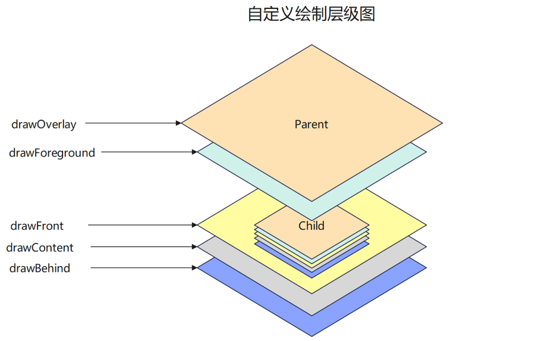
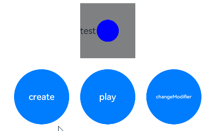
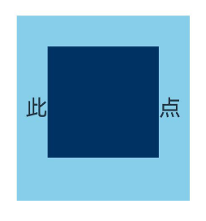

# 自定义绘制设置

当某些组件本身的绘制内容不满足需求时，可使用自定义组件绘制功能，在原有组件基础上部分绘制，或者全部自行绘制，以达到预期效果。例如：独特的按钮形状、文字和图像混合的图标等。自定义组件绘制提供了自定义绘制修改器，来实现更自由地组件绘制。

 

从API version 12开始支持。后续版本如有新增内容，则采用上角标单独标记该内容的起始版本。

## drawModifier

drawModifier(modifier: DrawModifier | undefined): T

设置组件的自定义绘制修改器。

 

该接口不支持在[attributeModifier](/ref/arkui-api/arkui-declarative-comp/ts-component-general-attributes/attribute-modifier-property/ts-universal-attributes-attribute-modifier/ts-universal-attributes-attribute-modifier#attributemodifier)中调用。

****元服务API：**** 从API version 12开始，该接口支持在元服务中使用。

****系统能力：**** SystemCapability.ArkUI.ArkUI.Full

****组件支持范围:****

[AlphabetIndexer](/ref/arkui-api/arkui-declarative-comp/information-display/ts-container-alphabet-indexer/ts-container-alphabet-indexer)、[Badge](/ref/arkui-api/arkui-declarative-comp/information-display/ts-container-badge/ts-container-badge)、[Blank](/ref/arkui-api/arkui-declarative-comp/blank-and-divider/ts-basic-components-blank/ts-basic-components-blank)、[Button](/ref/arkui-api/arkui-declarative-comp/buttons-and-selections/ts-basic-components-button/ts-basic-components-button)、[CalendarPicker](/ref/arkui-api/arkui-declarative-comp/buttons-and-selections/ts-basic-components-calendarpicker/ts-basic-components-calendarpicker)、[Checkbox](/ref/arkui-api/arkui-declarative-comp/buttons-and-selections/ts-basic-components-checkbox/ts-basic-components-checkbox)、[CheckboxGroup](/ref/arkui-api/arkui-declarative-comp/buttons-and-selections/ts-basic-components-checkboxgroup/ts-basic-components-checkboxgroup)、[Circle](/ref/arkui-api/arkui-declarative-comp/graphic-drawing/ts-drawing-components-circle/ts-drawing-components-circle)、[Column](/ref/arkui-api/arkui-declarative-comp/rows-columns-and-stacking/ts-container-column/ts-container-column)、[ColumnSplit](/ref/arkui-api/arkui-declarative-comp/grid-and-column-layout/ts-container-columnsplit/ts-container-columnsplit)、[Counter](/ref/arkui-api/arkui-declarative-comp/information-display/ts-container-counter/ts-container-counter)、[DataPanel](/ref/arkui-api/arkui-declarative-comp/information-display/ts-basic-components-datapanel/ts-basic-components-datapanel)、[DatePicker](/ref/arkui-api/arkui-declarative-comp/buttons-and-selections/ts-basic-components-datepicker/ts-basic-components-datepicker)、[Ellipse](/ref/arkui-api/arkui-declarative-comp/graphic-drawing/ts-drawing-components-ellipse/ts-drawing-components-ellipse)、[Flex](/ref/arkui-api/arkui-declarative-comp/rows-columns-and-stacking/ts-container-flex/ts-container-flex)、[FlowItem](/ref/arkui-api/arkui-declarative-comp/scroll-and-swipe/ts-container-flowitem/ts-container-flowitem)、[FolderStack](/ref/arkui-api/arkui-declarative-comp/system-preset-ui-component-library/ts-container-folderstack/ts-container-folderstack)、[FormLink](/ref/arkui-api/arkui-declarative-comp/service-widgets/ts-container-formlink/ts-container-formlink)、[Gauge](/ref/arkui-api/arkui-declarative-comp/information-display/ts-basic-components-gauge/ts-basic-components-gauge)、[Grid](/ref/arkui-api/arkui-declarative-comp/scroll-and-swipe/ts-container-grid/ts-container-grid)、[GridCol](/ref/arkui-api/arkui-declarative-comp/grid-and-column-layout/ts-container-gridcol/ts-container-gridcol)、[GridItem](/ref/arkui-api/arkui-declarative-comp/scroll-and-swipe/ts-container-griditem/ts-container-griditem)、[GridRow](/ref/arkui-api/arkui-declarative-comp/grid-and-column-layout/ts-container-gridrow/ts-container-gridrow)、[Hyperlink](/ref/arkui-api/arkui-declarative-comp/text-and-input/ts-container-hyperlink/ts-container-hyperlink)、[Image](/ref/arkui-api/arkui-declarative-comp/images-and-videos/ts-basic-components-image/ts-basic-components-image)、[ImageAnimator](/ref/arkui-api/arkui-declarative-comp/images-and-videos/ts-basic-components-imageanimator/ts-basic-components-imageanimator)、[ImageSpan](/ref/arkui-api/arkui-declarative-comp/text-and-input/ts-basic-components-imagespan/ts-basic-components-imagespan)、[Line](/ref/arkui-api/arkui-declarative-comp/graphic-drawing/ts-drawing-components-line/ts-drawing-components-line)、[List](/ref/arkui-api/arkui-declarative-comp/scroll-and-swipe/ts-container-list/ts-container-list)、[ListItem](/ref/arkui-api/arkui-declarative-comp/scroll-and-swipe/ts-container-listitem/ts-container-listitem)、[ListItemGroup](/ref/arkui-api/arkui-declarative-comp/scroll-and-swipe/ts-container-listitemgroup/ts-container-listitemgroup)、[LoadingProgress](/ref/arkui-api/arkui-declarative-comp/information-display/ts-basic-components-loadingprogress/ts-basic-components-loadingprogress)、[Marquee](/ref/arkui-api/arkui-declarative-comp/information-display/ts-basic-components-marquee/ts-basic-components-marquee)、[Menu](/ref/arkui-api/arkui-declarative-comp/menus/ts-basic-components-menu/ts-basic-components-menu)、[MenuItem](/ref/arkui-api/arkui-declarative-comp/menus/ts-basic-components-menuitem/ts-basic-components-menuitem)、[MenuItemGroup](/ref/arkui-api/arkui-declarative-comp/menus/ts-basic-components-menuitemgroup/ts-basic-components-menuitemgroup)、[NavDestination](/ref/arkui-api/arkui-declarative-comp/navigation-and-switching/ts-basic-components-navdestination/ts-basic-components-navdestination)、[Navigation](/ref/arkui-api/arkui-declarative-comp/navigation-and-switching/ts-basic-components-navigation/ts-basic-components-navigation)、[Navigator](/ref/arkui-api/arkui-declarative-comp/arkui-declarative-comp-dep/ts-container-navigator/ts-container-navigator)、[NavRouter](/ref/arkui-api/arkui-declarative-comp/arkui-declarative-comp-dep/ts-basic-components-navrouter/ts-basic-components-navrouter)、[NodeContainer](/ref/arkui-api/arkui-declarative-comp/custom-placeholder-comp/ts-basic-components-nodecontainer/ts-basic-components-nodecontainer)、[Path](/ref/arkui-api/arkui-declarative-comp/graphic-drawing/ts-drawing-components-path/ts-drawing-components-path)、[PatternLock](/ref/arkui-api/arkui-declarative-comp/information-display/ts-basic-components-patternlock/ts-basic-components-patternlock)、[Polygon](/ref/arkui-api/arkui-declarative-comp/graphic-drawing/ts-drawing-components-polygon/ts-drawing-components-polygon)、[Polyline](/ref/arkui-api/arkui-declarative-comp/graphic-drawing/ts-drawing-components-polyline/ts-drawing-components-polyline)、[Progress](/ref/arkui-api/arkui-declarative-comp/information-display/ts-basic-components-progress/ts-basic-components-progress)、[QRCode](/ref/arkui-api/arkui-declarative-comp/information-display/ts-basic-components-qrcode/ts-basic-components-qrcode)、[Radio](/ref/arkui-api/arkui-declarative-comp/buttons-and-selections/ts-basic-components-radio/ts-basic-components-radio)、[Rating](/ref/arkui-api/arkui-declarative-comp/buttons-and-selections/ts-basic-components-rating/ts-basic-components-rating)、[Rect](/ref/arkui-api/arkui-declarative-comp/graphic-drawing/ts-drawing-components-rect/ts-drawing-components-rect)、[Refresh](/ref/arkui-api/arkui-declarative-comp/scroll-and-swipe/ts-container-refresh/ts-container-refresh)、[RelativeContainer](/ref/arkui-api/arkui-declarative-comp/rows-columns-and-stacking/ts-container-relativecontainer/ts-container-relativecontainer)、[RichEditor](/ref/arkui-api/arkui-declarative-comp/text-and-input/ts-basic-components-richeditor/ts-basic-components-richeditor)、[Row](/ref/arkui-api/arkui-declarative-comp/rows-columns-and-stacking/ts-container-row/ts-container-row)、[RowSplit](/ref/arkui-api/arkui-declarative-comp/grid-and-column-layout/ts-container-rowsplit/ts-container-rowsplit)、[Scroll](/ref/arkui-api/arkui-declarative-comp/scroll-and-swipe/ts-container-scroll/ts-container-scroll)、[ScrollBar](/ref/arkui-api/arkui-declarative-comp/scroll-and-swipe/ts-basic-components-scrollbar/ts-basic-components-scrollbar)、[Search](/ref/arkui-api/arkui-declarative-comp/text-and-input/ts-basic-components-search/ts-basic-components-search)、[Select](/ref/arkui-api/arkui-declarative-comp/buttons-and-selections/ts-basic-components-select/ts-basic-components-select)、[Shape](/ref/arkui-api/arkui-declarative-comp/graphic-drawing/ts-drawing-components-shape/ts-drawing-components-shape)、[SideBarContainer](/ref/arkui-api/arkui-declarative-comp/grid-and-column-layout/ts-container-sidebarcontainer/ts-container-sidebarcontainer)、[Slider](/ref/arkui-api/arkui-declarative-comp/buttons-and-selections/ts-basic-components-slider/ts-basic-components-slider)、[Stack](/ref/arkui-api/arkui-declarative-comp/rows-columns-and-stacking/ts-container-stack/ts-container-stack)、[Stepper](/ref/arkui-api/arkui-declarative-comp/arkui-declarative-comp-dep/ts-basic-components-stepper/ts-basic-components-stepper)、[StepperItem](/ref/arkui-api/arkui-declarative-comp/arkui-declarative-comp-dep/ts-basic-components-stepperitem/ts-basic-components-stepperitem)、[Swiper](/ref/arkui-api/arkui-declarative-comp/scroll-and-swipe/ts-container-swiper/ts-container-swiper)、[SymbolGlyph](/ref/arkui-api/arkui-declarative-comp/text-and-input/ts-basic-components-symbolglyph/ts-basic-components-symbolglyph)、[TabContent](/ref/arkui-api/arkui-declarative-comp/navigation-and-switching/ts-container-tabcontent/ts-container-tabcontent)、[Tabs](/ref/arkui-api/arkui-declarative-comp/navigation-and-switching/ts-container-tabs/ts-container-tabs)、[Text](/ref/arkui-api/arkui-declarative-comp/text-and-input/ts-basic-components-text/ts-basic-components-text)、[TextArea](/ref/arkui-api/arkui-declarative-comp/text-and-input/ts-basic-components-textarea/ts-basic-components-textarea)、[TextClock](/ref/arkui-api/arkui-declarative-comp/information-display/ts-basic-components-textclock/ts-basic-components-textclock)、[TextInput](/ref/arkui-api/arkui-declarative-comp/text-and-input/ts-basic-components-textinput/ts-basic-components-textinput)、[TextPicker](/ref/arkui-api/arkui-declarative-comp/buttons-and-selections/ts-basic-components-textpicker/ts-basic-components-textpicker)、[TextTimer](/ref/arkui-api/arkui-declarative-comp/information-display/ts-basic-components-texttimer/ts-basic-components-texttimer)、[TimePicker](/ref/arkui-api/arkui-declarative-comp/buttons-and-selections/ts-basic-components-timepicker/ts-basic-components-timepicker)、[Toggle](/ref/arkui-api/arkui-declarative-comp/buttons-and-selections/ts-basic-components-toggle/ts-basic-components-toggle)、[WaterFlow](/ref/arkui-api/arkui-declarative-comp/scroll-and-swipe/ts-container-waterflow/ts-container-waterflow)、[XComponent](/ref/arkui-api/arkui-declarative-comp/rendering-drawing/ts-basic-components-xcomponent/ts-basic-components-xcomponent)

****参数：****

| 参数名 | 类型 | 必填 | 说明 |
| --- | --- | --- | --- |
| modifier | [DrawModifier](#drawmodifier-1) | undefined | 是 | 自定义绘制修改器，其中定义了自定义绘制的逻辑。  默认值：undefined  ****说明：****  每个自定义修改器只对当前绑定组件的[FrameNode](/ref/arkui-api/arkui-arkts/ui/ui-interface-arkui/js-apis-arkui-framenode/js-apis-arkui-framenode)生效，对其子节点不生效。 |

****返回值：****

| 类型 | 说明 |
| --- | --- |
| T | 返回当前组件。 |

## DrawModifier

DrawModifier可设置遮罩层前景（drawOverlay）、前景（drawForeground）、内容前景（drawFront）、内容（drawContent）和内容背景（drawBehind）的绘制方法，还提供主动触发重绘的方法[invalidate](#invalidate)。每个DrawModifier实例只能设置到一个组件上，禁止进行重复设置。

自定义层级示例图



****元服务API：**** 从API version 12开始，该接口支持在元服务中使用。

****系统能力：**** SystemCapability.ArkUI.ArkUI.Full

### drawFront

drawFront?(drawContext: DrawContext): void

自定义绘制内容前景的接口，若重载该方法则可进行内容前景的自定义绘制。

****元服务API：**** 从API version 12开始，该接口支持在元服务中使用。

****系统能力：**** SystemCapability.ArkUI.ArkUI.Full

****参数：****

| 参数名 | 类型 | 必填 | 说明 |
| --- | --- | --- | --- |
| drawContext | [DrawContext](#drawcontext) | 是 | 图形绘制上下文。 |

****示例：****

请参考[示例1（通过DrawModifier进行自定义绘制）](#示例1通过drawmodifier进行自定义绘制)。

### drawContent

drawContent?(drawContext: DrawContext): void

自定义绘制内容的接口，若重载该方法则可进行内容的自定义绘制，会替换组件原本的内容绘制函数。

该接口的[DrawContext](/ref/arkui-api/arkui-arkts/ui/ui-interface-arkui/js-apis-arkui-graphics/js-apis-arkui-graphics#drawcontext)中的Canvas是用于记录指令的临时Canvas，并非节点的真实Canvas。使用请参见[调整自定义绘制Canvas的变换矩阵](/arkui/arkts-ui-development/arkts-user-defined-capabilities/arkts-draw/arkts-user-defined-extension-drawmodifier#调整自定义绘制canvas的变换矩阵)。

****元服务API：**** 从API version 12开始，该接口支持在元服务中使用。

****系统能力：**** SystemCapability.ArkUI.ArkUI.Full

****参数：****

| 参数名 | 类型 | 必填 | 说明 |
| --- | --- | --- | --- |
| drawContext | [DrawContext](#drawcontext) | 是 | 图形绘制上下文。 |

****示例：****

请参考[示例1（通过DrawModifier进行自定义绘制）](#示例1通过drawmodifier进行自定义绘制)。

### drawBehind

drawBehind?(drawContext: DrawContext): void

自定义绘制背景的接口，若重载该方法则可进行背景的自定义绘制。

****元服务API：**** 从API version 12开始，该接口支持在元服务中使用。

****系统能力：**** SystemCapability.ArkUI.ArkUI.Full

****参数：****

| 参数名 | 类型 | 必填 | 说明 |
| --- | --- | --- | --- |
| drawContext | [DrawContext](#drawcontext) | 是 | 图形绘制上下文。 |

****示例：****

请参考[示例1（通过DrawModifier进行自定义绘制）](#示例1通过drawmodifier进行自定义绘制)。

### drawForeground20+

drawForeground(drawContext: DrawContext): void

自定义绘制前景的接口，若重载该方法则可进行前景的自定义绘制。需要对其组件的前景层进行绘制时重载该方法。

****元服务API：**** 从API version 20开始，该接口支持在元服务中使用。

****系统能力：**** SystemCapability.ArkUI.ArkUI.Full

****参数：****

| 参数名 | 类型 | 必填 | 说明 |
| --- | --- | --- | --- |
| drawContext | [DrawContext](#drawcontext) | 是 | 图形绘制上下文。 |

****示例：****

请参考[示例2（通过DrawModifier对容器的前景进行自定义绘制）](#示例2通过drawmodifier对容器的前景进行自定义绘制)。

### drawOverlay23+

drawOverlay(drawContext: DrawContext): void

自定义绘制遮罩层的接口，若重载该方法则可进行遮罩层的自定义绘制。需要对其组件的遮罩层进行绘制时重载该方法。

****元服务API：**** 从API version 23开始，该接口支持在元服务中使用。

****系统能力：**** SystemCapability.ArkUI.ArkUI.Full

****参数：****

| 参数名 | 类型 | 必填 | 说明 |
| --- | --- | --- | --- |
| drawContext | [DrawContext](#drawcontext) | 是 | 图形绘制上下文。 |

****示例：****

```
// test.ets
import { drawing } from '@kit.ArkGraphics2D';

class MyForegroundDrawModifier extends DrawModifier {
  public scaleX: number = 3;
  public scaleY: number = 3;
  uiContext: UIContext;

  constructor(uiContext: UIContext) {
    super();
    this.uiContext = uiContext;
  }

  // 重载drawOverlay方法，实现自定义绘制遮罩层前景
  drawOverlay(context: DrawContext): void {
    const brush = new drawing.Brush();
    brush.setColor({
      alpha: 255,
      red: 0,
      green: 50,
      blue: 100
    });
    context.canvas.attachBrush(brush);
    const halfWidth = context.size.width / 2;
    const halfHeight = context.size.height / 2;
    context.canvas.drawRect({
      left: this.uiContext.vp2px(halfWidth - 30 * this.scaleX),
      top: this.uiContext.vp2px(halfHeight - 30 * this.scaleY),
      right: this.uiContext.vp2px(halfWidth + 30 * this.scaleX),
      bottom: this.uiContext.vp2px(halfHeight + 60 * this.scaleY)
    });
  }
}

@Entry
@Component
struct DrawModifierExample {
  // 将自定义绘制遮罩层前景的类实例化，传入UIContext实例
  private overlayModifier: MyForegroundDrawModifier = new MyForegroundDrawModifier(this.getUIContext());

  build() {
    Column() {
      Text('此文本是子节点')
        .fontSize(36)
        .width('100%')
        .height('100%')
        .textAlign(TextAlign.Center)
    }
    .margin(50)
    .width(280)
    .height(300)
    .backgroundColor(0x87CEEB)
    // 调用此接口并传入自定义绘制前景的类实例，即可实现自定义绘制前景
    .drawModifier(this.overlayModifier)
  }
}
```

### invalidate

invalidate(): void

主动触发重绘的接口，开发者无需也无法重载，调用会触发所绑定组件的重绘。

****元服务API：**** 从API version 12开始，该接口支持在元服务中使用。

****系统能力：**** SystemCapability.ArkUI.ArkUI.Full

****示例：****

请参考[示例1（通过DrawModifier进行自定义绘制）](#示例1通过drawmodifier进行自定义绘制)。

### DrawContext

type DrawContext = DrawContext

****元服务API：**** 从API version 12开始，该接口支持在元服务中使用。

****系统能力：**** SystemCapability.ArkUI.ArkUI.Full

| 类型 | 说明 |
| --- | --- |
| [DrawContext](/ref/arkui-api/arkui-arkts/ui/ui-interface-arkui/js-apis-arkui-graphics/js-apis-arkui-graphics#drawcontext) | 图形绘制上下文。 |

## 示例

### 示例1（通过DrawModifier进行自定义绘制）

通过DrawModifier对[Text](/ref/arkui-api/arkui-declarative-comp/text-and-input/ts-basic-components-text/ts-basic-components-text)组件进行自定义绘制。

```
// xxx.ets
import { drawing } from '@kit.ArkGraphics2D';
import { AnimatorResult } from '@kit.ArkUI';

// 继承DrawModifier实现自定义绘制控制器
class MyFullDrawModifier extends DrawModifier {
  public scaleX: number = 1;
  public scaleY: number = 1;
  uiContext: UIContext;

  constructor(uiContext: UIContext) {
    super();
    this.uiContext = uiContext;
  }

  // 重载drawBehind方法，自定义绘制背景
  drawBehind(context: DrawContext): void {
    const brush = new drawing.Brush();
    brush.setColor({
      alpha: 255,
      red: 255,
      green: 0,
      blue: 0
    });
    context.canvas.attachBrush(brush);
    const halfWidth = context.size.width / 2;
    const halfHeight = context.size.height / 2;
    context.canvas.drawRect({
      left: this.uiContext.vp2px(halfWidth - 50 * this.scaleX),
      top: this.uiContext.vp2px(halfHeight - 50 * this.scaleY),
      right: this.uiContext.vp2px(halfWidth + 50 * this.scaleX),
      bottom: this.uiContext.vp2px(halfHeight + 50 * this.scaleY)
    });
  }

  // 重载drawContent方法，自定义绘制内容
  drawContent(context: DrawContext): void {
    const brush = new drawing.Brush();
    brush.setColor({
      alpha: 255,
      red: 0,
      green: 255,
      blue: 0
    });
    context.canvas.attachBrush(brush);
    const halfWidth = context.size.width / 2;
    const halfHeight = context.size.height / 2;
    context.canvas.drawRect({
      left: this.uiContext.vp2px(halfWidth - 30 * this.scaleX),
      top: this.uiContext.vp2px(halfHeight - 30 * this.scaleY),
      right: this.uiContext.vp2px(halfWidth + 30 * this.scaleX),
      bottom: this.uiContext.vp2px(halfHeight + 30 * this.scaleY)
    });
  }

  // 重载drawFront方法，自定义绘制内容前景
  drawFront(context: DrawContext): void {
    const brush = new drawing.Brush();
    brush.setColor({
      alpha: 255,
      red: 0,
      green: 0,
      blue: 255
    });
    context.canvas.attachBrush(brush);
    const halfWidth = context.size.width / 2;
    const halfHeight = context.size.height / 2;
    const radiusScale = (this.scaleX + this.scaleY) / 2;
    context.canvas.drawCircle(this.uiContext.vp2px(halfWidth), this.uiContext.vp2px(halfHeight),
      this.uiContext.vp2px(20 * radiusScale));
  }
}

// 继承DrawModifier实现自定义绘制控制器，仅支持自定义绘制内容前景
class MyFrontDrawModifier extends DrawModifier {
  public scaleX: number = 1;
  public scaleY: number = 1;
  uiContext: UIContext;

  constructor(uiContext: UIContext) {
    super();
    this.uiContext = uiContext;
  }

  drawFront(context: DrawContext): void {
    const brush = new drawing.Brush();
    brush.setColor({
      alpha: 255,
      red: 0,
      green: 0,
      blue: 255
    });
    context.canvas.attachBrush(brush);
    const halfWidth = context.size.width / 2;
    const halfHeight = context.size.height / 2;
    const radiusScale = (this.scaleX + this.scaleY) / 2;
    context.canvas.drawCircle(this.uiContext.vp2px(halfWidth), this.uiContext.vp2px(halfHeight),
      this.uiContext.vp2px(20 * radiusScale));
  }
}

@Entry
@Component
struct DrawModifierExample {
  private fullModifier: MyFullDrawModifier = new MyFullDrawModifier(this.getUIContext());
  private frontModifier: MyFrontDrawModifier = new MyFrontDrawModifier(this.getUIContext());
  private drawAnimator: AnimatorResult | undefined = undefined;
  @State modifier: DrawModifier = new MyFrontDrawModifier(this.getUIContext());
  private count = 0;

  // 创建Animator对象并设置动画
  create() {
    let self = this;
    this.drawAnimator = this.getUIContext().createAnimator({
      duration: 1000,
      easing: 'ease',
      delay: 0,
      fill: 'forwards',
      direction: 'normal',
      iterations: 1,
      begin: 0,
      end: 2
    });
    this.drawAnimator.onFrame = (value: number) => {
      console.info('frame value =', value);
      const tempModifier = self.modifier as MyFullDrawModifier | MyFrontDrawModifier;
      tempModifier.scaleX = Math.abs(value - 1);
      tempModifier.scaleY = Math.abs(value - 1);
      // 主动触发重绘
      self.modifier.invalidate();
    };
  }

  build() {
    Column() {
      Row() {
        Text('test text')
          .width(100)
          .height(100)
          .margin(10)
          .backgroundColor(Color.Gray)
          .onClick(() => {
            const tempModifier = this.modifier as MyFullDrawModifier | MyFrontDrawModifier;
            tempModifier.scaleX -= 0.1;
            tempModifier.scaleY -= 0.1;
          })
          .drawModifier(this.modifier)
      }

      Row() {
        Button('create')
          .width(100)
          .height(100)
          .borderRadius(50)
          .margin(10)
          .onClick(() => {
            this.create();
          })
        Button('play')
          .width(100)
          .height(100)
          .borderRadius(50)
          .margin(10)
          .onClick(() => {
            if (this.drawAnimator) {
              this.drawAnimator.play();
            }
          })
        Button('changeModifier')
          .width(100)
          .height(100)
          .borderRadius(50)
          .margin(10)
          .onClick(() => {
            this.count += 1;
            if (this.count % 2 === 1) {
              console.info('change to full modifier');
              this.modifier = this.fullModifier;
            } else {
              console.info('change to front modifier');
              this.modifier = this.frontModifier;
            }
          })
      }
    }
    .width('100%')
    .height('100%')
  }
}
```



### 示例2（通过DrawModifier对容器的前景进行自定义绘制）

通过DrawModifier对[Column](/ref/arkui-api/arkui-declarative-comp/rows-columns-and-stacking/ts-container-column/ts-container-column)容器的前景进行自定义绘制。

```
// xxx.ets
import { drawing } from '@kit.ArkGraphics2D';

class MyForegroundDrawModifier extends DrawModifier {
  public scaleX: number = 3;
  public scaleY: number = 3;
  uiContext: UIContext;

  constructor(uiContext: UIContext) {
    super();
    this.uiContext = uiContext;
  }

  // 重载drawForeground方法，实现自定义绘制前景
  drawForeground(context: DrawContext): void {
    const brush = new drawing.Brush();
    brush.setColor({
      alpha: 255,
      red: 0,
      green: 50,
      blue: 100
    });
    context.canvas.attachBrush(brush);
    const halfWidth = context.size.width / 2;
    const halfHeight = context.size.height / 2;
    context.canvas.drawRect({
      left: this.uiContext.vp2px(halfWidth - 30 * this.scaleX),
      top: this.uiContext.vp2px(halfHeight - 30 * this.scaleY),
      right: this.uiContext.vp2px(halfWidth + 30 * this.scaleX),
      bottom: this.uiContext.vp2px(halfHeight + 30 * this.scaleY)
    });
  }
}

@Entry
@Component
struct DrawModifierExample {
  // 将自定义绘制前景的类实例化，传入UIContext实例
  private foregroundModifier: MyForegroundDrawModifier = new MyForegroundDrawModifier(this.getUIContext());

  build() {
    Column() {
      Text('此文本是子节点')
        .fontSize(36)
        .width('100%')
        .height('100%')
        .textAlign(TextAlign.Center)
    }
    .margin(50)
    .width(280)
    .height(300)
    .backgroundColor(0x87CEEB)
    // 调用此接口并传入自定义绘制前景的类实例，即可实现自定义绘制前景
    .drawModifier(this.foregroundModifier)
  }
}
```


