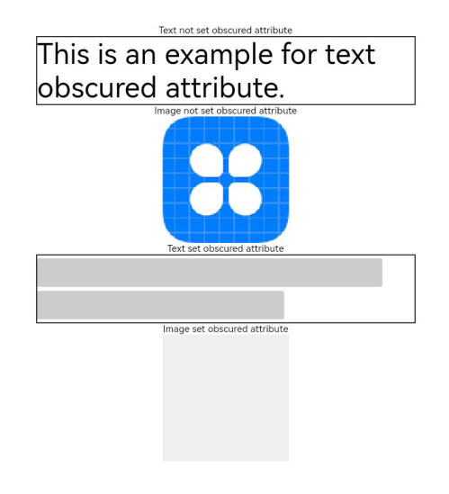

# 隐私遮罩

用于对组件内容进行隐私遮罩处理。

 

从API version 10开始支持。后续版本如有新增内容，则采用上角标单独标记该内容的起始版本。

## obscured

obscured(reasons: Array&lt;ObscuredReasons&gt;): T

设置组件内容的遮罩类型。

****元服务API：**** 从API version 11开始，该接口支持在元服务中使用。

****系统能力：**** SystemCapability.ArkUI.ArkUI.Full

****参数：****

| 参数名 | 类型 | 必填 | 说明 |
| --- | --- | --- | --- |
| reasons | Array&lt;[ObscuredReasons](/ref/arkui-api/arkui-declarative-comp/common-definitions/ts-appendix-enums/ts-appendix-enums#obscuredreasons10)&gt; | 是 | 设置组件内容的遮罩类型。  默认值：[]  仅支持[Image](/ref/arkui-api/arkui-declarative-comp/images-and-videos/ts-basic-components-image/ts-basic-components-image)组件、[Text](/ref/arkui-api/arkui-declarative-comp/text-and-input/ts-basic-components-text/ts-basic-components-text)组件的隐私遮罩处理。  ****说明：****  如需在图片加载过程中显示隐私遮罩，需要设置Image组件的宽度和高度。  Text组件设置子组件或设置[属性字符串](/ref/arkui-api/arkui-declarative-comp/text-and-input/ts-universal-styled-string/ts-universal-styled-string)时，不支持隐私遮罩。 |

****返回值：****

| 类型 | 说明 |
| --- | --- |
| T | 返回当前组件。 |

## 示例

该示例通过obscured对Text、Image组件实现了隐私遮罩效果。

```
// xxx.ets
@Entry
@Component
struct ObscuredExample {
  build() {
    Row() {
      Column() {
        Text('Text not set obscured attribute').fontSize(10).fontColor(Color.Black)
        Text('This is an example for text obscured attribute.')
          .fontSize(30)
          .width('600px')
          .fontColor(Color.Black)
          .border({ width: 1 })
        Text('Image not set obscured attribute').fontSize(10).fontColor(Color.Black)
        // $r('app.media.icon')需要替换为开发者所需的图像资源文件。
        Image($r('app.media.icon'))
          .width('200px')
          .height('200px')
        Text('Text set obscured attribute').fontSize(10).fontColor(Color.Black)
        Text('This is an example for text obscured attribute.')
          .fontSize(30)
          .width('600px')
          .fontColor(Color.Black)
          .border({ width: 1 })
          .obscured([ObscuredReasons.PLACEHOLDER])
        Text('Image set obscured attribute').fontSize(10).fontColor(Color.Black)
        // $r('app.media.icon')需要替换为开发者所需的图像资源文件。
        Image($r('app.media.icon'))
          .width('200px')
          .height('200px')
          .obscured([ObscuredReasons.PLACEHOLDER])
      }
      .width('100%')
    }
    .height('100%')
  }
}
```


