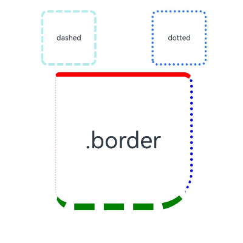
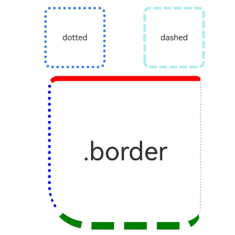

# 边框设置

设置组件边框样式。

 

从API version 7开始支持。后续版本如有新增内容，则采用上角标单独标记该内容的起始版本。

## border

border(value: BorderOptions): T

设置边框样式。

****卡片能力：**** 从API version 9开始，该接口支持在ArkTS卡片中使用。

****元服务API：**** 从API version 11开始，该接口支持在元服务中使用。

****系统能力：**** SystemCapability.ArkUI.ArkUI.Full

****参数：****

| 参数名 | 类型 | 必填 | 说明 |
| --- | --- | --- | --- |
| value | [BorderOptions](/ref/arkui-api/arkui-declarative-comp/common-definitions/ts-types/ts-types#borderoptions) | 是 | 统一边框样式设置接口。  ****说明：****  边框宽度默认值为0，即不显示边框。  从API version 9开始，父节点的border显示在子节点内容之上。 |

****返回值：****

| 类型 | 说明 |
| --- | --- |
| T | 返回当前组件。 |

 

color、radius缺省时，为了保证[borderColor](#bordercolor)、[borderRadius](#borderradius)生效，需要将[borderColor](#bordercolor)、[borderRadius](#borderradius)设置在[border](#border)后。

## borderStyle

borderStyle(value: BorderStyle | EdgeStyles): T

设置元素的边框线条样式。

****卡片能力：**** 从API version 9开始，该接口支持在ArkTS卡片中使用。

****元服务API：**** 从API version 11开始，该接口支持在元服务中使用。

****系统能力：**** SystemCapability.ArkUI.ArkUI.Full

****参数：****

| 参数名 | 类型 | 必填 | 说明 |
| --- | --- | --- | --- |
| value | [BorderStyle](/ref/arkui-api/arkui-declarative-comp/common-definitions/ts-appendix-enums/ts-appendix-enums#borderstyle) | [EdgeStyles](/ref/arkui-api/arkui-declarative-comp/common-definitions/ts-types/ts-types#edgestyles9)9+ | 是 | 设置元素的边框样式。  默认值：BorderStyle.Solid |

****返回值：****

| 类型 | 说明 |
| --- | --- |
| T | 返回当前组件。 |

## borderWidth

borderWidth(value: Length | EdgeWidths | LocalizedEdgeWidths): T

设置边框的宽度。

****卡片能力：**** 从API version 9开始，该接口支持在ArkTS卡片中使用。

****元服务API：**** 从API version 11开始，该接口支持在元服务中使用。

****系统能力：**** SystemCapability.ArkUI.ArkUI.Full

****参数：****

| 参数名 | 类型 | 必填 | 说明 |
| --- | --- | --- | --- |
| value | [Length](/ref/arkui-api/arkui-declarative-comp/common-definitions/ts-types/ts-types#length) | [EdgeWidths](/ref/arkui-api/arkui-declarative-comp/common-definitions/ts-types/ts-types#edgewidths9)9+ | [LocalizedEdgeWidths](/ref/arkui-api/arkui-declarative-comp/common-definitions/ts-types/ts-types#localizededgewidths12)12+ | 是 | 设置元素的边框宽度，不支持百分比。 |

****返回值：****

| 类型 | 说明 |
| --- | --- |
| T | 返回当前组件。 |

## borderColor

borderColor(value: ResourceColor | EdgeColors | LocalizedEdgeColors): T

设置边框的颜色。

****卡片能力：**** 从API version 9开始，该接口支持在ArkTS卡片中使用。

****元服务API：**** 从API version 11开始，该接口支持在元服务中使用。

****系统能力：**** SystemCapability.ArkUI.ArkUI.Full

****参数：****

| 参数名 | 类型 | 必填 | 说明 |
| --- | --- | --- | --- |
| value | [ResourceColor](/ref/arkui-api/arkui-declarative-comp/common-definitions/ts-types/ts-types#resourcecolor) | [EdgeColors](/ref/arkui-api/arkui-declarative-comp/common-definitions/ts-types/ts-types#edgecolors9)9+ | [LocalizedEdgeColors](/ref/arkui-api/arkui-declarative-comp/common-definitions/ts-types/ts-types#localizededgecolors12)12+ | 是 | 设置元素的边框颜色。  默认值：Color.Black |

****返回值：****

| 类型 | 说明 |
| --- | --- |
| T | 返回当前组件。 |

## borderRadius

borderRadius(value: Length | BorderRadiuses | LocalizedBorderRadiuses): T

设置边框的圆角半径。

****卡片能力：**** 从API version 9开始，该接口支持在ArkTS卡片中使用。

****元服务API：**** 从API version 11开始，该接口支持在元服务中使用。

****系统能力：**** SystemCapability.ArkUI.ArkUI.Full

****参数：****

| 参数名 | 类型 | 必填 | 说明 |
| --- | --- | --- | --- |
| value | [Length](/ref/arkui-api/arkui-declarative-comp/common-definitions/ts-types/ts-types#length) | [BorderRadiuses](/ref/arkui-api/arkui-declarative-comp/common-definitions/ts-types/ts-types#borderradiuses9)9+ | [LocalizedBorderRadiuses](/ref/arkui-api/arkui-declarative-comp/common-definitions/ts-types/ts-types#localizedborderradiuses12)12+ | 是 | 设置元素的边框圆角半径，支持百分比，百分比依据组件宽度。设置圆角后，可搭配[clip](/ref/arkui-api/arkui-declarative-comp/ts-component-general-attributes/visual-effect-property/ts-universal-attributes-sharp-clipping/ts-universal-attributes-sharp-clipping#clip12)属性进行裁剪，避免子组件超出组件自身。  设置四个不同圆角值，若某个圆角值超过高度或者宽度最小值一半时，按值的比例绘制异形圆角。 |

****返回值：****

| 类型 | 说明 |
| --- | --- |
| T | 返回当前组件。 |

## borderRadius22+

borderRadius(value: Length | BorderRadiuses | LocalizedBorderRadiuses, type?: RenderStrategy): T

设置边框的圆角半径和绘制圆角的模式。

****卡片能力：**** 从API version 22开始，该接口支持在ArkTS卡片中使用。

****元服务API：**** 从API version 22开始，该接口支持在元服务中使用。

****系统能力：**** SystemCapability.ArkUI.ArkUI.Full

****参数：****

| 参数名 | 类型 | 必填 | 说明 |
| --- | --- | --- | --- |
| value | [Length](/ref/arkui-api/arkui-declarative-comp/common-definitions/ts-types/ts-types#length) | [BorderRadiuses](/ref/arkui-api/arkui-declarative-comp/common-definitions/ts-types/ts-types#borderradiuses9) | [LocalizedBorderRadiuses](/ref/arkui-api/arkui-declarative-comp/common-definitions/ts-types/ts-types#localizedborderradiuses12) | 是 | 设置元素的边框圆角半径，支持百分比，百分比依据组件宽度。设置圆角后，可搭配[clip](/ref/arkui-api/arkui-declarative-comp/ts-component-general-attributes/visual-effect-property/ts-universal-attributes-sharp-clipping/ts-universal-attributes-sharp-clipping#clip12)属性进行裁剪，避免子组件超出组件自身。 |
| type | [RenderStrategy](/ref/arkui-api/arkui-declarative-comp/common-definitions/ts-appendix-enums/ts-appendix-enums#renderstrategy22) | 否 | 设置组件绘制圆角的模式。  默认值：RenderStrategy.FAST |

****返回值：****

| 类型 | 说明 |
| --- | --- |
| T | 返回当前组件。 |

## 示例

### 示例1（基本样式用法）

设置边框的宽度、颜色、圆角半径以及点、线样式。

```
// xxx.ets
@Entry
@Component
struct BorderExample {
  build() {
    Column() {
      Flex({ justifyContent: FlexAlign.SpaceAround, alignItems: ItemAlign.Center }) {
        // 线段
        Text('dashed')
          .borderStyle(BorderStyle.Dashed)
          .borderWidth(5)
          .borderColor(0xAFEEEE)
          .borderRadius(10)
          .width(120)
          .height(120)
          .textAlign(TextAlign.Center)
          .fontSize(16)
        // 点线
        Text('dotted')
          .border({
            width: 5,
            color: 0x317AF7,
            radius: 10,
            style: BorderStyle.Dotted
          })
          .width(120)
          .height(120)
          .textAlign(TextAlign.Center)
          .fontSize(16)
      }.width('100%').height(150)

      Text('.border')
        .fontSize(50)
        .width(300)
        .height(300)
        .border({
          width: {
            left: 3,
            right: 6,
            top: 10,
            bottom: 15
          },
          color: {
            left: '#e3bbbb',
            right: Color.Blue,
            top: Color.Red,
            bottom: Color.Green
          },
          radius: {
            topLeft: 10,
            topRight: 20,
            bottomLeft: 40,
            bottomRight: 80
          },
          style: {
            left: BorderStyle.Dotted,
            right: BorderStyle.Dotted,
            top: BorderStyle.Solid,
            bottom: BorderStyle.Dashed
          }
        })
        .textAlign(TextAlign.Center)
    }
  }
}
```


### 示例2（边框宽度类型和边框颜色）

border属性的width、radius、color属性值使用LocalizedEdgeWidths类型和LocalizedEdgeColors类型。

```
// xxx.ets
import { LengthMetrics } from '@kit.ArkUI';

@Entry
@Component
struct BorderExample {
  build() {
    Column() {
      Flex({ justifyContent: FlexAlign.SpaceAround, alignItems: ItemAlign.Center }) {
        // 线段
        Text('dashed')
          .borderStyle(BorderStyle.Dashed)
          .borderWidth(5)
          .borderColor(0xAFEEEE)
          .borderRadius(10)
          .width(120)
          .height(120)
          .textAlign(TextAlign.Center)
          .fontSize(16)
        // 点线
        Text('dotted')
          .border({
            width: 5,
            color: 0x317AF7,
            radius: 10,
            style: BorderStyle.Dotted
          })
          .width(120)
          .height(120)
          .textAlign(TextAlign.Center)
          .fontSize(16)
      }.width('100%').height(150)

      Text('.border')
        .fontSize(50)
        .width(300)
        .height(300)
        .border({
          width: {
            start: LengthMetrics.vp(3),
            end: LengthMetrics.vp(6),
            top: LengthMetrics.vp(10),
            bottom: LengthMetrics.vp(15)
          },
          color: {
            start: '#e3bbbb',
            end: Color.Blue,
            top: Color.Red,
            bottom: Color.Green
          },
          radius: {
            topStart: LengthMetrics.vp(10),
            topEnd: LengthMetrics.vp(20),
            bottomStart: LengthMetrics.vp(40),
            bottomEnd: LengthMetrics.vp(80)
          },
          style: {
            left: BorderStyle.Dotted,
            right: BorderStyle.Dotted,
            top: BorderStyle.Solid,
            bottom: BorderStyle.Dashed
          }
        })
        .textAlign(TextAlign.Center)
    }
  }
}
```

从左至右显示语言示例图



从右至左显示语言示例图



### 示例3（设置离屏圆角）

从API version 22开始，该示例支持设置组件绘制圆角的模式。

```
// xxx.ets
@Entry
@Component
struct RenderStrategyExample {
  build() {
    NavDestination() {
      Column({ space: 20 }) {
        Stack() {
          Column()
            .width(320)
            .height(320)
            .backgroundColor(Color.Black)

          Stack() {
            Stack() {
              Scroll(new Scroller()) {
                Image($r('app.media.startIcon'))
                  .width('100%')
                  .height('200%')
              }

              Column()
                .blur(50)
                .width(300)
                .height(100)
                .position({ x: 0, y: 0 })
            }
          }
          .width(300)
          .height(300)
          .backgroundColor(Color.Pink)
          .borderRadius(50, RenderStrategy.FAST)
          .clip(true)
        }

        Stack() {
          Column()
            .width(320)
            .height(320)
            .backgroundColor(Color.Black)

          Stack() {
            Stack() {
              Scroll(new Scroller()) {
                Image($r('app.media.startIcon'))
                  .width('100%')
                  .height('200%')
              }

              Column()
                .blur(50)
                .width(300)
                .height(100)
                .position({ x: 0, y: 0 })
            }
          }
          .width(300)
          .height(300)
          .backgroundColor(Color.Pink)
          .borderRadius(50, RenderStrategy.OFFSCREEN)
          .clip(true)
        }
      }
    }
    .width('100%')
    .height('100%')
  }
}
```

设置在线绘制模式（上方）以及离屏绘制模式（下方）的示例图如下：


### 示例4（设置异形圆角）

该示例通过[borderRadius](#borderradius)设置四个不同圆角值。当其中一个圆角值超过高度或宽度最小值的一半时，按值的比例绘制异形圆角。

```
// xxx.ets
@Entry
@Component
struct BorderExample {
  build() {
    Column() {
      Flex({ justifyContent: FlexAlign.SpaceAround, alignItems: ItemAlign.Center }) {
        Text('Text')
          .borderWidth(5)
          .borderColor(0xAFEEEE)
          .borderRadius({
            topLeft: 2000,
            topRight: 10,
            bottomLeft: 30,
            bottomRight: 50
          })
          .width(100)
          .height(100)
          .textAlign(TextAlign.Center)
          .fontSize(16)
      }
    }
  }
}
```


