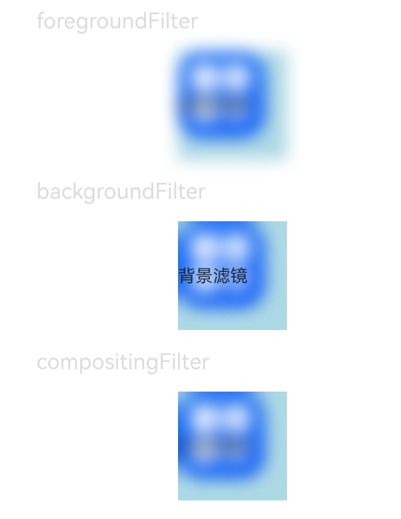

# 视效设置

本模块提供接口设置组件视觉效果，包括滤镜效果（如：模糊，像素扩展等）和非滤镜效果（如：点光源等）。

 

从API version 12开始支持。后续版本如有新增内容，则采用上角标单独标记该内容的起始版本。

## visualEffect

visualEffect(effect: VisualEffect): T

设置非滤镜视觉效果。

 

从API version 20开始，该接口支持在[attributeModifier](/ref/arkui-api/arkui-declarative-comp/ts-component-general-attributes/attribute-modifier-property/ts-universal-attributes-attribute-modifier/ts-universal-attributes-attribute-modifier#attributemodifier)中调用。

****元服务API：**** 从API version 12开始，该接口支持在元服务中使用。

****系统能力：**** SystemCapability.ArkUI.ArkUI.Full

****参数：****

| 参数名 | 类型 | 必填 | 说明 |
| --- | --- | --- | --- |
| effect | [VisualEffect](#visualeffect-1) | 是 | 非滤镜视觉效果。 |

****返回值：****

| 类型 | 说明 |
| --- | --- |
| T | 返回当前组件。 |

## backgroundFilter

backgroundFilter(filter: Filter): T

设置背景滤镜视觉效果。

 

从API version 20开始，该接口支持在[attributeModifier](/ref/arkui-api/arkui-declarative-comp/ts-component-general-attributes/attribute-modifier-property/ts-universal-attributes-attribute-modifier/ts-universal-attributes-attribute-modifier#attributemodifier)中调用。

****元服务API：**** 从API version 12开始，该接口支持在元服务中使用。

****系统能力：**** SystemCapability.ArkUI.ArkUI.Full

****参数：****

| 参数名 | 类型 | 必填 | 说明 |
| --- | --- | --- | --- |
| filter | [Filter](#filter) | 是 | 背景滤镜视觉效果。 |

****返回值：****

| 类型 | 说明 |
| --- | --- |
| T | 返回当前组件。 |

## foregroundFilter

foregroundFilter(filter: Filter): T

设置前景滤镜（内容）视觉效果。

 

从API version 20开始，该接口支持在[attributeModifier](/ref/arkui-api/arkui-declarative-comp/ts-component-general-attributes/attribute-modifier-property/ts-universal-attributes-attribute-modifier/ts-universal-attributes-attribute-modifier#attributemodifier)中调用。

****元服务API：**** 从API version 12开始，该接口支持在元服务中使用。

****系统能力：**** SystemCapability.ArkUI.ArkUI.Full

****参数：****

| 参数名 | 类型 | 必填 | 说明 |
| --- | --- | --- | --- |
| filter | [Filter](#filter) | 是 | 前景滤镜（内容）视觉效果。 |

****返回值：****

| 类型 | 说明 |
| --- | --- |
| T | 返回当前组件。 |

## compositingFilter

compositingFilter(filter: Filter): T

设置合成滤镜视觉效果。

 

从API version 20开始，该接口支持在[attributeModifier](/ref/arkui-api/arkui-declarative-comp/ts-component-general-attributes/attribute-modifier-property/ts-universal-attributes-attribute-modifier/ts-universal-attributes-attribute-modifier#attributemodifier)中调用。

****元服务API：**** 从API version 12开始，该接口支持在元服务中使用。

****系统能力：**** SystemCapability.ArkUI.ArkUI.Full

****参数：****

| 参数名 | 类型 | 必填 | 说明 |
| --- | --- | --- | --- |
| filter | [Filter](#filter) | 是 | 合成滤镜视觉效果。 |

****返回值：****

| 类型 | 说明 |
| --- | --- |
| T | 返回当前组件。 |

## materialFilter23+

materialFilter(filter: Filter | undefined): T

设置系统材质滤镜效果，系统材质滤镜的绘制早于[backgroundFilter](#backgroundfilter)绘制，即位于backgroundFilter的更底层。

 

该接口支持在[attributeModifier](/ref/arkui-api/arkui-declarative-comp/ts-component-general-attributes/attribute-modifier-property/ts-universal-attributes-attribute-modifier/ts-universal-attributes-attribute-modifier#attributemodifier)中调用。

****元服务API：**** 从API version 23开始，该接口支持在元服务中使用。

****系统能力：**** SystemCapability.ArkUI.ArkUI.Full

****参数：****

| 参数名 | 类型 | 必填 | 说明 |
| --- | --- | --- | --- |
| filter | [Filter](#filter) | undefined | 是 | 系统材质滤镜视觉效果。设置为undefined时恢复为无系统材质滤镜效果。 |

****返回值：****

| 类型 | 说明 |
| --- | --- |
| T | 返回当前组件。 |

## Filter

type Filter = Filter

导入Filter类型对象。

****元服务API：**** 从API version 12开始，该接口支持在元服务中使用。

****系统能力：**** SystemCapability.ArkUI.ArkUI.Full

| 类型 | 说明 |
| --- | --- |
| [Filter](/ref/arkgraphics-api/arkgraphics-arkts/js-apis-uieffect/js-apis-uieffect#filter) | 用于将相应的效果添加到指定的组件上。 |

## VisualEffect

type VisualEffect = VisualEffect

导入VisualEffect类型对象。

****元服务API：**** 从API version 12开始，该接口支持在元服务中使用。

****系统能力：**** SystemCapability.ArkUI.ArkUI.Full

| 类型 | 说明 |
| --- | --- |
| [VisualEffect](/ref/arkgraphics-api/arkgraphics-arkts/js-apis-uieffect/js-apis-uieffect#visualeffect) | 用于将相应的效果添加到指定的组件上。 |

## 示例

该示例主要演示前景滤镜、背景滤镜和合成滤镜的模糊效果。

```
// xxx.ets
import { uiEffect } from '@kit.ArkGraphics2D';

@Entry
@Component
struct FilterEffectExample {
  @State filterTest1: uiEffect.Filter = uiEffect.createFilter().blur(10);
  @State filterTest2: uiEffect.Filter = uiEffect.createFilter().blur(10);
  @State filterTest3: uiEffect.Filter = uiEffect.createFilter().blur(10);

  build() {
    Column({ space: 15 }) {

      Text('foregroundFilter').fontSize(20).width('75%').fontColor('#DCDCDC')
      Text('前景滤镜')
        .width(100)
        .height(100)
        .backgroundColor('#ADD8E6')
        // $r("app.media.app_icon")需替换为开发者所需的资源文件
        .backgroundImage($r("app.media.app_icon"))
        .backgroundImageSize({ width: 80, height: 80 })
        .foregroundFilter(this.filterTest1) // 通过 foregroundFilter 设置模糊效果

      Text('backgroundFilter').fontSize(20).width('75%').fontColor('#DCDCDC')
      Text('背景滤镜')
        .width(100)
        .height(100)
        .backgroundColor('#ADD8E6')
        // $r("app.media.app_icon")需替换为开发者所需的资源文件
        .backgroundImage($r("app.media.app_icon"))
        .backgroundImageSize({ width: 80, height: 80 })
        .backgroundFilter(this.filterTest2) // 通过 backgroundFilter 设置模糊效果

      Text('compositingFilter').fontSize(20).width('75%').fontColor('#DCDCDC')
      Text('合成滤镜')
        .width(100)
        .height(100)
        .backgroundColor('#ADD8E6')
        // $r("app.media.app_icon")需替换为开发者所需的资源文件
        .backgroundImage($r("app.media.app_icon"))
        .backgroundImageSize({ width: 80, height: 80 })
        .compositingFilter(this.filterTest3) // 通过 compositingFilter 设置模糊效果
    }
    .height('100%')
    .width('100%')
  }
}
```


