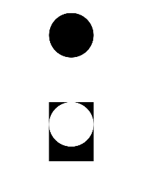

# 前景色设置

设置组件的前景色。与背景色相对应，前景色会影响绘制组件内容的颜色。主要影响文字的颜色、形状绘制组件的填充色。

 

从API version 10开始支持。后续版本如有新增内容，则采用上角标单独标记该内容的起始版本。

## foregroundColor

foregroundColor(value: ResourceColor | ColoringStrategy): T

设置组件的前景色。当组件未设置前景色，默认继承父组件。

****元服务API：**** 从API version 11开始，该接口支持在元服务中使用。

****系统能力：**** SystemCapability.ArkUI.ArkUI.Full

****参数：****

| 参数名 | 类型 | 必填 | 说明 |
| --- | --- | --- | --- |
| value | [ResourceColor](/ref/arkui-api/arkui-declarative-comp/common-definitions/ts-types/ts-types#resourcecolor) | [ColoringStrategy](/ref/arkui-api/arkui-declarative-comp/common-definitions/ts-appendix-enums/ts-appendix-enums#coloringstrategy10) | 是 | 设置组件的前景颜色或者根据智能取色策略设置前景颜色。不支持[属性动画](/ref/arkui-api/arkui-declarative-comp/animation/ts-animatorproperty/ts-animatorproperty)。 |

****返回值：****

| 类型 | 说明 |
| --- | --- |
| T | 返回当前组件。 |

## foregroundColor18+

foregroundColor(color: Optional&lt;ResourceColor | ColoringStrategy&gt;): T

设置组件的前景色。当组件未设置前景色，默认继承父组件。与[foregroundColor](#foregroundcolor)相比，color参数新增了对undefined类型的支持。

****元服务API：**** 从API version 18开始，该接口支持在元服务中使用。

****系统能力：**** SystemCapability.ArkUI.ArkUI.Full

****参数：****

| 参数名 | 类型 | 必填 | 说明 |
| --- | --- | --- | --- |
| color | [Optional](/ref/arkui-api/arkui-declarative-comp/ts-component-general-attributes/attribute-modifier-property/ts-universal-attributes-custom-property/ts-universal-attributes-custom-property#optionalt)<[ResourceColor](/ref/arkui-api/arkui-declarative-comp/common-definitions/ts-types/ts-types#resourcecolor) | [ColoringStrategy](/ref/arkui-api/arkui-declarative-comp/common-definitions/ts-appendix-enums/ts-appendix-enums#coloringstrategy10)> | 是 | 设置组件的前景颜色或者根据智能取色策略设置前景颜色。不支持属性动画。  当color的值为undefined时，维持之前取值或组件默认取值，具体行为不同组件可能会有差异，建议开发者使用确定颜色或[ColoringStrategy](/ref/arkui-api/arkui-declarative-comp/common-definitions/ts-appendix-enums/ts-appendix-enums#coloringstrategy10)。 |

****返回值：****

| 类型 | 说明 |
| --- | --- |
| T | 返回当前组件。 |

## 示例

### 示例1（使用前景色设置）

该示例主要演示通过foregroundColor设置前景色。

```
// xxx.ets
@Entry
@Component
struct ForegroundColorExample {
  build() {
    Column({ space: 100 }) {
      // 绘制一个直径为150的圆，默认填充色为黑色
      Circle({ width: 150, height: 200 }).margin(20)
      // 绘制一个直径为150的圆，设置前景色为橙色
      Circle({ width: 150, height: 200 }).foregroundColor(Color.Orange)
    }.width('100%').backgroundColor(Color.Gray)
  }
}
```


### 示例2（设置前景色为组件背景色反色）

该示例通过[ColoringStrategy](/ref/arkui-api/arkui-declarative-comp/common-definitions/ts-appendix-enums/ts-appendix-enums#coloringstrategy10).INVERT将前景色设置为背景色反色。

```
// xxx.ets
@Entry
@Component
struct ColoringStrategyExample {
  build() {
    Column({ space: 100 }) {
      // 绘制一个直径为150的圆,默认填充色为黑色
      Circle({ width: 150, height: 200 })
      // 绘制一个直径为150的圆，设置前景色为组件背景色的反色
      Circle({ width: 150, height: 200 })
        .backgroundColor(Color.Black)
        .foregroundColor(ColoringStrategy.INVERT)
    }.width('100%')
  }
}
```



### 示例3（前景色未继承父组件）

该示例主要演示组件同时设置前景色和背景色与只设置背景色的效果对比。

```
// xxx.ets
@Entry
@Component
struct ForegroundColorInherit {
  build() {
    Column() {
      Button('设置前景色为橘色').fontSize(20).foregroundColor(Color.Orange).backgroundColor(Color.Gray)
      Divider()
      Button('未设置前景色继承自父组件').fontSize(20).backgroundColor(Color.Gray)
    }.foregroundColor(Color.Pink)
  }
}
```


