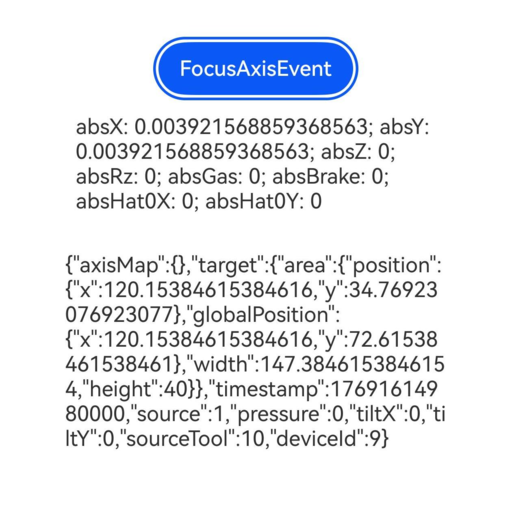

# 焦点轴事件

焦点轴事件是指在与游戏手柄交互时，通过十字按键或者操作杆上报的轴事件，此轴事件通过获得焦点的组件分发并回调给应用。若组件默认可获焦，如Button，则不需要额外设置属性。若组件在默认情况下不可获焦，如Text和Image，可以通过将[focusable](/ref/arkui-api/arkui-declarative-comp/ts-component-general-attributes/interaction-property/ts-universal-attributes-focus/ts-universal-attributes-focus#focusable)属性设置为true来启用焦点轴事件。

 

本模块首批接口从API version 15开始支持。后续版本的新增接口，采用上角标单独标记接口的起始版本。

## onFocusAxisEvent

onFocusAxisEvent(event: Callback&lt;FocusAxisEvent&gt;): T

给组件绑定焦点轴事件回调。绑定该方法的组件获焦后，游戏手柄上的摇杆、十字键等的操作会触发该回调。

****元服务API：**** 从API version 15开始，该接口支持在元服务中使用。

****系统能力：**** SystemCapability.ArkUI.ArkUI.Full

****参数：****

| 参数名 | 类型 | 必填 | 说明 |
| --- | --- | --- | --- |
| event | Callback&lt;[FocusAxisEvent](#focusaxisevent对象说明)&gt; | 是 | 焦点轴事件回调。 |

****返回值：****

| 类型 | 说明 |
| --- | --- |
| T | 返回当前组件。 |

## FocusAxisEvent对象说明

焦点轴事件的对象说明，继承于[BaseEvent](/ref/arkui-api/arkui-declarative-comp/gesture-handling/gesture-control/ts-gesture-customize-judge/ts-gesture-customize-judge#baseevent8)。

****元服务API：**** 从API version 15开始，该接口支持在元服务中使用。

****系统能力：**** SystemCapability.ArkUI.ArkUI.Full

| 名称 | 类型 | 只读 | 可选 | 说明 |
| --- | --- | --- | --- | --- |
| axisMap | Map&lt;[AxisModel](/ref/arkui-api/arkui-declarative-comp/common-definitions/ts-appendix-enums/ts-appendix-enums#axismodel15), number&gt; | 否 | 否 | 焦点轴事件的轴值表。 |
| stopPropagation | Callback&lt;void&gt; | 否 | 否 | 阻塞[事件冒泡](/arkui/arkts-ui-development/arkts-interaction-development-guide-overview/arkts-interaction-basic-principles#事件冒泡)传递。 |

## 示例

该示例通过按钮设置了焦点轴事件，当按钮获得焦点时，操控游戏手柄的十字按键或者操作杆将触发onFocusAxisEvent回调。

```
// xxx.ets
@Entry
@Component
struct FocusAxisEventExample {
  @State text: string = ''
  @State axisValue: string = ''

  aboutToAppear(): void {
    this.getUIContext().getFocusController().activate(true)
  }

  aboutToDisappear(): void {
    this.getUIContext().getFocusController().activate(false)
  }

  build() {
    Column() {
      Button('FocusAxisEvent')
        .defaultFocus(true)
        .onFocusAxisEvent((event: FocusAxisEvent) => {
          let absX = event.axisMap.get(AxisModel.ABS_X);
          let absY = event.axisMap.get(AxisModel.ABS_Y);
          let absZ = event.axisMap.get(AxisModel.ABS_Z);
          let absRz = event.axisMap.get(AxisModel.ABS_RZ);
          let absGas = event.axisMap.get(AxisModel.ABS_GAS);
          let absBrake = event.axisMap.get(AxisModel.ABS_BRAKE);
          let absHat0X = event.axisMap.get(AxisModel.ABS_HAT0X);
          let absHat0Y = event.axisMap.get(AxisModel.ABS_HAT0Y);
          this.axisValue =
            'absX: ' + absX + '; absY: ' + absY + '; absZ: ' + absZ + '; absRz: ' + absRz + '; absGas: ' + absGas +
              '; absBrake: ' + absBrake + '; absHat0X: ' + absHat0X + '; absHat0Y: ' + absHat0Y;
          this.text = JSON.stringify(event);
        })
      Text(this.axisValue).padding(15)
      Text(this.text).padding(15)
    }.height(300).width('100%').padding(35)
  }
}
```

游戏手柄摇杆移动时：


