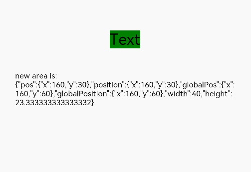

# 组件区域变化事件

组件区域变化事件指组件显示的尺寸、位置等发生变化时触发的事件。

 

从API version 8开始支持。后续版本如有新增内容，则采用上角标单独标记该内容的起始版本。

onAreaChange回调执行仅与本组件有关，对祖先或子孙组件上的onAreaChange的回调没有严格的执行顺序和限制保证。

## onAreaChange

onAreaChange(event: (oldValue: Area, newValue: Area) => void): T

组件区域变化时触发该回调。仅会响应由布局变化所导致的组件大小、位置发生变化时的回调。

由绘制变化所导致的渲染属性变化不会响应回调，如[translate](/ref/arkui-api/arkui-declarative-comp/ts-component-general-attributes/visual-effect-property/ts-universal-attributes-transformation/ts-universal-attributes-transformation#translate)、[offset](/ref/arkui-api/arkui-declarative-comp/ts-component-general-attributes/layout-property/ts-universal-attributes-location/ts-universal-attributes-location#offset)、[markAnchor](/ref/arkui-api/arkui-declarative-comp/ts-component-general-attributes/layout-property/ts-universal-attributes-location/ts-universal-attributes-location#markanchor)、[scale](/ref/arkui-api/arkui-declarative-comp/ts-component-general-attributes/visual-effect-property/ts-universal-attributes-transformation/ts-universal-attributes-transformation#scale)、[transform](/ref/arkui-api/arkui-declarative-comp/ts-component-general-attributes/visual-effect-property/ts-universal-attributes-transformation/ts-universal-attributes-transformation#transform)。若组件自身位置由绘制变化决定也不会响应回调，如[bindSheet](/ref/arkui-api/arkui-declarative-comp/ts-component-general-attributes/transition/ts-universal-attributes-sheet-transition/ts-universal-attributes-sheet-transition#bindsheet)。

 

当组件同时绑定onAreaChange事件和[position](/ref/arkui-api/arkui-declarative-comp/ts-component-general-attributes/layout-property/ts-universal-attributes-location/ts-universal-attributes-location#position)属性时，onAreaChange事件响应设置[Position](/ref/arkui-api/arkui-declarative-comp/common-definitions/ts-types/ts-types#position)类型的position属性变化，不响应设置[Edges](/ref/arkui-api/arkui-declarative-comp/common-definitions/ts-types/ts-types#edges12)和[LocalizedEdges](/ref/arkui-api/arkui-declarative-comp/common-definitions/ts-types/ts-types#localizededges12)类型的position属性变化。

****元服务API：**** 从API version 11开始，该接口支持在元服务中使用。

****系统能力：**** SystemCapability.ArkUI.ArkUI.Full

****参数：****

| 参数名 | 类型 | 必填 | 说明 |
| --- | --- | --- | --- |
| event | (oldValue: [Area](/ref/arkui-api/arkui-declarative-comp/common-definitions/ts-types/ts-types#area8), newValue: [Area](/ref/arkui-api/arkui-declarative-comp/common-definitions/ts-types/ts-types#area8)) => void | 是 | 返回目标元素位置信息变化情况，oldValue为目标元素变化之前的宽高以及目标元素相对父元素和页面左上角的坐标位置。newValue为目标元素变化之后的宽高以及目标元素相对父元素和页面左上角的坐标位置。 |

****返回值：****

| 类型 | 说明 |
| --- | --- |
| T | 返回当前组件。 |

## 示例

该示例通过Text组件设置组件区域变化事件，当Text布局变化时可以触发onAreaChange事件，获取相关参数。

```
// xxx.ets
@Entry
@Component
struct AreaExample {
  @State value: string = 'Text'
  @State sizeValue: string = ''

  build() {
    Column() {
      Text(this.value)
        .backgroundColor(Color.Green)
        .margin(30)
        .fontSize(20)
        .onClick(() => {
          this.value = this.value + 'Text'
        })
        .onAreaChange((oldValue: Area, newValue: Area) => {
          console.info(`Ace: on area change, oldValue is ${JSON.stringify(oldValue)} value is ${JSON.stringify(newValue)}`)
          this.sizeValue = JSON.stringify(newValue)
        })
      Text('new area is: \n' + this.sizeValue).margin({ right: 30, left: 30 })
    }
    .width('100%').height('100%').margin({ top: 30 })
  }
}
```


