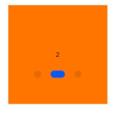

# swiper

滑动容器，提供切换子组件显示的能力。

 

从API version 8 开始支持。后续版本如有新增内容，则采用上角标单独标记该内容的起始版本。

## 属性

除支持[通用属性](/ref/arkui-api/arkui-js-comp/arkui-card-comp/card-comp-universal-comp-inform/js-service-widget-common-attributes/js-service-widget-common-attributes)外，还支持如下属性：

| 名称 | 类型 | 默认值 | 必填 | 描述 |
| --- | --- | --- | --- | --- |
| index | number | 0 | 否 | 当前在容器中显示的子组件的索引值。 |
| indicator | boolean | true | 否 | 是否启用导航点指示器，默认true。true为启用导航点指示器，false为不启用。 |
| digital | boolean | false | 否 | 是否启用数字导航点，默认为false。true为启用数字导航点，false为不启用。  必须设置indicator时才能生效数字导航点。 |
| loop | boolean | true | 否 | 是否开启循环滑动。true为开启循环，false为关闭循环。 |
| duration | number | 0 | 否 | 子组件切换的动画时长。  单位：毫秒  取值范围：[0, +∞) |
| vertical | boolean | false | 否 | 是否为纵向滑动。true为纵向滑动，false为水平滑动。纵向滑动时采用纵向的指示器。 |

## 样式

除支持[通用样式](/ref/arkui-api/arkui-js-comp/arkui-card-comp/card-comp-universal-comp-inform/js-service-widget-common-styles/js-service-widget-common-styles)外，还支持如下样式：

| 名称 | 类型 | 默认值 | 必填 | 描述 |
| --- | --- | --- | --- | --- |
| indicator-color | <color> | - | 否 | 导航点指示器的填充颜色。 |
| indicator-selected-color | <color> | - | 否 | 导航点指示器选中的颜色。 |
| indicator-size | <length> | 4px | 否 | 导航点指示器的直径大小。 |
| indicator-top|left|right|bottom | <length> | <percentage> | - | 否 | 导航点指示器在swiper中的相对位置。 |

## 事件

支持[通用事件](/ref/arkui-api/arkui-js-comp/arkui-card-comp/card-comp-universal-comp-inform/js-service-widget-common-events/js-service-widget-common-events)。

## 示例

```
<!-- xxx.hml -->
<swiper class="container" index="{{index}}">
  <div class="swiper-item primary-item">
    <text>1</text>
  </div>
  <div class="swiper-item warning-item">
    <text>2</text>
  </div>
  <div class="swiper-item success-item">
    <text>3</text>
  </div>
</swiper>
```

```
/* xxx.css */
.container {
  left: 0px;
  top: 0px;
  width: 454px;
  height: 454px;
}
.swiper-item {
  width: 454px;
  height: 454px;
  justify-content: center;
  align-items: center;
}
.primary-item {
  background-color: #007dff;
}
.warning-item {
  background-color: #ff7500;
}
.success-item {
  background-color: #41ba41;
}
```

```
{
  "data": {
    "index": 1
  }
}
```

****4×4卡片****


