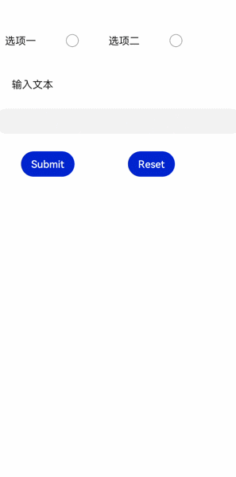

# form

 

从API version 6开始支持。后续版本如有新增内容，则采用上角标单独标记该内容的起始版本。

表单容器，支持容器内input元素的内容提交和重置。

## 权限列表

无

## 子组件

支持。

## 属性

支持[通用属性](/ref/arkui-api/arkui-js-comp/arkui-js-full-comp/js-full-universal-comp-inform/js-components-common-attributes/js-components-common-attributes)。

## 样式

支持[组件通用样式](/ref/arkui-api/arkui-js-comp/arkui-js-full-comp/js-full-universal-comp-inform/js-components-common-styles/js-components-common-styles)。

## 事件

除支持[通用事件](/ref/arkui-api/arkui-js-comp/arkui-js-full-comp/js-full-universal-comp-inform/js-components-common-events/js-components-common-events)外，还支持如下事件：

| 名称 | 参数 | 描述 |
| --- | --- | --- |
| submit | FormResult | 点击提交按钮，进行表单提交时，触发该事件。 |
| reset | - | 点击重置按钮后，触发该事件。 |

****表1**** FormResult

| 名称 | 类型 | 描述 |
| --- | --- | --- |
| value | Object | input元素的name和value的值。 |

## 方法

支持[通用方法](/ref/arkui-api/arkui-js-comp/arkui-js-full-comp/js-full-universal-comp-inform/js-components-common-methods/js-components-common-methods)。

## 示例

```
<!-- xxx.hml -->
<form onsubmit='onSubmit' onreset='onReset'>
  <div style="width: 600px;height: 150px;flex-direction: row;justify-content: space-around;">
    <label>选项一</label>
    <input type='radio' name='radioGroup' value='radio1'></input>
    <label>选项二</label>
    <input type='radio' name='radioGroup' value='radio2'></input>
  </div>
  <text style="margin-left: 50px;margin-bottom: 50px;">输入文本</text>
  <input type='text' name='user'></input>
  <div style="width: 600px;height: 150px;margin-top: 50px;flex-direction: row;justify-content: space-around;">
    <input type='submit'>Submit</input>
    <input type='reset'>Reset</input>
  </div>
</form>
```

```
// xxx.js
export default{
  onSubmit(result) {
    console.info(result.value.radioGroup) // radio1 or radio2
    console.info(result.value.user) // text input value
  },
  onReset() {
    console.info('reset all value')
  }
}
```


