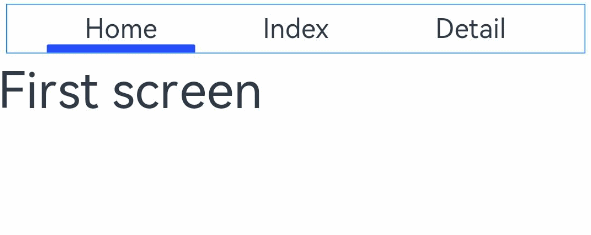

# tabs

 

从API version 4开始支持。后续版本如有新增内容，则采用上角标单独标记该内容的起始版本。

tab页签容器。

## 权限列表

无

## 子组件

仅支持<[tab-bar](/ref/arkui-api/arkui-js-comp/arkui-js-full-comp/js-full-container-comp/js-components-container-tab-bar/js-components-container-tab-bar)>和<[tab-content](/ref/arkui-api/arkui-js-comp/arkui-js-full-comp/js-full-container-comp/js-components-container-tab-content/js-components-container-tab-content)>。

## 属性

除支持[通用属性](/ref/arkui-api/arkui-js-comp/arkui-js-full-comp/js-full-universal-comp-inform/js-components-common-attributes/js-components-common-attributes)外，还支持如下属性：

| 名称 | 类型 | 默认值 | 必填 | 描述 |
| --- | --- | --- | --- | --- |
| index | number | 0 | 否 | 当前处于激活态的tab索引。 |
| vertical | boolean | false | 否 | 是否为纵向的tab，默认为false，可选值为：  - false：tabbar和tabcontent上下排列。  - true：tabbar和tabcontent左右排列。 |

## 样式

支持[通用样式](/ref/arkui-api/arkui-js-comp/arkui-js-full-comp/js-full-universal-comp-inform/js-components-common-styles/js-components-common-styles)。

## 事件

除支持[通用事件](/ref/arkui-api/arkui-js-comp/arkui-js-full-comp/js-full-universal-comp-inform/js-components-common-events/js-components-common-events)外，还支持如下事件：

| 名称 | 参数 | 描述 |
| --- | --- | --- |
| change | { index: indexValue } | tab页签切换后触发，动态修改index值不会触发该回调。 |

## 示例

```
<!-- xxx.hml -->
<div class="container">
  <tabs class = "tabs" index="0" vertical="false" onchange="change">
    <tab-bar class="tab-bar" mode="fixed">
      <text class="tab-text">Home</text>
      <text class="tab-text">Index</text>
      <text class="tab-text">Detail</text>
    </tab-bar>
    <tab-content class="tabcontent" scrollable="true">
      <div class="item-content" >
        <text class="item-title">First screen</text>
      </div>
      <div class="item-content" >
        <text class="item-title">Second screen</text>
      </div>
      <div class="item-content" >
        <text class="item-title">Third screen</text>
      </div>
    </tab-content>
  </tabs>
</div>
```

```
/* xxx.css */
.container {
  flex-direction: column;
  justify-content: flex-start;
  align-items: center;
}
.tabs {
  width: 100%;
}
.tabcontent {
  width: 100%;
  height: 80%;
  justify-content: center;
}
.item-content {
  height: 100%;
  justify-content: center;
}
.item-title {
  font-size: 60px;
}
.tab-bar {
  margin: 10px;
  height: 60px;
  border-color: #007dff;
  border-width: 1px;
}
.tab-text {
  width: 300px;
  text-align: center;
}
```

```
// xxx.js
export default {
  change: function(e) {
    console.info("Tab index: " + e.index);
  },
}
```


