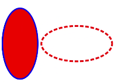

# ellipse

 

该组件从API version 7开始支持。后续版本如有新增内容，则采用上角标单独标记该内容的起始版本。

椭圆形状。

## 权限列表

无

## 子组件

支持[animate](/ref/arkui-api/arkui-js-comp/arkui-js-full-comp/js-full-svg-comp/js-components-svg-animate/js-components-svg-animate)、[animateMotion](/ref/arkui-api/arkui-js-comp/arkui-js-full-comp/js-full-svg-comp/js-components-svg-animatemotion/js-components-svg-animatemotion)、[animateTransform](/ref/arkui-api/arkui-js-comp/arkui-js-full-comp/js-full-svg-comp/js-components-svg-animatetransform/js-components-svg-animatetransform)。

## 属性

支持Svg组件[通用属性](/ref/arkui-api/arkui-js-comp/arkui-js-full-comp/js-full-svg-comp/js-components-svg-common-attributes/js-components-svg-common-attributes)和以下属性。

| 名称 | 类型 | 默认值 | 必填 | 描述 |
| --- | --- | --- | --- | --- |
| id | string | - | 否 | 组件的唯一标识。 |
| cx | <length>|<percentage> | 0 | 否 | 设置椭圆的x轴坐标。支持属性动画。 |
| cy | <length>|<percentage> | 0 | 否 | 设置椭圆的y轴坐标。支持属性动画。 |
| rx | <length>|<percentage> | 0 | 否 | 设置椭圆x轴的半径。支持属性动画。 |
| ry | <length>|<percentage> | 0 | 否 | 设置椭圆y轴的半径。支持属性动画。 |

## 示例

```
<!-- xxx.hml -->
<div class="container">
  <svg fill="white" width="400" height="400">
    <ellipse cx="60" cy="200" rx="50" ry="100" stroke-width="4" fill="red" stroke="blue"></ellipse>
    <ellipse cx="220" cy="200" rx="100" ry="50" stroke-width="5" stroke="red" stroke-dasharray="10 5" stroke-dashoffset="3"></ellipse>
  </svg>
</div>
```


