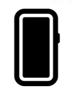

# symbolRegister

本模块提供自定义Symbol图标资源与动效参数资源注册加载能力。

****起始版本：**** 5.1.1(19)

## 导入模块

```
import { symbolRegister } from '@kit.UIDesignKit';
```

## symbolRegister.registerSymbol

registerSymbol(ttfSrc: resourceManager.Resource, jsonSrc: resourceManager.Resource): boolean

注册自定义Symbol资源。

****模型约束：**** 此接口仅可在Stage模型下使用。

****系统能力：**** SystemCapability.UIDesign.Core

****起始版本：**** 5.1.1(19)

****参数：****

| ****参数名**** | ****类型**** | 必填 | ****说明**** |
| --- | --- | --- | --- |
| ttfSrc | [resourceManager.Resource](/ref/arkui-api/arkui-declarative-comp/common-definitions/ts-types/ts-types#resource) | 是 | 自定义Symbol图标资源。 |
| jsonSrc | [resourceManager.Resource](/ref/arkui-api/arkui-declarative-comp/common-definitions/ts-types/ts-types#resource) | 是 | 自定义Symbol动效参数资源。 |

****返回值：****

| 类型 | 说明 |
| --- | --- |
| boolean | 返回注册结果，true：注册成功，false：注册失败。 |

****错误码：****

以下错误码的详细介绍请参见[ArkTS API错误码](/ref/ui-design-api/ui-design-arkts/ui-design-error-code/ui-design-error-code)。

| 错误码ID | 错误信息 |
| --- | --- |
| 401 | Parameter error. |
| 801 | Device Type error. |
| 1012600002 | TTF or JSON resource out of size. |
| 1012600003 | TTF or JSON resource content error. |

****示例：****

```
import { symbolRegister } from '@kit.UIDesignKit';
import { BusinessError } from '@kit.BasicServicesKit';

@Entry
@Component
struct test {
  aboutToAppear(): void {
    try {
      // 注册自定义的Symbol资源,在resource/rawfile目录下配置图标资源
      let result =
        symbolRegister.registerSymbol($rawfile("symbol/symbol_register.ttf"), $rawfile("symbol/symbol_register.json"));
    } catch (error) {
      let err = error as BusinessError;
      console.error("errCode:" + err.code)
      console.error("error " + err.message);
    }
  }

  build() {
    Column() {
      SymbolGlyph($r('app.string.symbol_custom_phone_fill_1'))
    }
  }
}
```


