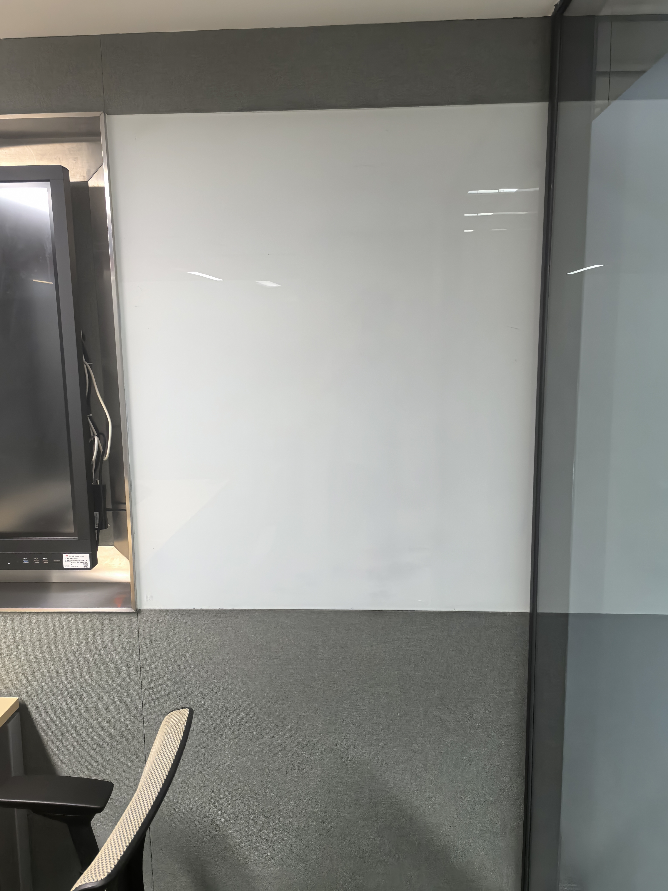
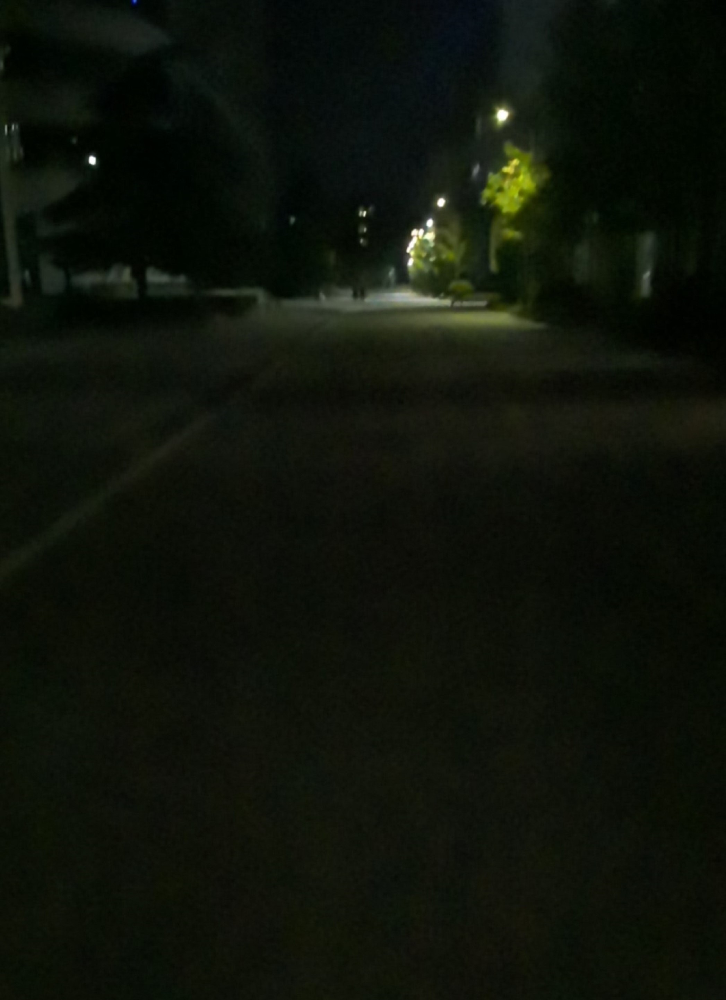
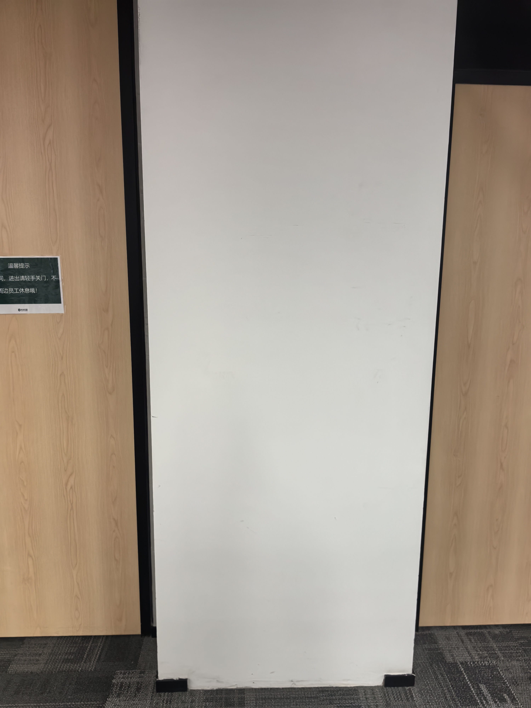
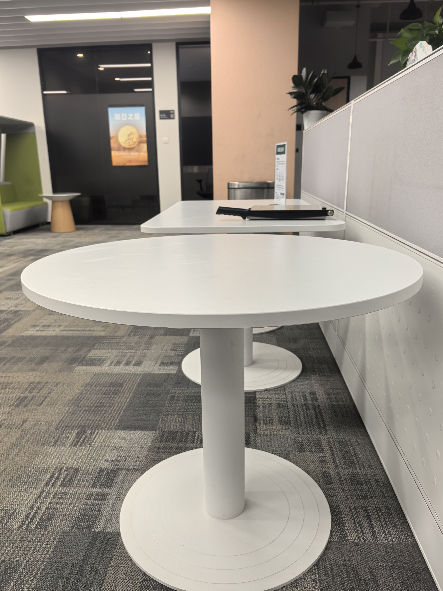

# 反光、光线暗或者弱纹理场景（输入图像颜色变化小）下无法识别平面

## 现象描述

使用环境跟踪能力时，如果输入图像中有反光、光线暗、有弱纹理（输入图像颜色变化小），识别到的点云数量会变少甚至没有，出平面时间也会变长或无法生成平面。

1. 反光：镜面，光滑的大理石地板等

   ****图1**** 镜面

   
2. 光线暗：夜晚的路面或摄像头遮挡等。

   ****图2**** 夜晚的路面

   
3. 弱纹理：如单色柜子、单色桌面和墙面等。

   ****图3**** 墙面

   

   ****图4**** 纯色的桌面

   

## 可能原因

AR Engine通过输入的图像数据进行平面上特征点的计算，如果输入图像数据中存在反光、光线暗和弱纹理，AR Engine计算后只能得到很少的点，而平面根据识别到的点云生成，因此会导致平面出现缓慢或无法出现的现象。

## 处理步骤

建议应用在持续无法获取点云或平面数据时，提示用户移动相机，避免画面中持续出现反光、光线暗或弱纹理。
