# 绘制几何图形 (Shape)

绘制组件用于在页面绘制图形，Shape组件是绘制组件的父组件，包含所有绘制组件的通用属性。具体用法请参考[Shape](/ref/arkui-api/arkui-declarative-comp/graphic-drawing/ts-drawing-components-shape/ts-drawing-components-shape)。

## 创建绘制组件

绘制组件可以由以下两种形式创建：

- 绘制组件使用Shape作为父组件，实现类似SVG的效果。接口调用为以下形式：

  ```
  Shape(value?: PixelMap)
  ```

  该接口用于创建带有父组件的绘制组件，其中value用于设置绘制目标，可将图形绘制在指定的PixelMap对象中，若未设置，则在当前绘制目标中进行绘制。

  ```
  Shape() {
    Rect().width(300).height(50)
  }
  ```
- 绘制组件单独使用，用于在页面上绘制指定的图形。有7种绘制类型，分别为[Circle](/ref/arkui-api/arkui-declarative-comp/graphic-drawing/ts-drawing-components-circle/ts-drawing-components-circle)（圆形）、[Ellipse](/ref/arkui-api/arkui-declarative-comp/graphic-drawing/ts-drawing-components-ellipse/ts-drawing-components-ellipse)（椭圆形）、[Line](/ref/arkui-api/arkui-declarative-comp/graphic-drawing/ts-drawing-components-line/ts-drawing-components-line)（直线）、[Polyline](/ref/arkui-api/arkui-declarative-comp/graphic-drawing/ts-drawing-components-polyline/ts-drawing-components-polyline)（折线）、[Polygon](/ref/arkui-api/arkui-declarative-comp/graphic-drawing/ts-drawing-components-polygon/ts-drawing-components-polygon)（多边形）、[Path](/ref/arkui-api/arkui-declarative-comp/graphic-drawing/ts-drawing-components-path/ts-drawing-components-path)（路径）、[Rect](/ref/arkui-api/arkui-declarative-comp/graphic-drawing/ts-drawing-components-rect/ts-drawing-components-rect)（矩形）。以Circle的接口调用为例：

  ```
  Circle(value?: { width?: string | number, height?: string | number })
  ```

  该接口用于在页面绘制圆形，其中width用于设置圆形的宽度，height用于设置圆形的高度，圆形直径由宽高最小值确定。

  ```
  Circle({ width: 150, height: 150 })
  ```

  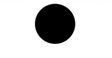

## 形状视口viewPort

```
viewPort(value: { x?: number | string, y?: number | string, width?: number | string, height?: number | string })
```

形状视口viewPort指定用户空间中的一个矩形，该矩形映射到为关联的SVG元素建立的视区边界。viewPort属性的值包含x、y、width和height四个可选参数，x和y表示视区的左上角坐标，width和height表示其尺寸。

以下三个示例说明如何使用viewPort：

- 通过形状视口对图形进行放大与缩小。

  ```
  class Tmp {
    public x: number = 0;
    public y: number = 0;
    public width: number = 75;
    public height: number = 75;
  }

  class TmpOne {
    public x: number = 0;
    public y: number = 0;
    public width: number = 300;
    public height: number = 300;
  }

  @Entry
  @Component
  struct ViewPort1 {
    viep: Tmp = new Tmp();
    viep1: TmpOne = new TmpOne();

    build() {
      Column() {
        // 画一个宽高都为75的圆
        // 请将$r('app.string.OriginalSizeCircle')替换为实际资源文件，在本示例中该资源文件的value值为"原始尺寸Circle组件"
        Text($r('app.string.OriginalSizeCircle')).margin({ top: 20 })
        Circle({ width: 75, height: 75 }).fill('rgb(39, 135, 217)')

        Row({ space: 10 }) {
          Column() {
            // 创建一个宽高都为150的shape组件，背景色为黄色，一个宽高都为75的viewPort。
            // 用一个蓝色的矩形来填充viewPort，在viewPort中绘制一个直径为75的圆。
            // 绘制结束，viewPort会根据组件宽高放大两倍。
            // 请将$r('app.string.EnlargedCircle')替换为实际资源文件，在本示例中该资源文件的value值为"shape内放大的Circle组件"
            Text($r('app.string.EnlargedCircle'))
            Shape() {
              Rect().width('100%').height('100%').fill('rgb(39, 135, 217)')
              Circle({ width: 75, height: 75 }).fill('rgb(213, 213, 213)')
            }
            .viewPort(this.viep)
            .width(150)
            .height(150)
            .backgroundColor('rgb(23, 169, 141)')
          }

          Column() {
            // 创建一个宽高都为150的shape组件，背景色为黄色，一个宽高都为300的viewPort。
            // 用一个绿色的矩形来填充viewPort，在viewPort中绘制一个直径为75的圆。
            // 绘制结束，viewPort会根据组件宽高缩小两倍。
            // 请将$r('app.string.ShrunkCircle')替换为实际资源文件，在本示例中该资源文件的value值为"Shape内缩小的Circle组件"
            Text($r('app.string.ShrunkCircle'))
            Shape() {
              Rect().width('100%').height('100%').fill('rgb(213, 213, 213)')
              Circle({ width: 75, height: 75 }).fill('rgb(39, 135, 217)')
            }
            .viewPort(this.viep1)
            .width(150)
            .height(150)
            .backgroundColor('rgb(23, 169, 141)')
          }
        }
      }
    }
  }
  ```

  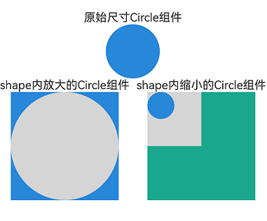
- 创建一个宽高都为300的shape组件，背景色为黄色，创建一个宽高都为300的viewPort。用一个蓝色的矩形来填充viewPort，在viewPort中绘制一个半径为75的圆。

  ```
  class TmpTwo {
    public x: number = 0;
    public y: number = 0;
    public width: number = 300;
    public height: number = 300;
  }

  @Entry
  @Component
  struct ViewPort2 {
    viep: TmpTwo = new TmpTwo();

    build() {
      Column() {
        Shape() {
          Rect().width('100%').height('100%').fill('#0097D4')
          Circle({ width: 150, height: 150 }).fill('#E87361')
        }
        .viewPort(this.viep)
        .width(300)
        .height(300)
        .backgroundColor('#F5DC62')
      }
    }
  }
  ```

  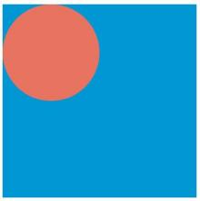
- 创建一个宽高都为300的shape组件，背景色为黄色，创建一个宽高都为300的viewPort。用一个蓝色的矩形来填充viewPort，在viewPort中绘制一个半径为75的圆，将viewPort向右方和下方各平移150。

  ```
  class TmpThree {
    public x: number = -150;
    public y: number = -150;
    public width: number = 300;
    public height: number = 300;
  }

  @Entry
  @Component
  struct ViewPort3 {
    viep: TmpThree = new TmpThree();

    build() {
      Column() {
        Shape() {
          Rect().width('100%').height('100%').fill('#0097D4')
          Circle({ width: 150, height: 150 }).fill('#E87361')
        }
        .viewPort(this.viep)
        .width(300)
        .height(300)
        .backgroundColor('#F5DC62')
      }
    }
  }
  ```

  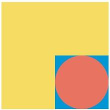

## 自定义样式

 

示例通过commands来绘制路径，commands参数说明请参考[SVG路径描述规范](/ref/arkui-api/arkui-declarative-comp/graphic-drawing/ts-drawing-components-path/ts-drawing-components-path#svg路径描述规范)。

绘制组件支持通过各种属性更改组件样式。

- 通过[fill](/ref/arkui-api/arkui-declarative-comp/graphic-drawing/ts-drawing-components-path/ts-drawing-components-path#fill)可以设置组件填充区域颜色。

  ```
  Path()
    .width(100)
    .height(100)
    .commands('M150 0 L300 300 L0 300 Z')
    .fill('#E87361')
    .strokeWidth(0)
  ```

  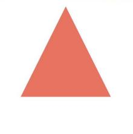
- 通过[stroke](/ref/arkui-api/arkui-declarative-comp/graphic-drawing/ts-drawing-components-path/ts-drawing-components-path#stroke)可以设置组件边框颜色。

  ```
  Path()
    .width(100)
    .height(100)
    .fillOpacity(0)
    .commands('M150 0 L300 300 L0 300 Z')
    .stroke(Color.Red)
  ```

  
- 通过[strokeOpacity](/ref/arkui-api/arkui-declarative-comp/graphic-drawing/ts-drawing-components-path/ts-drawing-components-path#strokeopacity)可以设置边框透明度。

  ```
  Path()
    .width(100)
    .height(100)
    .fillOpacity(0)
    .commands('M150 0 L300 300 L0 300 Z')
    .stroke(Color.Red)
    .strokeWidth(10)
    .strokeOpacity(0.2)
  ```

  
- 通过[strokeLineJoin](/ref/arkui-api/arkui-declarative-comp/graphic-drawing/ts-drawing-components-polyline/ts-drawing-components-polyline#strokelinejoin)可以设置线条拐角绘制样式。拐角绘制样式分为Bevel(使用斜角连接路径段)、Miter(使用尖角连接路径段)、Round(使用圆角连接路径段)。

  ```
  Polyline()
    .width(100)
    .height(100)
    .fillOpacity(0)
    .stroke(Color.Red)
    .strokeWidth(8)
    .points([[20, 0], [0, 100], [100, 90]])
    // 设置折线拐角处为圆弧
    .strokeLineJoin(LineJoinStyle.Round)
  ```

  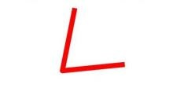
- 通过[strokeMiterLimit](/ref/arkui-api/arkui-declarative-comp/graphic-drawing/ts-drawing-components-polyline/ts-drawing-components-polyline#strokemiterlimit)设置斜接长度与边框宽度比值的极限值。

  斜接长度表示外边框外边交点到内边交点的距离，边框宽度即[strokeWidth](/ref/arkui-api/arkui-declarative-comp/graphic-drawing/ts-drawing-components-polyline/ts-drawing-components-polyline#strokewidth)属性的值。

  strokeMiterLimit取值需大于等于1，且在[strokeLineJoin](/ref/arkui-api/arkui-declarative-comp/graphic-drawing/ts-drawing-components-polyline/ts-drawing-components-polyline#strokelinejoin)属性取值LineJoinStyle.Miter时生效。

  ```
  Polyline()
    .width(100)
    .height(100)
    .fillOpacity(0)
    .stroke(Color.Red)
    .strokeWidth(10)
    .points([[20, 0], [20, 100], [100, 100]])
    // 设置折线拐角处为尖角
    .strokeLineJoin(LineJoinStyle.Miter)
    // 设置斜接长度与线宽的比值
    .strokeMiterLimit(1/Math.sin(45))
  Polyline()
    .width(100)
    .height(100)
    .fillOpacity(0)
    .stroke(Color.Red)
    .strokeWidth(10)
    .points([[20, 0], [20, 100], [100, 100]])
    .strokeLineJoin(LineJoinStyle.Miter)
    .strokeMiterLimit(1.42)
  ```

  
- 通过[antiAlias](/ref/arkui-api/arkui-declarative-comp/graphic-drawing/ts-drawing-components-circle/ts-drawing-components-circle#antialias)设置是否开启抗锯齿，默认值为true（开启抗锯齿）。

  ```
  // 开启抗锯齿
  Circle()
    .width(150)
    .height(200)
    .fillOpacity(0)
    .strokeWidth(5)
    .stroke(Color.Black)
  ```

  

  ```
  // 关闭抗锯齿
  Circle()
    .width(150)
    .height(200)
    .fillOpacity(0)
    .strokeWidth(5)
    .stroke(Color.Black)
    .antiAlias(false)
  ```

  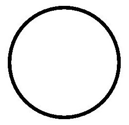
- 通过[mesh](/ref/arkui-api/arkui-declarative-comp/graphic-drawing/ts-drawing-components-shape/ts-drawing-components-shape#mesh8)设置网格效果，实现图像局部扭曲。

   

  示例通过commands来绘制路径，commands参数说明请参考[SVG路径描述规范](/ref/arkui-api/arkui-declarative-comp/graphic-drawing/ts-drawing-components-path/ts-drawing-components-path#svg路径描述规范)。

  ```
  import { FrameNode, NodeController, RenderNode } from '@kit.ArkUI';
  import { image } from '@kit.ImageKit';
  import { drawing } from '@kit.ArkGraphics2D';

  let offCanvas: OffscreenCanvas = new OffscreenCanvas(150, 150);
  let ctx = offCanvas.getContext('2d');

  class DrawingRenderNode extends RenderNode {
    private verts_: Array<number> = [0, 0, 50, 0, 410, 0, 0, 180, 50, 180, 410, 180, 0, 360, 50, 360, 410, 360];

    setVerts(verts: Array<number>): void {
      this.verts_ = verts
    }

    async draw(context: DrawContext) {
      const canvas = context.canvas;
      let pixelMap = ctx.getPixelMap(0, 0, 150, 150);
      const brush = new drawing.Brush(); // 只支持brush，使用pen没有绘制效果。
      canvas.attachBrush(brush);
      let verts: number[] = [0, 0, 410, 0, 50, 0, 0, 180, 50, 180, 410, 180, 0, 360, 410, 360, 50, 360];
      ; // 18
      canvas.drawPixelMapMesh(pixelMap, 2, 2, verts, 0, null, 0);
      canvas.detachBrush();
    }
  }

  const renderNode = new DrawingRenderNode();
  renderNode.frame = {
    x: 0,
    y: 0,
    width: 150,
    height: 150
  };

  class MyNodeController extends NodeController {
    private rootNode: FrameNode | null = null;

    makeNode(uiContext: UIContext): FrameNode | null {
      this.rootNode = new FrameNode(uiContext);

      const rootRenderNode = this.rootNode.getRenderNode();
      if (rootRenderNode !== null) {
        rootRenderNode.appendChild(renderNode);
      }
      return this.rootNode;
    }
  }

  @Entry
  @Component
  struct Mesh {
    private myNodeController: MyNodeController = new MyNodeController();
    @State showShape: boolean = false;
    @State pixelMap: image.PixelMap | undefined = undefined;
    @State shapeWidth: number = 150;
    @State strokeWidth: number = 1;
    @State meshArray: Array<number> = [0, 0, 50, 0, 410, 0, 0, 180, 50, 180, 410, 180, 0, 360, 50, 360, 410, 360];

    aboutToAppear(): void {
      // 'resources/base/media/image.png'需要替换为开发者所需的图像资源文件
      let img: ImageBitmap = new ImageBitmap('resources/base/media/image.png');
      ctx.drawImage(img, 0, 0, 100, 100);
      this.pixelMap = ctx.getPixelMap(0, 0, 150, 150);
    }

    build() {
      Column() {
        Image(this.pixelMap)
          .backgroundColor('#86C5E3')
          .width(150)
          .height(150)
          .onClick(() => {
            // 'resources/base/media/image.png'需要替换为开发者所需的图像资源文件
            let img: ImageBitmap = new ImageBitmap('resources/base/media/image.png');
            ctx.drawImage(img, 0, 0, 100, 100);
            this.pixelMap = ctx.getPixelMap(1, 1, 150, 150);
            this.myNodeController.rebuild();
            this.strokeWidth += 1;
          })

        NodeContainer(this.myNodeController)
          .width(150)
          .height(150)
          .backgroundColor(Color.Grey)
          .onClick(() => {
            this.meshArray = [0, 0, 50, 0, 410, 0, 0, 180, 50, 180, 410, 180, 0, 360, 50, 360, 410, 360, 0];
          })
        Button('change mesh')
          .margin(5)
          .onClick(() => {
            this.meshArray = [0, 0, 410, 0, 50, 0, 0, 180, 50, 180, 410, 180, 0, 360, 410, 360, 50, 360];
          })
        Button('Show Shape')
          .margin(5)
          .onClick(() => {
            this.showShape = !this.showShape;
          })

        if (this.showShape) {
          Shape(this.pixelMap) {
            Path().width(150).height(60).commands('M0 0 L400 0 L400 150 Z')
          }
          .fillOpacity(0.2)
          .backgroundColor(Color.Grey)
          .width(this.shapeWidth)
          .height(150)
          .mesh(this.meshArray, 2, 2)
          .fill(0x317AF7)
          .stroke(0xEE8443)
          .strokeWidth(this.strokeWidth)
          .strokeLineJoin(LineJoinStyle.Miter)
          .strokeMiterLimit(5)

          Shape(this.pixelMap) {
            Path().width(150).height(60).commands('M0 0 L400 0 L400 150 Z')
          }
          .fillOpacity(0.2)
          .backgroundColor(Color.Grey)
          .width(this.shapeWidth)
          .height(150)
          .fill(0x317AF7)
          .stroke(0xEE8443)
          .strokeWidth(this.strokeWidth)
          .strokeLineJoin(LineJoinStyle.Miter)
          .strokeMiterLimit(5)
          .onDragStart(() => {
          })

          // mesh只对shape传入pixelMap时生效，此处不生效
          Shape() {
            Path().width(150).height(60).commands('M0 0 L400 0 L400 150 Z')
          }
          .fillOpacity(0.2)
          .backgroundColor(Color.Grey)
          .width(this.shapeWidth)
          .height(150)
          .mesh(this.meshArray, 2, 2)
          .fill(0x317AF7)
          .stroke(0xEE8443)
          .strokeWidth(this.strokeWidth)
          .strokeLineJoin(LineJoinStyle.Miter)
          .strokeMiterLimit(5)
          .onClick(() => {
            this.pixelMap = undefined;
          })
        }
      }
    }
  }
  ```

  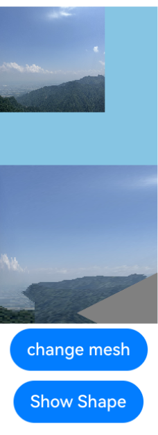

## 场景示例

### 绘制封闭路径

在Shape的(-80, -5)点绘制一个封闭路径，填充颜色0x317AF7，线条宽度3，边框颜色红色，拐角样式锐角（默认值）。

 

示例通过commands来绘制路径，commands参数说明请参考[SVG路径描述规范](/ref/arkui-api/arkui-declarative-comp/graphic-drawing/ts-drawing-components-path/ts-drawing-components-path#svg路径描述规范)。

```
@Entry
@Component
struct ShapeExample {
  build() {
    Column({ space: 10 }) {
      Shape() {
        Path().width(200).height(60).commands('M0 0 L400 0 L400 150 Z')
      }
      .viewPort({
        x: -80,
        y: -5,
        width: 500,
        height: 300
      })
      .fill('rgb(213, 213, 213)')
      .stroke('rgb(39, 135, 217)')
      .strokeWidth(3)
      .strokeLineJoin(LineJoinStyle.Miter)
      .strokeMiterLimit(5)
    }.width('100%').margin({ top: 15 })
  }
}
```

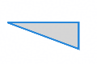

### 绘制圆和圆环

绘制一个直径为150的圆，和一个直径为150、线条为红色虚线的圆环（宽高设置不一致时以短边为直径）。

 

本示例通过strokeDashArray属性设置边框间隙来实现红色虚线的圆环，strokeDashArray属性参考[strokeDashArray](/ref/arkui-api/arkui-declarative-comp/graphic-drawing/ts-drawing-components-shape/ts-drawing-components-shape#strokedasharray)。

```
@Entry
@Component
struct CircleExample {
  build() {
    Column({ space: 10 }) {
      // 绘制一个直径为150的圆
      Circle({ width: 150, height: 150 })
      // 绘制一个直径为150、线条为红色虚线的圆环
      Circle()
        .width(150)
        .height(200)
        .fillOpacity(0)
        .strokeWidth(3)
        .stroke(Color.Red)
        .strokeDashArray([1, 2])
      // ...
    }.width('100%')
  }
}
```

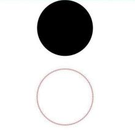

### UI视觉属性作用效果

 

[backgroundColor](/ref/arkui-api/arkui-declarative-comp/ts-component-general-attributes/basic-property/ts-universal-attributes-background/ts-universal-attributes-background#backgroundcolor)、[linearGradient](/ref/arkui-api/arkui-declarative-comp/ts-component-general-attributes/visual-effect-property/ts-universal-attributes-gradient-color/ts-universal-attributes-gradient-color#lineargradient)等通用属性作用于组件的背景区域，而不会在组件具体的内容区域生效。

```
@Entry
@Component
struct CircleExample {
  build() {
    Column({ space: 10 }) {
      // ...
      // 绘制一个直径为150的圆
      Circle()
        .width(150)
        .height(200)
        .backgroundColor(Color.Pink) // 会生效在一个150*200大小的矩形区域，而非仅在绘制的一个直径为150的圆形区域
    }.width('100%')
  }
}
```

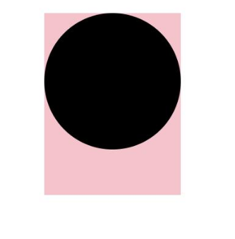
