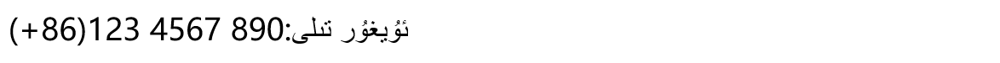
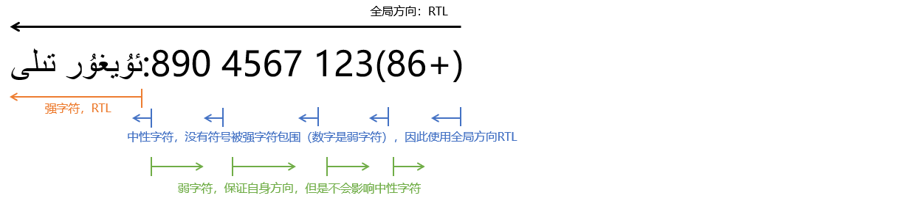

# UI国际化

本文介绍如何实现应用程序UI界面的国际化，包含资源配置和镜像布局，关于应用适配国际化的详细参考，请参考[Localization Kit（本地化开发服务）](/localization-kit/i18n-l10n)。

## 利用资源限定词配置国际化资源

在开发阶段，通过DevEco Studio，可以为应用在对应语言和地区的资源限定词目录下配置不同的资源，来实现UI国际化。详细介绍请参考[资源分类与访问](/resource-categories-and-access)。

## 使用镜像能力

不同国家对文本对齐方式和读取顺序有所不同，例如英语采用从左到右的顺序，阿拉伯语和希腊语则采用从右到左（RTL）的顺序。为满足不同用户的阅读习惯，ArkUI提供了镜像能力。在特定情况下将显示内容在X轴上进行镜像反转，由从左到右显示变成从右到左显示。

| 镜像前 | 镜像后 |
| --- | --- |
|  |  |

当组件满足以下任意条件时，镜像能力生效：

1. 组件的direction属性设置为Direction.Rtl。
2. 组件的direction属性设置为Direction.Auto，且当前的系统语言（如维吾尔语）的阅读习惯是从右向左。

### 基本概念

- LTR：顺序为从左到右。
- RTL：顺序为从右到左。

### 使用约束

ArkUI 如下能力已默认适配镜像：

| 类别 | 名称 |
| --- | --- |
| 基础组件 | [Swiper](/ref/arkui-api/arkui-declarative-comp/scroll-and-swipe/ts-container-swiper/ts-container-swiper)、[Tabs](/ref/arkui-api/arkui-declarative-comp/navigation-and-switching/ts-container-tabs/ts-container-tabs)、[TabContent](/ref/arkui-api/arkui-declarative-comp/navigation-and-switching/ts-container-tabcontent/ts-container-tabcontent)、[List](/ref/arkui-api/arkui-declarative-comp/scroll-and-swipe/ts-container-list/ts-container-list)、[Progress](/ref/arkui-api/arkui-declarative-comp/information-display/ts-basic-components-progress/ts-basic-components-progress)、[CalendarPicker](/ref/arkui-api/arkui-declarative-comp/buttons-and-selections/ts-basic-components-calendarpicker/ts-basic-components-calendarpicker)、[CalendarPickerDialog](/ref/arkui-api/arkui-declarative-comp/dialog-boxes/ts-methods-calendarpicker-dialog/ts-methods-calendarpicker-dialog)、[TextPicker](/ref/arkui-api/arkui-declarative-comp/buttons-and-selections/ts-basic-components-textpicker/ts-basic-components-textpicker)、[TextPickerDialog](/ref/arkui-api/arkui-declarative-comp/dialog-boxes/ts-methods-textpicker-dialog/ts-methods-textpicker-dialog)、[DatePicker](/ref/arkui-api/arkui-declarative-comp/buttons-and-selections/ts-basic-components-datepicker/ts-basic-components-datepicker)、[DatePickerDialog](/ref/arkui-api/arkui-declarative-comp/dialog-boxes/ts-methods-datepicker-dialog/ts-methods-datepicker-dialog)、[Grid](/ref/arkui-api/arkui-declarative-comp/scroll-and-swipe/ts-container-grid/ts-container-grid)、[WaterFlow](/ref/arkui-api/arkui-declarative-comp/scroll-and-swipe/ts-container-waterflow/ts-container-waterflow)、[Scroll](/ref/arkui-api/arkui-declarative-comp/scroll-and-swipe/ts-container-scroll/ts-container-scroll)、[ScrollBar](/ref/arkui-api/arkui-declarative-comp/scroll-and-swipe/ts-basic-components-scrollbar/ts-basic-components-scrollbar)、[AlphabetIndexer](/ref/arkui-api/arkui-declarative-comp/information-display/ts-container-alphabet-indexer/ts-container-alphabet-indexer)、[Stepper](/ref/arkui-api/arkui-declarative-comp/arkui-declarative-comp-dep/ts-basic-components-stepper/ts-basic-components-stepper)、[SideBarContainer](/ref/arkui-api/arkui-declarative-comp/grid-and-column-layout/ts-container-sidebarcontainer/ts-container-sidebarcontainer)、[Navigation](/ref/arkui-api/arkui-declarative-comp/navigation-and-switching/ts-basic-components-navigation/ts-basic-components-navigation)、[NavDestination](/ref/arkui-api/arkui-declarative-comp/navigation-and-switching/ts-basic-components-navdestination/ts-basic-components-navdestination)、[Rating](/ref/arkui-api/arkui-declarative-comp/buttons-and-selections/ts-basic-components-rating/ts-basic-components-rating)、[Slider](/ref/arkui-api/arkui-declarative-comp/buttons-and-selections/ts-basic-components-slider/ts-basic-components-slider)、[Toggle](/ref/arkui-api/arkui-declarative-comp/buttons-and-selections/ts-basic-components-toggle/ts-basic-components-toggle)、[Badge](/ref/arkui-api/arkui-declarative-comp/information-display/ts-container-badge/ts-container-badge)、[Counter](/ref/arkui-api/arkui-declarative-comp/information-display/ts-container-counter/ts-container-counter)、[Chip](/ref/arkui-api/arkui-declarative-comp/system-preset-ui-component-library/ohos-arkui-advanced-chip/ohos-arkui-advanced-chip)、[SegmentButton](/ref/arkui-api/arkui-declarative-comp/system-preset-ui-component-library/ohos-arkui-advanced-segmentbutton/ohos-arkui-advanced-segmentbutton)、[bindMenu](/ref/arkui-api/arkui-declarative-comp/ts-component-general-attributes/popup-property/ts-universal-attributes-menu/ts-universal-attributes-menu#bindmenu)、[bindContextMenu](/ref/arkui-api/arkui-declarative-comp/ts-component-general-attributes/popup-property/ts-universal-attributes-menu/ts-universal-attributes-menu#bindcontextmenu8)、[TextInput](/ref/arkui-api/arkui-declarative-comp/text-and-input/ts-basic-components-textinput/ts-basic-components-textinput)、[TextArea](/ref/arkui-api/arkui-declarative-comp/text-and-input/ts-basic-components-textarea/ts-basic-components-textarea)、[Search](/ref/arkui-api/arkui-declarative-comp/text-and-input/ts-basic-components-search/ts-basic-components-search)、[Stack](/ref/arkui-api/arkui-declarative-comp/rows-columns-and-stacking/ts-container-stack/ts-container-stack)、[GridRow](/ref/arkui-api/arkui-declarative-comp/grid-and-column-layout/ts-container-gridrow/ts-container-gridrow)、[Text](/ref/arkui-api/arkui-declarative-comp/text-and-input/ts-basic-components-text/ts-basic-components-text)、[Select](/ref/arkui-api/arkui-declarative-comp/buttons-and-selections/ts-basic-components-select/ts-basic-components-select)、[Marquee](/ref/arkui-api/arkui-declarative-comp/information-display/ts-basic-components-marquee/ts-basic-components-marquee)、[Row](/ref/arkui-api/arkui-declarative-comp/rows-columns-and-stacking/ts-container-row/ts-container-row)、[Column](/ref/arkui-api/arkui-declarative-comp/rows-columns-and-stacking/ts-container-column/ts-container-column)、[Flex](/ref/arkui-api/arkui-declarative-comp/rows-columns-and-stacking/ts-container-flex/ts-container-flex)、[RelativeContainer](/ref/arkui-api/arkui-declarative-comp/rows-columns-and-stacking/ts-container-relativecontainer/ts-container-relativecontainer)、[ListItemGroup](/ref/arkui-api/arkui-declarative-comp/scroll-and-swipe/ts-container-listitemgroup/ts-container-listitemgroup) |
| 高级组件 | [SelectionMenu](/ref/arkui-api/arkui-declarative-comp/system-preset-ui-component-library/ohos-arkui-advanced-selectionmenu/ohos-arkui-advanced-selectionmenu) 、[TreeView](/ref/arkui-api/arkui-declarative-comp/system-preset-ui-component-library/ohos-arkui-advanced-treeview/ohos-arkui-advanced-treeview) 、[Filter](/ref/arkui-api/arkui-declarative-comp/system-preset-ui-component-library/ohos-arkui-advanced-filter/ohos-arkui-advanced-filter)、[SplitLayout](/ref/arkui-api/arkui-declarative-comp/system-preset-ui-component-library/ohos-arkui-advanced-splitlayout/ohos-arkui-advanced-splitlayout)、[ToolBar](/ref/arkui-api/arkui-declarative-comp/system-preset-ui-component-library/ohos-arkui-advanced-toolbar/ohos-arkui-advanced-toolbar)、[ComposeListItem](/ref/arkui-api/arkui-declarative-comp/system-preset-ui-component-library/ohos-arkui-advanced-composelistitem/ohos-arkui-advanced-composelistitem)、[EditableTitleBar](/ref/arkui-api/arkui-declarative-comp/system-preset-ui-component-library/ohos-arkui-advanced-editabletitlebar/ohos-arkui-advanced-editabletitlebar)、[ProgressButton](/ref/arkui-api/arkui-declarative-comp/system-preset-ui-component-library/ohos-arkui-advanced-progressbutton/ohos-arkui-advanced-progressbutton)、[SubHeader](/ref/arkui-api/arkui-declarative-comp/system-preset-ui-component-library/ohos-arkui-advanced-subheader/ohos-arkui-advanced-subheader) 、[Popup](/ref/arkui-api/arkui-declarative-comp/system-preset-ui-component-library/ohos-arkui-advanced-popup/ohos-arkui-advanced-popup)、[Dialog](/ref/arkui-api/arkui-declarative-comp/dialog-boxes/ohos-arkui-advanced-dialog/ohos-arkui-advanced-dialog)、[SwipeRefresher](/ref/arkui-api/arkui-declarative-comp/system-preset-ui-component-library/ohos-arkui-advanced-swiperefresher/ohos-arkui-advanced-swiperefresher) |
| 通用属性 | [position](/ref/arkui-api/arkui-declarative-comp/ts-component-general-attributes/layout-property/ts-universal-attributes-location/ts-universal-attributes-location#position)、[markAnchor](/ref/arkui-api/arkui-declarative-comp/ts-component-general-attributes/layout-property/ts-universal-attributes-location/ts-universal-attributes-location#markanchor)、[offset](/ref/arkui-api/arkui-declarative-comp/ts-component-general-attributes/layout-property/ts-universal-attributes-location/ts-universal-attributes-location#offset)、[alignRules](/ref/arkui-api/arkui-declarative-comp/ts-component-general-attributes/layout-property/ts-universal-attributes-location/ts-universal-attributes-location#alignrules12)、[borderWidth](/ref/arkui-api/arkui-declarative-comp/ts-component-general-attributes/layout-property/ts-universal-attributes-border/ts-universal-attributes-border#borderwidth)、[borderColor](/ref/arkui-api/arkui-declarative-comp/ts-component-general-attributes/layout-property/ts-universal-attributes-border/ts-universal-attributes-border#bordercolor)、[borderRadius](/ref/arkui-api/arkui-declarative-comp/ts-component-general-attributes/layout-property/ts-universal-attributes-border/ts-universal-attributes-border#borderradius)、[padding](/ref/arkui-api/arkui-declarative-comp/ts-component-general-attributes/layout-property/ts-universal-attributes-size/ts-universal-attributes-size#padding)、[margin](/ref/arkui-api/arkui-declarative-comp/ts-component-general-attributes/layout-property/ts-universal-attributes-size/ts-universal-attributes-size#margin) |
| 接口 | [AlertDialog](/ref/arkui-api/arkui-declarative-comp/dialog-boxes/ts-methods-alert-dialog-box/ts-methods-alert-dialog-box)、[ActionSheet](/ref/arkui-api/arkui-declarative-comp/dialog-boxes/ts-methods-action-sheet/ts-methods-action-sheet)、[promptAction.showDialog](/ref/arkui-api/arkui-arkts/ui/js-apis-promptaction/js-apis-promptaction#promptactionshowdialogdeprecated)、[promptAction.showToast](/ref/arkui-api/arkui-arkts/ui/js-apis-promptaction/js-apis-promptaction#promptactionshowtoastdeprecated) |

但如下三种场景还需要进行适配：

1. 界面布局、边框设置：关于方向类的通用属性，如果需要支持镜像能力，使用泛化的方向指示词 start/end入参类型替换 left/right、x/y等绝对方向指示词的入参类型，来表示自适应镜像能力。
2. Canvas组件只有限支持文本绘制的镜像能力。
3. XComponent组件不支持组件镜像能力。

### 界面布局和边框设置

目前，以下三类通用属性需要使用新入参类型适配：

位置设置：[position](/ref/arkui-api/arkui-declarative-comp/ts-component-general-attributes/layout-property/ts-universal-attributes-location/ts-universal-attributes-location#position)、[markAnchor](/ref/arkui-api/arkui-declarative-comp/ts-component-general-attributes/layout-property/ts-universal-attributes-location/ts-universal-attributes-location#markanchor)、[offset](/ref/arkui-api/arkui-declarative-comp/ts-component-general-attributes/layout-property/ts-universal-attributes-location/ts-universal-attributes-location#offset)、[alignRules](/ref/arkui-api/arkui-declarative-comp/ts-component-general-attributes/layout-property/ts-universal-attributes-location/ts-universal-attributes-location#alignrules12)

边框设置：[borderWidth](/ref/arkui-api/arkui-declarative-comp/ts-component-general-attributes/layout-property/ts-universal-attributes-border/ts-universal-attributes-border#borderwidth)、[borderColor](/ref/arkui-api/arkui-declarative-comp/ts-component-general-attributes/layout-property/ts-universal-attributes-border/ts-universal-attributes-border#bordercolor)、[borderRadius](/ref/arkui-api/arkui-declarative-comp/ts-component-general-attributes/layout-property/ts-universal-attributes-border/ts-universal-attributes-border#borderradius)

尺寸设置：[padding](/ref/arkui-api/arkui-declarative-comp/ts-component-general-attributes/layout-property/ts-universal-attributes-size/ts-universal-attributes-size#padding)、[margin](/ref/arkui-api/arkui-declarative-comp/ts-component-general-attributes/layout-property/ts-universal-attributes-size/ts-universal-attributes-size#margin)

以position为例，需要把绝对方向x、y描述改为新入参类型start、end的描述，其他属性类似。

```
import { LengthMetrics } from '@kit.ArkUI';

@Entry
@Component
struct InterfaceLayoutBorderSettings {
  build() {
    Stack({ alignContent: Alignment.TopStart }) {
      Stack({ alignContent: Alignment.TopStart }) {
        Column()
          .width(100)
          .height(100)
          .backgroundColor(Color.Red)
          .position({
            start: LengthMetrics.px(200),
            top: LengthMetrics.px(200)
          }) // 需要同时支持LTR和RTL时使用API12新增的LocalizedEdges入参类型,
        // 仅支持LTR时等同于.position({ x: '200px', y: '200px' })

      }.backgroundColor(Color.Blue)
    }.width('100%').height('100%').border({ color: '#880606' })
  }
}
```

### 自定义绘制Canvas组件

Canvas组件的绘制内容和坐标均不支持镜像能力。已绘制到Canvas组件上的内容并不会跟随系统语言的切换自动做镜像效果。

[CanvasRenderingContext2D](/ref/arkui-api/arkui-declarative-comp/canvas-drawing/ts-canvasrenderingcontext2d/ts-canvasrenderingcontext2d)的文本绘制支持镜像能力，在使用时需要与Canvas组件的通用属性direction（组件显示方向）和CanvasRenderingContext2D的属性direction（文本绘制方向）协同使用。具体规格如下：

1. 优先级：CanvasRenderingContext2D的direction属性 > Canvas组件通用属性direction > 系统语言决定的水平显示方向。
2. Canvas组件本身不会自动跟随系统语言切换镜像效果，需要应用监听到系统语言切换后自行重新绘制。
3. CanvasRenderingContext2D绘制文本时，只有符号等文本会对绘制方向生效，英文字母和数字不响应绘制方向的变化。

```
import { BusinessError, commonEventManager } from '@kit.BasicServicesKit';

@Entry
@Component
struct CustomizeCanvasComponentDrawing {
  @State message: string = 'Hello world';
  private settings: RenderingContextSettings = new RenderingContextSettings(true)
  private context: CanvasRenderingContext2D = new CanvasRenderingContext2D(this.settings)

  aboutToAppear(): void {
    // 监听系统语言切换
    let subscriber: commonEventManager.CommonEventSubscriber | null = null;
    let subscribeInfo2: commonEventManager.CommonEventSubscribeInfo = {
      events: ['usual.event.LOCALE_CHANGED'],
    }
    commonEventManager.createSubscriber(subscribeInfo2,
      (err: BusinessError, data: commonEventManager.CommonEventSubscriber) => {
        if (err) {
          console.error(`Failed to create subscriber. Code is ${err.code}, message is ${err.message}`);
          return;
        }

        subscriber = data;
        if (subscriber !== null) {
          commonEventManager.subscribe(subscriber, (err: BusinessError, data: commonEventManager.CommonEventData) => {
            if (err) {
              return;
            }
            // 监听到语言切换后，需要重新绘制Canvas内容
            this.drawText();
          })
        } else {
          console.error(`MayTest Need create subscriber`);
        }
      })
  }

  drawText(): void {
    console.error('MayTest drawText')
    this.context.reset()
    this.context.direction = 'inherit'
    this.context.font = '30px sans-serif'
    this.context.fillText('ab%123&*@', 50, 50)
  }

  build() {
    Row() {
      Canvas(this.context)
        .direction(Direction.Auto)
        .width('100%')
        .height('100%')
        .onReady(() =>{
          this.drawText()
        })
    }
    .height('100%')
  }

}
```

| 镜像前 | 镜像后 |
| --- | --- |
|  |  |

### 镜像状态字符对齐

[Direction](/ref/arkui-api/arkui-declarative-comp/common-definitions/ts-appendix-enums/ts-appendix-enums#direction)是指文字的方向，即文本在屏幕上呈现时字符的顺序。在从左到右（LTR）文本中，显示顺序是从左向右；在从右到左（RTL）文本中，显示顺序是从右到左。

[TextAlign](/ref/arkui-api/arkui-declarative-comp/common-definitions/ts-appendix-enums/ts-appendix-enums#textalign)是将文本作为一个整体，在布局上的影响，具体位置会受Direction影响，以TextAlign为start为例，当Direction为LTR时，布局位置靠左；当Direction为RTL时，布局位置靠右。

在LTR与RTL文本混排时，如一个英文句子中包含阿拉伯语的单词或短语，显示顺序将变得复杂。下图为数字和维吾尔语混合时对应的字符逻辑顺序。



此时，文本渲染引擎会采用名为“双向算法”或“Unicode双向算法”（Unicode Bidirectional Algorithm）的方法来确定字符的显示顺序。下图展示了LTR与RTL文本混合时对应的字符显示顺序，确定字符方向的基本原则如下：

1. 强字符的方向性：强字符具有明确的方向性，例如，中文为LTR，阿拉伯语为RTL，这类字符的方向性会影响其周围的中性字符。
2. 弱字符的方向性：弱字符不具备明确的方向性，这些字符不会影响其周围中性字符的方向。
3. 中性字符的方向性：中性字符无固定方向性，它们会继承其最近的强字符的方向；若附近无强字符，则采用全局方向。


