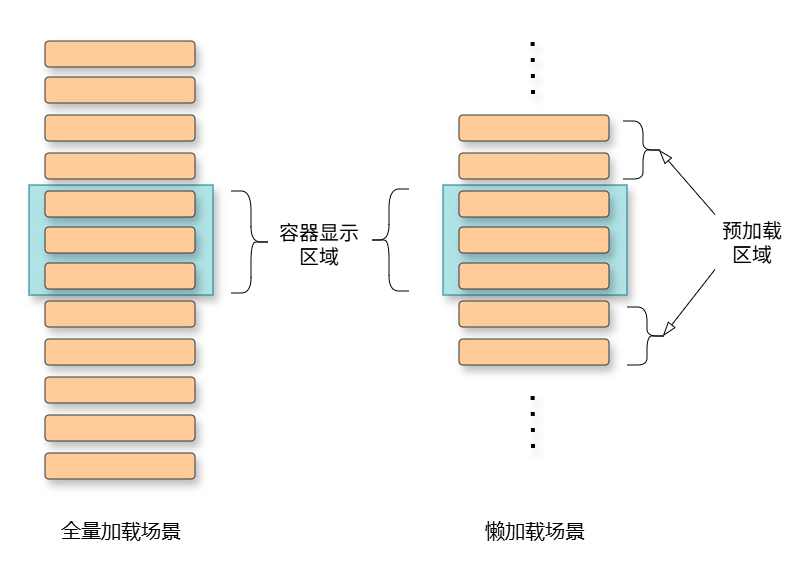

# 渲染控制概述

ArkUI通过[自定义组件](/arkui/arkts-ui-development/arkts-ui-paradigm-basic-syntax/arkts-custom-components/arkts-create-custom-components)的[build()函数](/arkui/arkts-ui-development/arkts-ui-paradigm-basic-syntax/arkts-custom-components/arkts-create-custom-components#build函数)和[@Builder装饰器](/arkui/arkts-ui-development/arkts-ui-paradigm-basic-syntax/arkts-extend-components/arkts-builder)中的声明式UI描述语句构建相应的UI。在声明式描述语句中开发者除了使用系统组件外，还可以使用渲染控制组件来辅助UI的构建，这些渲染控制组件包括控制组件是否显示的条件渲染组件和基于数组数据快速生成组件的循环渲染组件。

## 基本概念

| 名词 | 含义 |
| --- | --- |
| 条件渲染 | 根据给定的条件，判断是否渲染指定的UI组件。 |
| 循环渲染 | 根据给定的数据源，渲染出一系列相似的UI组件。 |
| 条件渲染组件 | 能够实现条件渲染的语法组件：[if-else](/arkui/arkts-ui-development/arkts-rendering-control/arkts-rendering-control-ifelse)。 |
| 循环渲染组件 | 能够实现循环渲染的语法组件：[ForEach](/arkui/arkts-ui-development/arkts-rendering-control/arkts-rendering-control-foreach)、[LazyForEach](/arkui/arkts-ui-development/arkts-rendering-control/arkts-rendering-control-lazyforeach)、[Repeat](/arkui/arkts-ui-development/arkts-rendering-control/arkts-new-rendering-control-repeat)。 |
| 滚动容器组件 | [List](/ref/arkui-api/arkui-declarative-comp/scroll-and-swipe/ts-container-list/ts-container-list)、[ListItemGroup](/ref/arkui-api/arkui-declarative-comp/scroll-and-swipe/ts-container-listitemgroup/ts-container-listitemgroup)、[Grid](/ref/arkui-api/arkui-declarative-comp/scroll-and-swipe/ts-container-grid/ts-container-grid)、[Swiper](/ref/arkui-api/arkui-declarative-comp/scroll-and-swipe/ts-container-swiper/ts-container-swiper)、[WaterFlow](/ref/arkui-api/arkui-declarative-comp/scroll-and-swipe/ts-container-waterflow/ts-container-waterflow)。 |
| 预加载区域 | 懒加载模式下紧邻容器组件显示范围的区域。该区域内的子组件会在系统空闲时提前创建并布局。其大小由容器组件的cachedCount属性设定。  以List为例，设置[cachedCount](/ref/arkui-api/arkui-declarative-comp/scroll-and-swipe/ts-container-list/ts-container-list#cachedcount)属性后，显示区域外上下各会预加载并布局cachedCount行[ListItem](/ref/arkui-api/arkui-declarative-comp/scroll-and-swipe/ts-container-listitem/ts-container-listitem)。cachedCount默认值等于显示区域中节点的数量。 |

## 全量加载&懒加载介绍

循环渲染数组数据，通常有以下两种方式：全量加载和懒加载（配合滚动容器组件）。

全量加载场景下，组合（Composition）阶段会一次性将所有子组件节点都挂载到UI树上，后续渲染（Rendering）阶段绘制全部子组件。长列表场景下，加载所有节点会导致页面卡顿、高内存占用，尤其是当列表数据高频刷新时，非常影响页面使用体验。首次加载耗时长，但滑动时性能较好，适合数据较少的场景。

相比之下，懒加载场景只加载“列表显示区域+预加载区域”的子组件节点。滚动容器组件获取需要构建的组件的索引范围，创建需要的节点并计算布局，在列表滑动或数据更新时再次刷新索引范围。首次加载性能提升，滑动时创建节点，性能降低。

应用开发者应该根据实际业务情况选择适合的场景。当明确数据列表长度固定，且长度小于某个值（取决于容器组件区域显示子组件的个数），可以考虑使用全量加载方式。除此之外的其他场景，都推荐使用懒加载方式渲染列表数据。

ArkUI框架为鸿蒙应用开发者提供了[ForEach](/arkui/arkts-ui-development/arkts-rendering-control/arkts-rendering-control-foreach)组件（全量加载）和[LazyForEach](/arkui/arkts-ui-development/arkts-rendering-control/arkts-rendering-control-lazyforeach)组件（懒加载）对列表数据循环渲染。除此之外，[Repeat](/arkui/arkts-ui-development/arkts-rendering-control/arkts-new-rendering-control-repeat)组件同时支持两种开发场景，并且默认具备组件复用能力。

| 组件 | 懒加载能力 | 复用能力 | 推荐使用场景 |
| --- | --- | --- | --- |
| ForEach | × | × | 适用于数据量较少的短列表场景。 |
| LazyForEach | √ | × | 适用于长列表、网格等需要滚动浏览大量数据的场景。 |
| Repeat | √ | √ | 适用于长列表、网格等需要滚动浏览大量数据的场景，并且其复用能力有助于优化渲染性能。 |

## 最佳实践

- [懒加载优化性能-界面渲染性能优化-性能场景优化案例](https://developer.huawei.com/consumer/cn/doc/best-practices/bpta-lazyforeach-optimization)
- [长列表加载丢帧优化-界面渲染性能优化-性能场景优化案例](https://developer.huawei.com/consumer/cn/doc/best-practices/bpta-best-practices-long-list)
