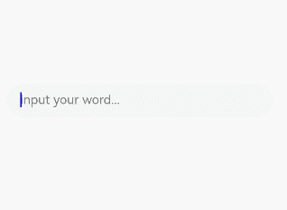

# $$语法：系统组件双向同步

$$运算符为系统组件提供TS变量的引用，使得TS变量和系统组件的内部状态保持同步。

内部状态的具体含义取决于组件。例如，[TextInput](/ref/arkui-api/arkui-declarative-comp/text-and-input/ts-basic-components-textinput/ts-basic-components-textinput)组件的text参数。

## 使用规则

- 当前$$支持基础类型变量，当该变量使用[@State](/arkui/arkts-ui-development/arkts-state-management/arkts-state-management-v1/arkts-v1-component-state-management/arkts-state)、[@Link](/arkui/arkts-ui-development/arkts-state-management/arkts-state-management-v1/arkts-v1-component-state-management/arkts-link)、[@Prop](/arkui/arkts-ui-development/arkts-state-management/arkts-state-management-v1/arkts-v1-component-state-management/arkts-prop)、[@Provide](/arkui/arkts-ui-development/arkts-state-management/arkts-state-management-v1/arkts-v1-component-state-management/arkts-provide-and-consume)等状态管理V1装饰器装饰，或者[@Local](/arkui/arkts-ui-development/arkts-state-management/arkts-state-management-v2/arkts-v2-manage-component-state/arkts-new-local)等状态管理V2装饰器装饰时，变量值的变化会触发UI刷新。
- 当前$$支持的组件：

  | 组件 | 支持的参数/属性 | 起始API版本 |
  | --- | --- | --- |
  | [Checkbox](/ref/arkui-api/arkui-declarative-comp/buttons-and-selections/ts-basic-components-checkbox/ts-basic-components-checkbox) | select | 10 |
  | [CheckboxGroup](/ref/arkui-api/arkui-declarative-comp/buttons-and-selections/ts-basic-components-checkboxgroup/ts-basic-components-checkboxgroup) | selectAll | 10 |
  | [DatePicker](/ref/arkui-api/arkui-declarative-comp/buttons-and-selections/ts-basic-components-datepicker/ts-basic-components-datepicker) | selected | 10 |
  | [TimePicker](/ref/arkui-api/arkui-declarative-comp/buttons-and-selections/ts-basic-components-timepicker/ts-basic-components-timepicker) | selected | 10 |
  | [MenuItem](/ref/arkui-api/arkui-declarative-comp/menus/ts-basic-components-menuitem/ts-basic-components-menuitem) | selected | 10 |
  | [Panel](/ref/arkui-api/arkui-declarative-comp/arkui-declarative-comp-dep/ts-container-panel/ts-container-panel) | mode | 10 |
  | [Radio](/ref/arkui-api/arkui-declarative-comp/buttons-and-selections/ts-basic-components-radio/ts-basic-components-radio) | checked | 10 |
  | [Rating](/ref/arkui-api/arkui-declarative-comp/buttons-and-selections/ts-basic-components-rating/ts-basic-components-rating) | rating | 10 |
  | [Search](/ref/arkui-api/arkui-declarative-comp/text-and-input/ts-basic-components-search/ts-basic-components-search) | value | 10 |
  | [SideBarContainer](/ref/arkui-api/arkui-declarative-comp/grid-and-column-layout/ts-container-sidebarcontainer/ts-container-sidebarcontainer) | showSideBar | 10 |
  | [Slider](/ref/arkui-api/arkui-declarative-comp/buttons-and-selections/ts-basic-components-slider/ts-basic-components-slider) | value | 10 |
  | [Stepper](/ref/arkui-api/arkui-declarative-comp/arkui-declarative-comp-dep/ts-basic-components-stepper/ts-basic-components-stepper) | index | 10 |
  | [Swiper](/ref/arkui-api/arkui-declarative-comp/scroll-and-swipe/ts-container-swiper/ts-container-swiper) | index | 10 |
  | [Tabs](/ref/arkui-api/arkui-declarative-comp/navigation-and-switching/ts-container-tabs/ts-container-tabs) | index | 10 |
  | [TextArea](/ref/arkui-api/arkui-declarative-comp/text-and-input/ts-basic-components-textarea/ts-basic-components-textarea) | text | 10 |
  | [TextInput](/ref/arkui-api/arkui-declarative-comp/text-and-input/ts-basic-components-textinput/ts-basic-components-textinput) | text | 10 |
  | [TextPicker](/ref/arkui-api/arkui-declarative-comp/buttons-and-selections/ts-basic-components-textpicker/ts-basic-components-textpicker) | selected、value | 10 |
  | [Toggle](/ref/arkui-api/arkui-declarative-comp/buttons-and-selections/ts-basic-components-toggle/ts-basic-components-toggle) | isOn | 10 |
  | [AlphabetIndexer](/ref/arkui-api/arkui-declarative-comp/information-display/ts-container-alphabet-indexer/ts-container-alphabet-indexer) | selected | 10 |
  | [Select](/ref/arkui-api/arkui-declarative-comp/buttons-and-selections/ts-basic-components-select/ts-basic-components-select) | selected、value | 10 |
  | [BindSheet](/ref/arkui-api/arkui-declarative-comp/ts-component-general-attributes/transition/ts-universal-attributes-sheet-transition/ts-universal-attributes-sheet-transition#bindsheet) | isShow | 10 |
  | [BindContentCover](/ref/arkui-api/arkui-declarative-comp/ts-component-general-attributes/transition/ts-universal-attributes-modal-transition/ts-universal-attributes-modal-transition#bindcontentcover) | isShow | 10 |
  | [Refresh](/ref/arkui-api/arkui-declarative-comp/scroll-and-swipe/ts-container-refresh/ts-container-refresh) | refreshing | 8 |
  | [GridItem](/ref/arkui-api/arkui-declarative-comp/scroll-and-swipe/ts-container-griditem/ts-container-griditem) | selected | 10 |
  | [ListItem](/ref/arkui-api/arkui-declarative-comp/scroll-and-swipe/ts-container-listitem/ts-container-listitem) | selected | 10 |

## 使用示例

以[TextInput](/ref/arkui-api/arkui-declarative-comp/text-and-input/ts-basic-components-textinput/ts-basic-components-textinput)方法的text参数为例：

```
// xxx.ets
@Entry
@Component
struct TextInputExample {
  @State text: string = '';
  controller: TextInputController = new TextInputController();

  build() {
    Column({ space: 20 }) {
      Text(this.text)
      TextInput({ text: $$this.text, placeholder: 'input your word...', controller: this.controller })
        .placeholderColor(Color.Grey)
        .placeholderFont({ size: 14, weight: 400 })
        .caretColor(Color.Blue)
        .width(300)
    }
    .width('100%')
    .height('100%')
    .justifyContent(FlexAlign.Center)
  }
}
```


