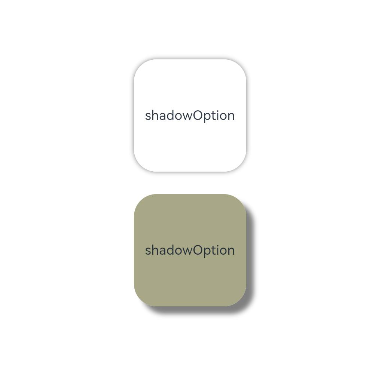

# 阴影

阴影接口[shadow](/ref/arkui-api/arkui-declarative-comp/ts-component-general-attributes/visual-effect-property/ts-universal-attributes-image-effect/ts-universal-attributes-image-effect#shadow)可以为当前组件添加阴影效果，该接口支持两种类型参数，开发者可配置[ShadowOptions](/ref/arkui-api/arkui-declarative-comp/ts-component-general-attributes/visual-effect-property/ts-universal-attributes-image-effect/ts-universal-attributes-image-effect#shadowoptions对象说明)自定义阴影效果。ShadowOptions模式下，当radius = 0或者color的透明度为0时，无阴影效果。

```
@Entry
@Component
struct ShadowOptionDemo {
  build() {
    Row() {
      Column() {
        Column() {
          Text('shadowOption').fontSize(12)
        }
        .width(100)
        .aspectRatio(1)
        .margin(10)
        .justifyContent(FlexAlign.Center)
        .backgroundColor(Color.White)
        .borderRadius(20)
        .shadow({ radius: 10, color: Color.Gray })

        Column() {
          Text('shadowOption').fontSize(12)
        }
        .width(100)
        .aspectRatio(1)
        .margin(10)
        .justifyContent(FlexAlign.Center)
        .backgroundColor('#a8a888')
        .borderRadius(20)
        .shadow({
          radius: 10,
          color: Color.Gray,
          offsetX: 20,
          offsetY: 20
        })
      }
      .width('100%')
      .height('100%')
      .justifyContent(FlexAlign.Center)
    }
    .height('100%')
  }
}
```


