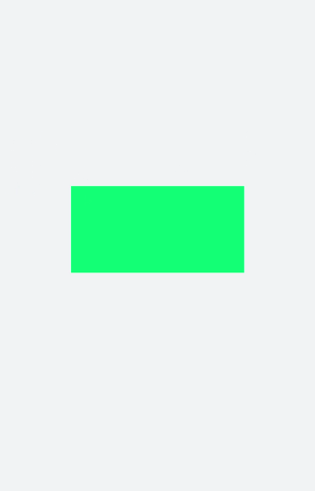
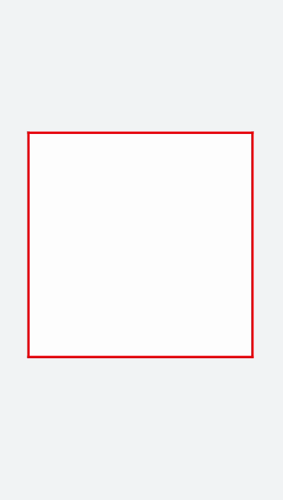
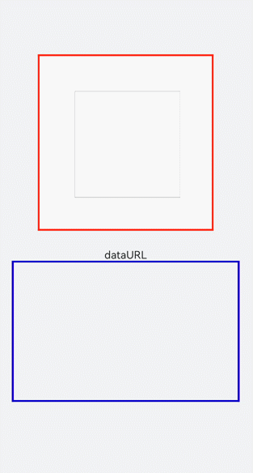

# Canvas对象

Canvas组件提供画布，用于自定义绘制图形。具体用法请参考[CanvasRenderingContext2D对象](/ref/arkui-api/arkui-js-comp/arkui-js-full-comp/js-full-canvas-comp/js-components-canvas-canvasrenderingcontext2d/js-components-canvas-canvasrenderingcontext2d)。

## 创建Canvas组件

在pages/index目录下的hml文件中创建一个Canvas组件。

```
<!-- xxx.hml -->
<div class="container">
  <canvas></canvas>
</div>
```

```
/* xxx.css */
.container {
    width: 100%;
    height: 100%;
    flex-direction: column;
    justify-content: center;
    align-items: center;
    background-color: #F1F3F5;
}

canvas {
    background-color: #00ff73;
}
```



 

- Canvas组件默认背景色与父组件的背景色一致。
- Canvas默认宽高为width: 300px，height: 150px。

## 添加样式

Canvas组件设置宽（width）、高（height）、背景色（background-color）及边框样式（border）。

```
<!-- xxx.hml -->
<div class="container">
  <canvas></canvas>
</div>
```

```
/* xxx.css */
.container {
    flex-direction: column;
    justify-content: center;
    align-items: center;
    background-color: #F1F3F5;
    width: 100%;
    height: 100%;
}

canvas {
    width: 500px;
    height: 500px;
    background-color: #fdfdfd;
    border: 5px solid red;
}
```



## 添加事件

Canvas添加长按事件，长按后可获取Canvas组件的dataUrl值（toDataURL方法返回的图片信息），打印在下方文本区域内。

 

promptAction相关接口参考[弹窗](/ref/arkui-api/arkui-arkts/ui/js-apis-promptaction/js-apis-promptaction)。

```
<!-- xxx.hml -->
<div class="container">
    <canvas ref="canvas1" onlongpress="getUrl"></canvas>
    <text>dataURL</text>
    <text class="content">{{ dataURL }}</text>
</div>
```

```
/* xxx.css */
.container {
    width: 100%;
    height: 100%;
    flex-direction: column;
    justify-content: center;
    align-items: center;
    background-color: #F1F3F5;
}

canvas {
    width: 500px;
    height: 500px;
    background-color: #fdfdfd;
    border: 5px solid red;
    margin-bottom: 50px;
}

.content {
    border: 5px solid blue;
    padding: 10px;
    width: 90%;
    height: 400px;
    overflow: scroll;
}
```

```
// xxx.js
import promptAction from '@ohos.promptAction';

export default {
    data: {
        dataURL: null,
    },
    onShow() {
        let el = this.$refs.canvas1;
        let ctx = el.getContext("2d");
        ctx.strokeRect(100, 100, 300, 300);
    },
    getUrl() {
        let el = this.$refs.canvas1
        let dataUrl = el.toDataURL()
        this.dataURL = dataUrl;
        promptAction.showToast({ duration: 2000, message: "long press,get dataURL" })
    }
}
```



 

画布不支持在onInit和onReady中进行创建。
