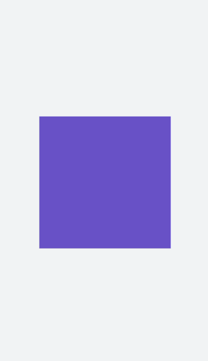
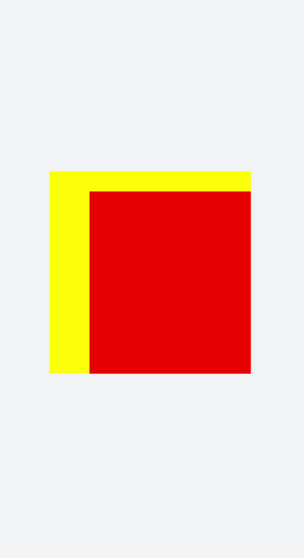

# 基础知识

svg组件主要作为svg画布的根节点使用，也可以在svg中嵌套使用。具体用法请参考[svg](/ref/arkui-api/arkui-js-comp/arkui-js-full-comp/js-full-svg-comp/js-components-svg/js-components-svg)。

 

svg父组件或者svg组件需要定义宽高值，否则不进行绘制。

## 创建svg组件

在pages/index目录下的hml文件中创建一个svg组件。

```
<!-- xxx.hml -->
<div class="container">
  <svg width="400" height="400">  </svg>
</div>
```

```
/* xxx.css */
.container{
  width: 100%;
  height: 100%;
  flex-direction: column;
  align-items: center;
  justify-content: center;
  background-color: #F1F3F5;
}
svg{
  background-color: blue;
}
```



## 设置属性

通过设置width、height、x、y和viewBox属性为svg设置宽度、高度、x轴坐标、y轴坐标和svg视口。

```
<!-- xxx.hml -->
<div class="container">
  <svg width="400" height="400" viewBox="0 0 100 100">    
    <svg class="rect" width="100" height="100" x="20" y="10">    
    </svg>  
  </svg>
</div>
```

```
/* xxx.css */
.container{
  width: 100%;
  height: 100%;
  flex-direction: column;
  align-items: center;
  justify-content: center;
  background-color: #F1F3F5;
}
svg{
  background-color: yellow;
}
.rect{
  background-color: red;
}
```



 

- x和y设置的是当前svg的x轴和y轴坐标，如果当前svg为根节点，x轴和y轴属性无效。
- viewBox的宽高和svg的宽高不一致，会以中心对齐进行缩放。
