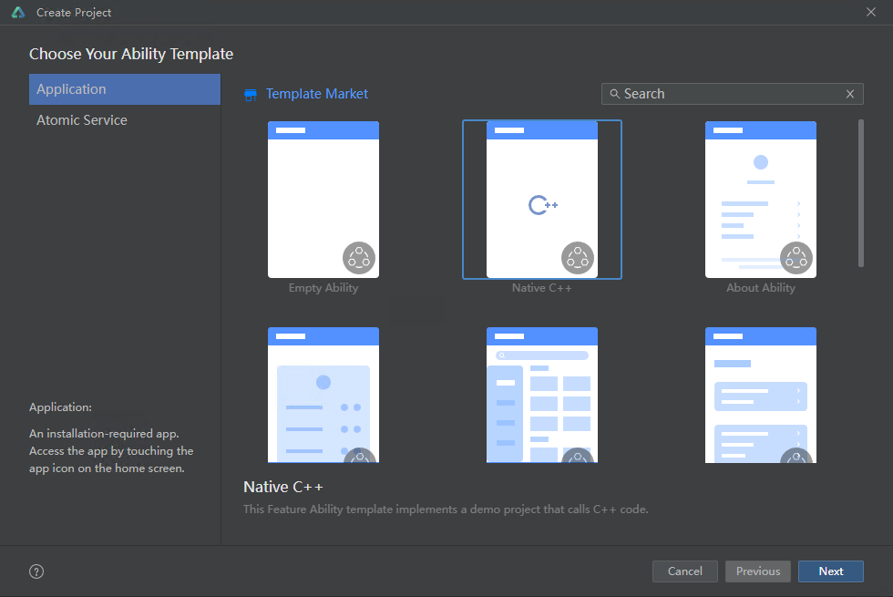
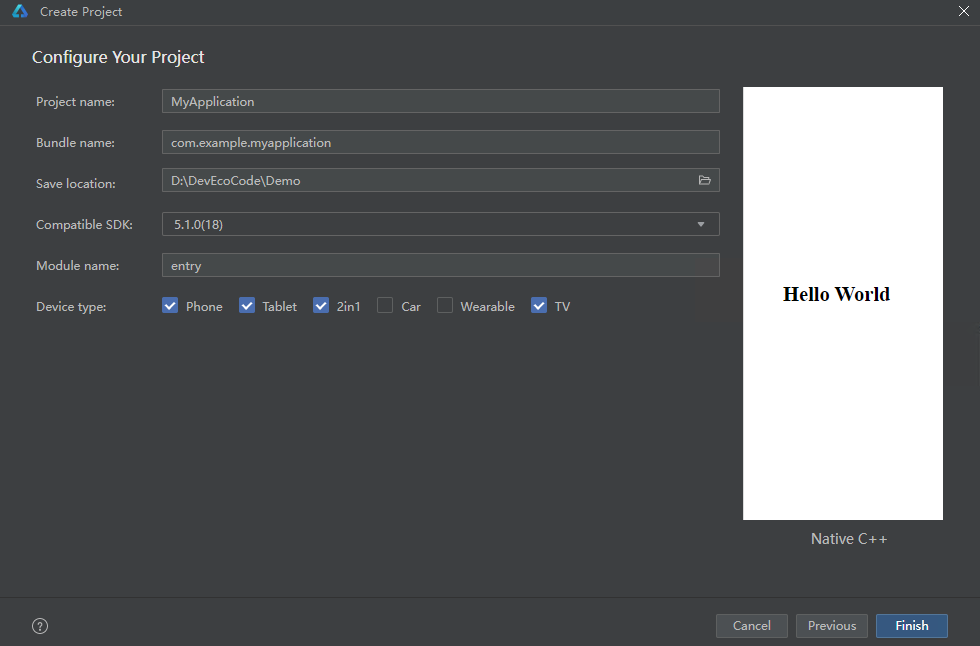

# 创建项目

本章以[Caffe SqueezeNet](https://github.com/forresti/SqueezeNet)模型集成为例，说明App集成操作过程。

1. 创建DevEco Studio项目，选择“Native C++”模板，点击“Next”。

   
2. 按需填写“Project name”、“Save location”和“Module name”，选择“Compile SDK”为“5.1.0(18)”及以上版本，点击“Finish”。

   
