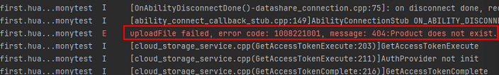

# 使用云存储上传文件失败，提示“404:Product does not exist”

****问题现象****

使用云存储上传文件失败，HiLog提示“404:Product does not exist”。

****解决措施****

此错误由云存储服务端返回，原因是云存储服务未开通。请[开通云存储服务](/cloud-foundation-kit-guide/cloudfoundation-preparations/cloudfoundation-enable-storage)。
