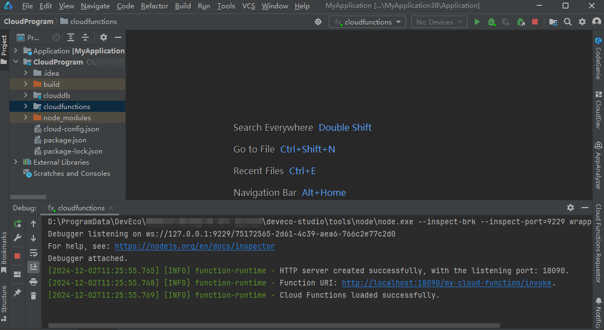

# 启动本地云函数

请按照如下步骤启动本地云函数：

1. [创建端云一体化开发工程](/ide-project/ide-module-management/agc-harmonyos-clouddevguide/agc-harmonyos-clouddev-devprocess/agc-harmonyos-clouddev-devproject/agc-harmonyos-create-appproject)：选择合适的云开发模板，根据工程向导创建端云一体化开发工程。
2. [开发云函数](/ide-project/ide-module-management/agc-harmonyos-clouddevguide/agc-harmonyos-clouddev-devprocess/agc-harmonyos-clouddev-develop/agc-harmonyos-clouddev-cloudfunctions/agc-harmonyos-clouddev-functionprocess)：使用DevEco Studio在端云一体化云侧工程下创建函数、开发函数、调试函数（通过本地调用方式调试函数）。

   调试函数过程中，如果下方通知栏的“cloudfunctions”窗口显示“Cloud Functions loaded successfully”，则表示本地云函数启动成功，将生成本地函数的Function URI。****请记录下该Function URI的域名和端口信息，例如下图中的`http://localhost:18090`，后续[调用本地云函数](/cloud-foundation-kit-guide/cloudfoundation-function-service/cloudfoundation-debug-local-function/cloudfoundation-call-local-function)时需要使用这些信息。****

    

   由于本地云函数和部署至云端的函数获取请求体的方式不同，开发本地云函数时必须按照如下示例获取请求体，否则将无法成功获取请求体：

   let body = event.body ? JSON.parse(event.body) : event;

   完整示例代码请参见[函数示例](/cloud-foundation-kit-guide/cloudfoundation-function-service/cloudfoundation-develop-cloud-function/cloudfoundation-develop-function/cloudfoundation-develop-function-nodejs#函数示例)。

   
