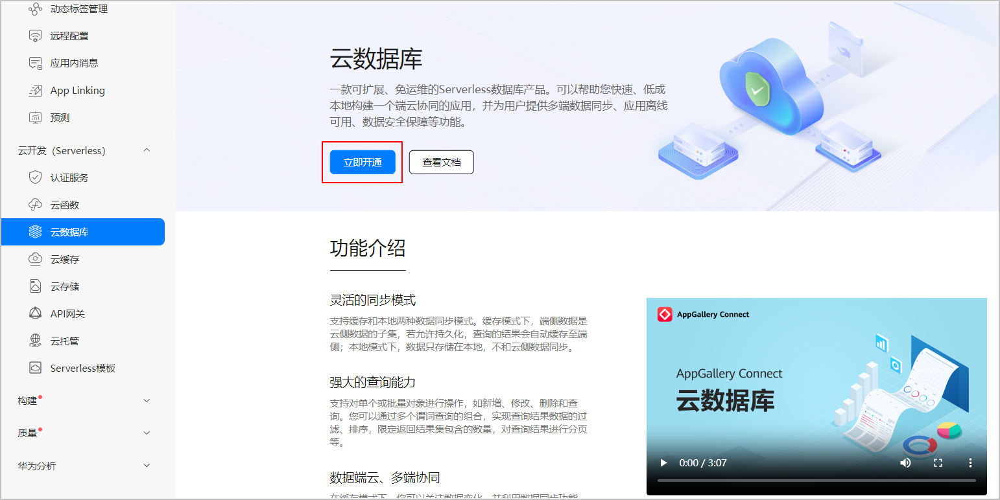

# 开通云数据库服务

首次使用云数据库服务前，需要先开通此服务。如果已经开通，可跳过本步骤。

1. 登录[AppGallery Connect](https://developer.huawei.com/consumer/cn/service/josp/agc/index.html)，点击“开发与服务”。
2. 在项目列表中点击需要开通云数据库的项目。
3. 在左侧导航栏选择“云开发（Serverless）> 云数据库”，进入云数据库页面，点击“立即开通”。

   

    

   如果开发者此时未设置数据处理位置，系统会自动弹出提示框提示开发者进行设置，具体请参见[设置数据处理位置](https://developer.huawei.com/consumer/cn/doc/app/agc-help-data-location-0000002277923065#section154810363471)。
