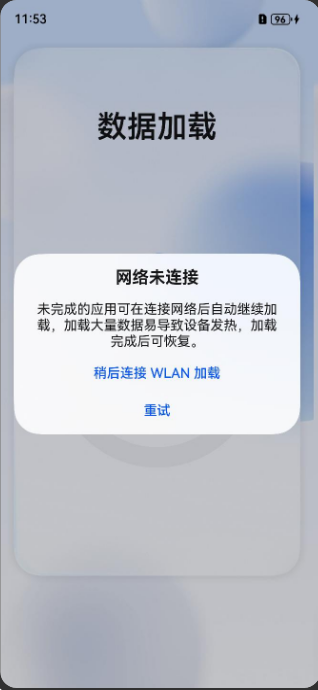
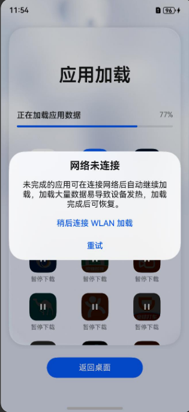
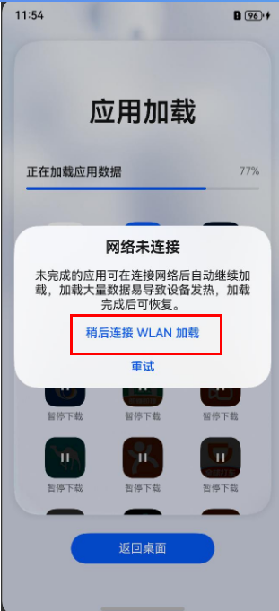
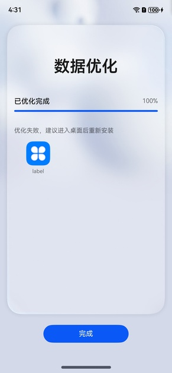

# 常见问题与异常处理

## 应用数据迁移暂停

****问题现象1****

在数据加载界面，应用数据迁移暂停。

****可能原因****

应用数据迁移的过程中需要使用到网络，当前终端设备网络不可用，导致数据迁移暂停。

****解决方法****

单击“稍后连接WLAN加载”按钮，进入桌面后连接网络，终端设备网络可用后，恢复应用数据迁移。

****问题现象2****

进入桌面之后，若应用数据迁移还未结束，可通过通知栏进入应用加载界面查看加载进度

在应用加载界面，应用数据迁移暂停。

****可能原因****

应用数据迁移的过程中需要使用到网络，当前终端设备网络不可用，导致数据迁移暂停。

****解决方法****

单击“稍后连接WLAN加载”按钮，进入桌面后连接网络，终端设备网络可用后，恢复应用数据迁移。

## 应用数据迁移执行十五分钟后失败

****问题现象****

应用数据迁移执行十五分钟后显示失败。

****可能原因****

单个应用数据迁移执行超过十五分钟，超过设定的单个应用最长数据迁移时间，任务执行失败。

****解决方法****

请优化应用BackupExtensionAbility的代码实现，在十五分钟内完成应用数据迁移。

 

已接入“数据迁移框架”的应用完成数据迁移后，才可以被消费者使用。尽可能快的完成应用数据迁移，可以带给消费者更好的体验。
