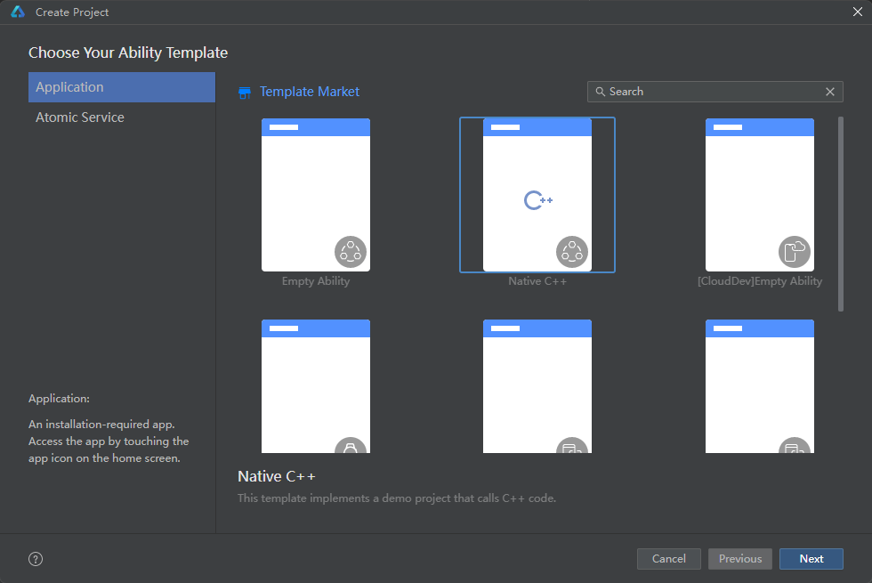
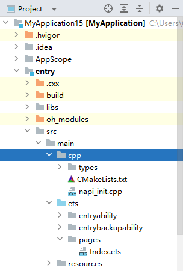

# 创建NDK工程

下面通过DevEco Studio的NDK工程模板，来演示如何创建一个NDK工程。

 

不同DevEco Studio版本的向导界面、模板默认参数等会有所不同，请根据实际工程需要，创建工程或修改工程参数。

1. 通过如下两种方式，打开工程创建向导界面。

   - 如果当前未打开任何工程，可以在DevEco Studio的欢迎页，选择****Create Project****开始创建一个新NDK工程。
   - 如果已经打开了工程，可以在菜单栏选择****File > New > Create Project****来创建一个新NDK工程。
2. 根据工程创建向导，选择Native C++工程模板，然后单击****Next****。

   
3. 在工程配置页面，根据向导配置工程的基本信息后，单击****Finish****，工具会自动生成示例代码和相关资源，等待工程创建完成。

   在工程entry/src/main目录下会包含cpp目录，该目录文件的详细介绍请参见[C++工程目录结构](/ide-project/ide-project-structure)。

   
