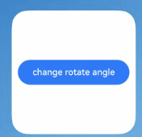

# ArkTS卡片为组件添加动效

ArkTS卡片开放了使用动画效果的能力，支持[显式动画](/ref/arkui-api/arkui-declarative-comp/animation/ts-explicit-animation/ts-explicit-animation)、[属性动画](/ref/arkui-api/arkui-declarative-comp/animation/ts-animatorproperty/ts-animatorproperty)、[组件内转场](/ref/arkui-api/arkui-declarative-comp/animation/ts-transition-animation-component/ts-transition-animation-component)能力。ArkTS卡片使用动画效果时具有以下限制：

****表1**** 动效参数限制

| 名称 | 参数说明 | 限制描述 |
| --- | --- | --- |
| duration | 动画播放时长 | 限制最长的动效播放时长为1秒，当设置大于1秒的时间时，动效时长仍为1秒。 |
| tempo | 动画播放速度 | 卡片中禁止设置此参数，使用默认值1。 |
| delay | 动画延迟执行的时长 | 卡片中禁止设置此参数，使用默认值0毫秒。 |
| iterations | 动画播放次数 | 卡片中禁止设置此参数，使用默认值1次。 |

 

静态卡片不支持使用动效能力。

## 组件自身动效

以下示例代码使用[animation](/ref/arkui-api/arkui-declarative-comp/animation/ts-animatorproperty/ts-animatorproperty)接口实现了按钮旋转的动画效果。



```
@Entry
@Component
struct AnimationCard {
  @State rotateAngle: number = 0;

  build() {
    Row() {
      Button('change rotate angle')
        .height('20%')
        .width('90%')
        .margin('5%')
        .onClick(() => {
          this.rotateAngle = (this.rotateAngle === 0 ? 90 : 0);
        })
        .rotate({ angle: this.rotateAngle })
        .animation({
          curve: Curve.EaseOut,
          playMode: PlayMode.Normal,
        })
    }.height('100%')
     .alignItems(VerticalAlign.Center)
  }
}
```

## 组件转场动效

以下示例代码使用[transition](/ref/arkui-api/arkui-declarative-comp/animation/ts-transition-animation-component/ts-transition-animation-component)接口实现了在卡片内图片出现与消失的动画效果。


```
// entry/src/main/ets/widget/pages/TransitionEffectExample1.ets
@Entry
@Component
struct TransitionEffectExample1 {
  @State flag: boolean = true;
  @State show: string = 'show';

  build() {
    Column() {
      Button(this.show).width(80).height(30).margin(30)
        .onClick(() => {
          // 点击Button控制Image的显示和消失
          if (this.flag) {
            this.show = 'hide';
          } else {
            this.show = 'show';
          }
          this.flag = !this.flag;
        })
      if (this.flag) {
        // Image的显示和消失配置为相同的过渡效果（出现和消失互为逆过程）
        // 出现时从指定的透明度为0、绕z轴旋转180°的状态，变为默认的透明度为1、旋转角为0的状态，透明度与旋转动画时长都为1000ms
        // 消失时从默认的透明度为1、旋转角为0的状态，变为指定的透明度为0、绕z轴旋转180°的状态，透明度与旋转动画时长都为1000ms
        // $r('app.media.testImg')需要替换开发者所需的图像资源文件
        Image($r('app.media.testImg')).width(200).height(200)
          .transition(TransitionEffect.OPACITY.animation({ duration: 1000, curve: Curve.Ease }).combine(
            TransitionEffect.rotate({ z: 1, angle: 180 })
          ))
      }
    }.width('100%')
  }
}
```
