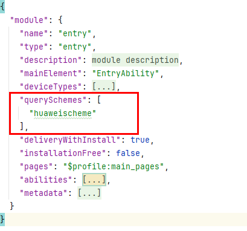

# 拉起运动健康App隐私授权

## 场景介绍

用户在设备上首次使用运动健康服务时，需要用户同意运动健康服务隐私协议，当前隐私授权依赖运动健康App，需引导用户打开运动健康App并完成隐私授权。

开发者调用后续章节的接口后，如果返回错误码[1002703001](/ref/health-service-api/errorcode-healthservice/errorcode-healthservice#section1002703001-用户隐私未同意)，可参考本章节，引导用户同意运动健康服务隐私授权。

## 开发步骤

1. 在module.json5文件中增加querySchemes字段，并在列表中配置"huaweischeme"。

   "huaweischeme"为需要跳转到的运动健康App首页的scheme，页面参考如下：

   
2. 导入相关功能模块。

   ```
   import { bundleManager, common, Want } from '@kit.AbilityKit';
   import { BusinessError } from '@kit.BasicServicesKit';
   import { productViewManager } from '@kit.AppGalleryKit';
   import { hilog } from '@kit.PerformanceAnalysisKit';
   ```
3. 调用[canOpenLink](/ref/ability-api/ability-arkts/both-models/js-apis-bundlemanager/js-apis-bundlemanager#bundlemanagercanopenlink12)判断运动健康App是否安装。

   - 已安装则调用[openLink](/ref/ability-api/ability-arkts/ability-api-interface-depend/ability-arkts-application/js-apis-inner-application-uiabilitycontext/js-apis-inner-application-uiabilitycontext#openlink12)接口拉起运动健康App；
   - 未安装调用[应用市场推荐](/store-kit-guide/store-productview#应用详情页展示)接口，引导用户下载运动健康App。

   ```
   try {
    // 请在组件内获取context，确保this.getUIContext().getHostContext()返回结果为UIAbilityContext
     let result = bundleManager.canOpenLink('huaweischeme://healthapp/home/main');
     let context = this.getUIContext().getHostContext() as common.UIAbilityContext;
     if (result) {
       // 拉起运动健康App首页，进行隐私授权
       let link: string = 'huaweischeme://healthapp/home/main';
       await context.openLink(link)
     } else {
       // 拉起应用市场推荐，引导用户下载运动健康App，进行隐私授权
       const wantParam: Want = {
         parameters: {
           bundleName: 'com.huawei.hmos.health'
         }
       };
       const callback: productViewManager.ProductViewCallback = {
         onError: (error: BusinessError) => {
           hilog.error(0x0001, 'TAG', `Failed to open AppGallery.Code: ${error.code}, message: ${error.message}`);
         }
       }
       productViewManager.loadProduct(context, wantParam, callback);
     }
   } catch (err) {
     hilog.error(0x0000, 'testTag', `Failed to agree user privacy.Code: ${err.code}, message: ${err.message}`);
   }
   ```
