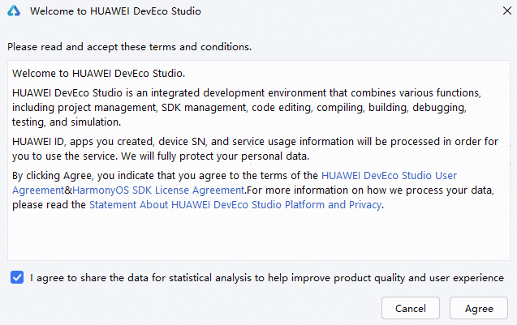
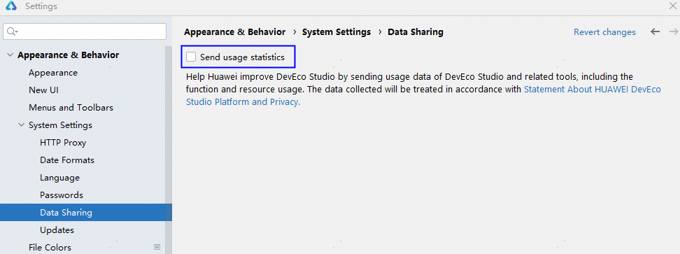

# 关闭数据采集

DevEco Studio在首次启动时，弹窗出现提示开启数据采集功能。该功能用于帮助DevEco Studio改进使用体验，收集的数据将按照[关于HUAWEI DevEco Studio 平台与隐私的声明](https://legal.cloud.huawei.com/terms/scope/huawei/deveco-studio-hmos/privacy-statement.htm?code=CN&branchid=0&language=zh-cn)处理。

若开发者后续需要关闭数据采集功能，请在****File > Settings**** （macOS为****DevEco Studio > Preferences********/Settings****）****> Appearance & Behavior > System Settings > Data Sharing****设置界面，取消勾选****Send usage statistics****关闭数据采集开关。

