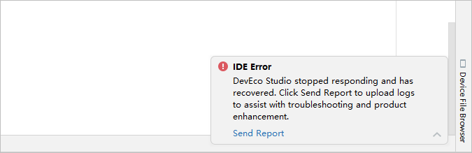

# 日志上传

 

该功能仅支持中国境内（香港特别行政区、澳门特别行政区、中国台湾除外）。

若开发过程中遇到DevEco Studio卡顿、卡死或其他故障时，可点击IDE Error问题弹窗中Send Report，点击OK后向DevEco Studio回传日志信息。

或通过菜单栏****Help > Collect Logs and Diagnostic Data****，选择并上传相关日志，帮助DevEco Studio提升稳定性体验。

若开发者后续需要关闭数据采集功能，请在****File > Settings****（macOS为****DevEco Studio > Preferences/Settings****）****> Appearance & Behavior > System Settings > Data Sharing****设置界面，取消勾选****Send usage statistics****关闭数据采集开关。

