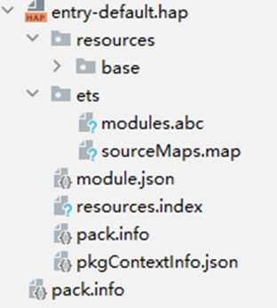

# 实践说明

应用正式对外发布版本前，需要对应用进行代码调试。调试和正式发布版本，两者编译行为可能不同。此时，可以利用buildMode能力，来定制两个版本的编译差异性。

假设其中构建产物均为default，但编译行为不同：release模式下使能混淆，debug模式下使能debug调试。

示例工程中包含一个模块entry，将entry模块交付到构建产物default中，模块定制两种不同的编译模式debug、release，将两种构建模式均绑定到构建产物default中。工程示例图如下（模块）：


## 工程级build-profile.json5示例

```
{
  "app": {
    "signingConfigs": [],
    "products": [
      {
        "name": "default",
        "signingConfig": "default",
        "compatibleSdkVersion": "6.1.0(23)",
        "runtimeOS": "HarmonyOS",
        "buildOption": {
          "strictMode": {
            "caseSensitiveCheck": true,
            "useNormalizedOHMUrl": true
          }
        }
      }
    ],
    "buildModeSet": [
      {
        "name": "debug"
      },
      {
        "name": "release"
      }
    ]
  },
  "modules": [
    {
      "name": "entry",
      "srcPath": "./entry",
      "targets": [
        {
          "name": "default",
          "applyToProducts": [
            "default"
          ]
        }
      ]
    }
  ]
}
```

## 模块级build-profile.json5示例

### entry模块

```
{
  "apiType": "stageMode",
  "buildOption": {
  },
  "buildOptionSet": [
    {
      "name": "release",
      "arkOptions": {
        "obfuscation": {
          "ruleOptions": {
            "enable": true,
            "files": [
              "./obfuscation-rules.txt"
            ]
          }
        }
      }
    },
    {
      "name": "debug",
      "debuggable": true,
      "arkOptions": {
        "obfuscation": {
          "ruleOptions": {
            "enable": false
          }
        }
      }
    }
  ],
  "buildModeBinder": [
    {
      "buildModeName": "release",
      "mappings": [
        {
          "buildOptionName": "release",
          "targetName": "default"
        }
      ]
    },
    {
      "buildModeName": "debug",
      "mappings": [
        {
          "buildOptionName": "debug",
          "targetName": "default"
        }
      ]
    }
  ],
  "targets": [
    {
      "name": "default",
    },
    {
      "name": "ohosTest",
    }
  ]
}
```

## 指定构建模式

### 命令行

示例1：构建APP时，构建产物为default，指定构建模式为debug，可执行如下命令：

```
hvigorw --mode project -p product=default -p buildMode=debug assembleApp
```

编译产物示例如下：



示例2：构建APP时，构建产物为default，指定构建模式为release，可执行如下命令：

```
hvigorw --mode project -p product=default -p buildMode=release assembleApp
```

编译产物示例如下：


### DevEco Studio界面

在DevEco Studio界面进行可视化配置，Build Mode下拉选择对应配置选项debug后，点击Build -> Build Hap(s)/APP(s) -> Build APP(s) ，构建编译模式为debug，构建产物为default的APP包。


