# 布局分析

开发者可以使用ArkUI Inspector，在DevEco Studio上查看应用在真机上的UI显示效果，并通过查看多次操作后的界面状态，快速分析定位UI界面存在的问题。

ArkUI Inspector支持的功能包括：

- [查看设备上应用的UI显示效果](#section1645813371383)。
- [导出及导入应用UI界面快照](#section0442629153111)，脱离设备查看UI显示效果。
- 在组件树上选择组件，UI界面自动框选对应组件，属性列表显示当前组件的属性信息。
- 在UI界面点击选择组件，组件树对应组件变化为选中状态，属性列表显示当前组件的属性信息。
- [UI组件源码跳转](#section1226015494335)，选中UI组件后点击源码跳转按钮即可跳转至源码位置。
- 在UI界面上选择Show Component Border，可[查看当前页面上所有组件显示区域](#section1137025915336)。
- 在组件树上选择自定义组件，属性列表显示当前组件配置的[状态变量信息以及影响组件](#section19923158103412)。
- [查看窗口交互事件](#section516993011576)，包括触屏、鼠标、按键、滚轮、窗口焦点变化事件。
- 按照组件粒度[3D展开应用](#section138812162416)，方便查看组件之间的嵌套、遮挡关系。

## 使用场景

针对界面较复杂的应用：

- 通过组件树查看组件的父子关系，检查是否存在冗余组件。
- 针对应用在真机或模拟器上运行出现UI界面显示异常，尤其经过多次界面复杂操作后产生的界面错误以及后台逻辑错误，进行问题分析定位。

## 使用约束

- 仅运行在前台的应用支持通过Inspector查看。
- 已通过USB或WLAN连接设备。
- 仅支持Stage工程。
- 仅支持全屏应用或者焦点在前台的窗口。
- 不支持应用市场上架的商用签名应用。

## 操作步骤

1. 在DevEco Studio下方点击****ArkUI Inspector****，打开ArkUI Inspector。

   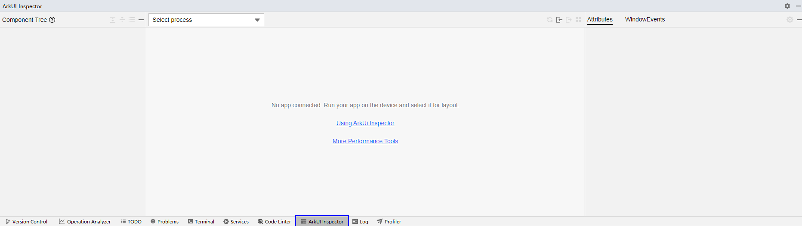
2. 点击RUN或者DEBUG按钮，将应用推送安装到设备上，在设备的应用列表中选择当前显示在前台的UI进程。

   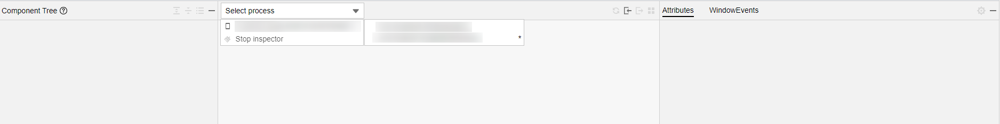
3. ArkUI Inspector左侧为当前的组件树结构，中间栏显示当前设备的UI界面，右侧在选中组件的情况下为当前组件的属性信息。可以在左侧组件树上或在中间UI界面点击选择组件。当设备上UI发生变化时，可点击中间栏右上角按钮同步设备上的UI效果。

   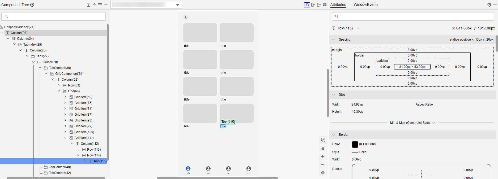
4. 在设备框，点击设备列表的最后一项****Stop inspector****，可断开与设备的连接。

   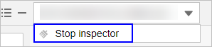

## 显示组件信息

- 点击，勾选****Show Tree Statistics****，可显示组件树组件信息。

  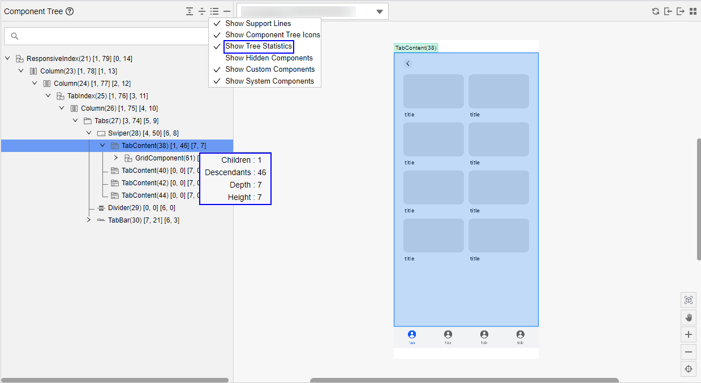
- 点击，勾选****Show Hidden Components****，可显示隐藏的组件。

  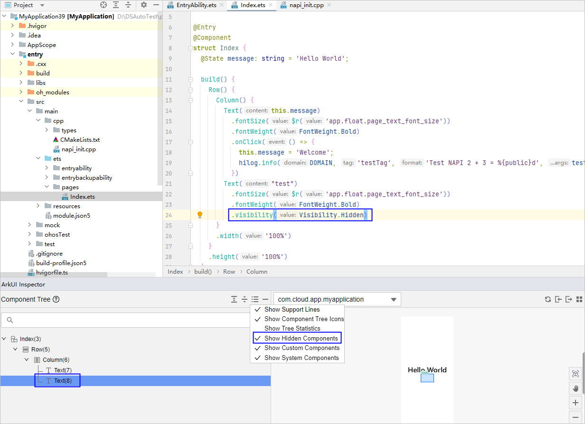
- 点击，勾选****Show Custom Components****，可过滤自定义组件。

  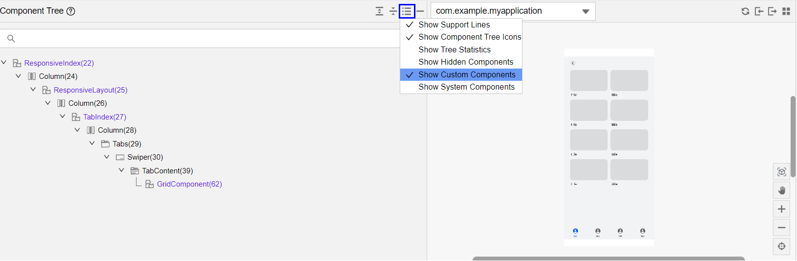
- 点击，勾选****Show System Components****，可过滤系统组件。

  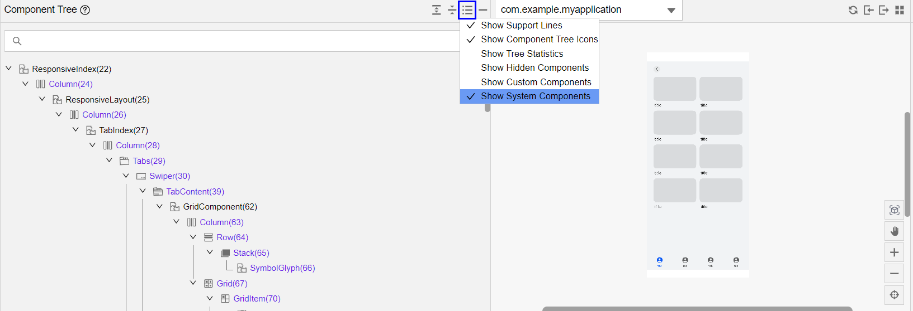

## 导入/导出UI界面快照

ArkUI Inspector支持导出及导入应用UI界面快照，脱离设备查看应用UI界面显示效果。

- 在中间栏点击可以导入本地的应用UI界面快照。导入成功后将在DevEco Studio中打开该快照。
- 在中间栏点击可以将应用UI界面快照导出到本地。导出成功后将默认在DevEco Studio中打开该快照。

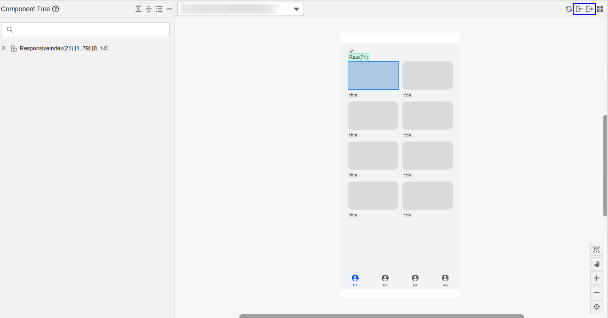

## UI组件源码跳转

1. 单击****Run > Edit Configurations****，勾选“****Enable DebugLine****”，点击****OK****保存后，重新运行工程，表示开启源码跳转功能。

   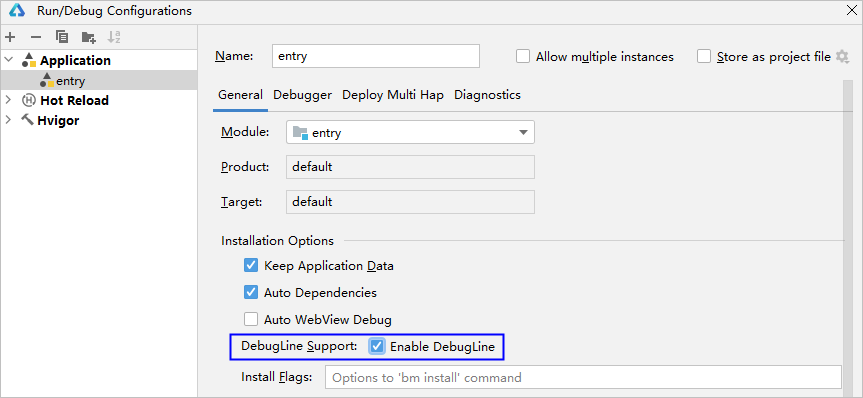
2. 在ArkUI Inspector中，选中要进行源码跳转的UI组件，点击右侧的源码跳转，即可跳转到UI组件源码位置。

   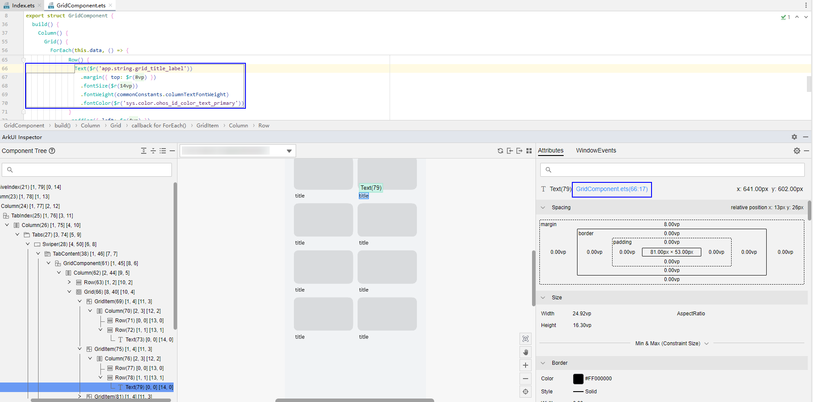

## 显示布局边框

在UI显示设置上，勾选“****Show Component Border****”，可显示当前页面所有组件的布局信息。

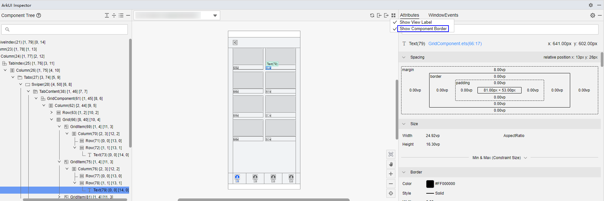

## 查看UI组件的状态变量

点击自定义组件，可以查看自定义组件的状态变量，以及状态变量影响的下一层组件。

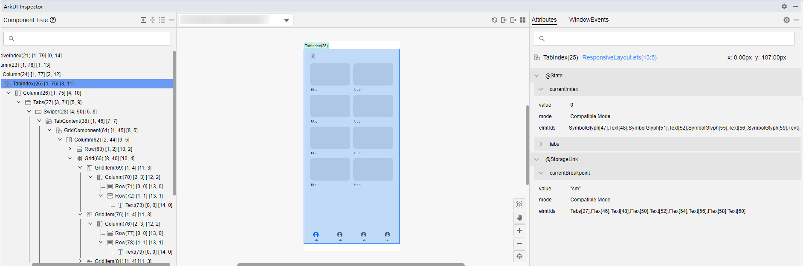

## 查看窗口交互事件

从DevEco Studio 6.1.0 Beta1版本开始，支持查看[窗口交互事件](/arkui/arkts-ui-development/arkts-interaction-development-guide-overview/arkts-interaction-capability-overview)，包括触屏、鼠标、按键、滚轮、窗口焦点变化事件，帮助开发者定位窗口发生失焦、获焦、重绘等问题。

选择****WindowEvents****页签，点击Start按钮，开始上报事件消息，包括事件时间戳、窗口ID、事件类型、坐标等，支持按事件类型过滤。点击Stop按钮，即可停止上报事件。

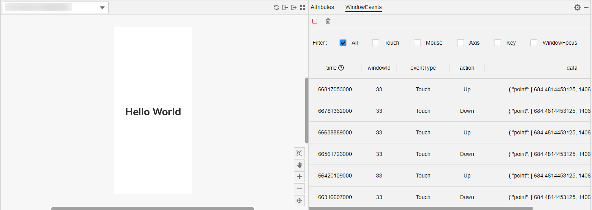

## 3D展开应用

ArkUI Inspector支持将应用按照组件粒度进行3D展开，即UI界面能够在Z轴展开，方便查看组件之间的嵌套、遮挡关系。

该功能从DevEco Studio 6.0.0 Beta1版本开始支持，同时设备系统版本需要升级到API 20。

### 使用场景

- 点击图层可以精准选中和查看被遮挡的组件，可用于定位组件是否被遮挡等问题。
- 3D视图展示的图层均是组件树上参与渲染的组件，可帮助开发者判断组件是否需要进行渲染，例如过长的列表、不可见区域是否需要渲染，帮助开发者优化渲染性能。
- 对于页面复杂、小组件较多的场景，在组件树或者2D视图中难以选中，通过3D视图增加图层之间的距离，能够有效地突出小组件，使其更易于选中。

### 进入3D视图

点击3D View按钮，进入3D视图。首次进入3D视图会加载3D数据，请等待数据加载完成。

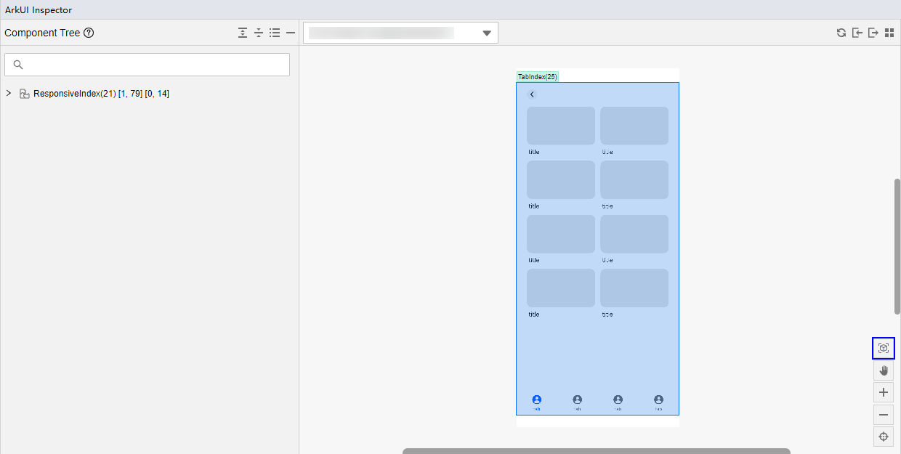

### 基础操作

- 旋转视图：按住鼠标左键移动。
- 平移视图：按住鼠标右键移动。
- 放大/缩小视图：滚动鼠标滚轮。

### 隐藏前方图层

选中图层后，图层会显示蓝色边框，点击Hide Views in Front按钮，能够隐藏当前选中图层前方（朝向用户）的所有图层，避免不必要图层的干扰。

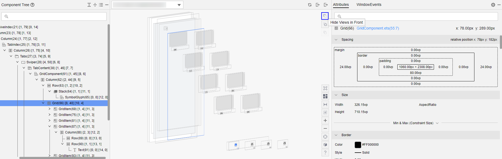

### 隐藏后方图层

和隐藏前方图层类似，选中图层后，点击Hide Views Behind按钮，能够隐藏当前选中图层后方的所有图层。

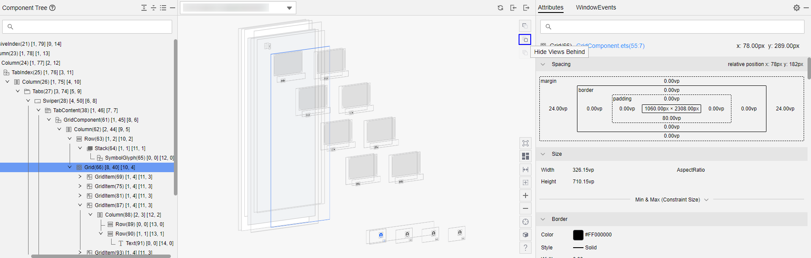

### 恢复隐藏图层

点击Restore Hidden Views按钮，能够恢复所有隐藏的前方图层和后方图层。

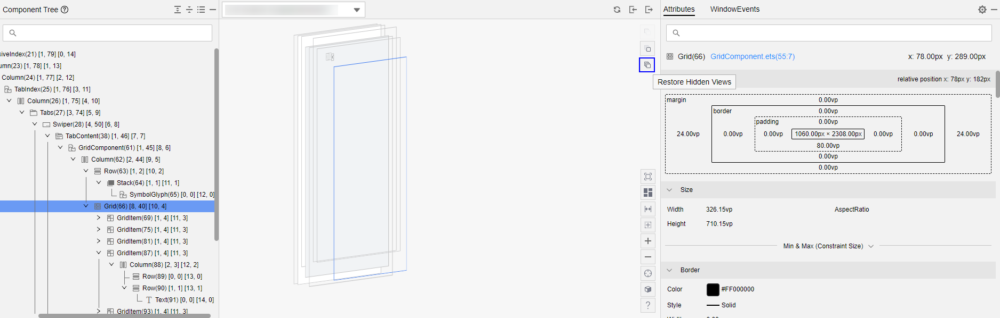

### 切换图层排列顺序

图层有两种排列顺序，id顺序和层级顺序。

- id顺序：默认顺序，即渲染的顺序，也是组件真实显示的顺序，图层的遮挡关系和实际应用一致，每个图层显示在一个Z轴平面上，但如果图层数量较多，会导致Z轴过长，操作不方便。
- 层级顺序：组件树上同一层级的组件，在3D视图中会显示在相同Z轴平面上，能够有效减少3D视图下Z轴长度。

切换方式：点击Switch to Layer Order/Switch to Id Order按钮，可以将图层的排列顺序分别切换至层级顺序/id顺序。

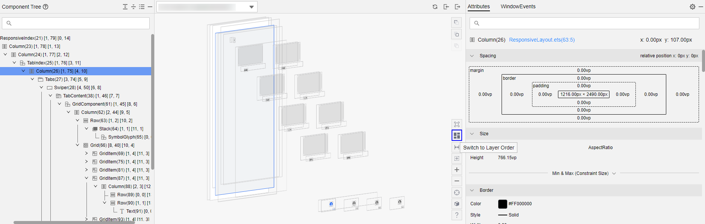

### 调节图层间距

鼠标悬浮在Adjust the Gap of Layers按钮上，出现一个拖动条，拖动后可调节图层间的距离，范围是0~100px。

### 显示/隐藏图层边框

DevEco Studio默认给图层加了边框，此边框并非应用自身边框，便于查看透明图层。点击Hide Border按钮或Show Border可以隐藏或显示图层边框。

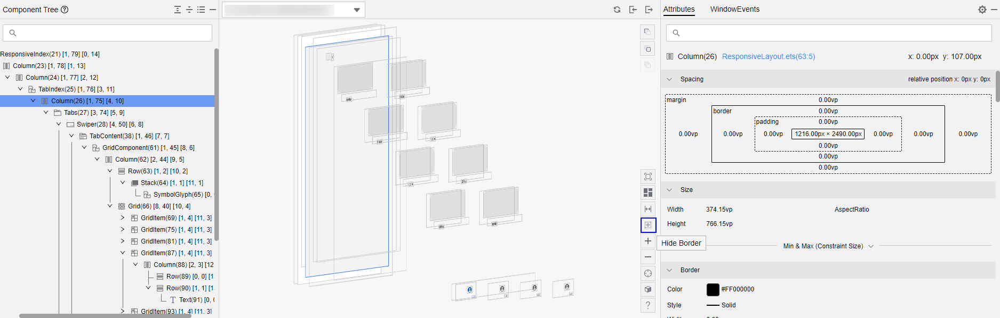

### 放大/缩小视图

点击Zoom In按钮或Zoom Out按钮，能够放大或缩小3D视图。

### 自适应窗口

点击Zoom to Fit Screen按钮，能够自动根据窗口大小，调整3D图层的缩放比例，并使3D视图回到区域中间。

### 切换正面/侧面视图

DevEco Studio默认展示侧面视图，经过复杂的旋转后，可点击Switch to Front View按钮或Switch to Side View按钮，将3D视图自动调整到预设的正面或侧面视角。

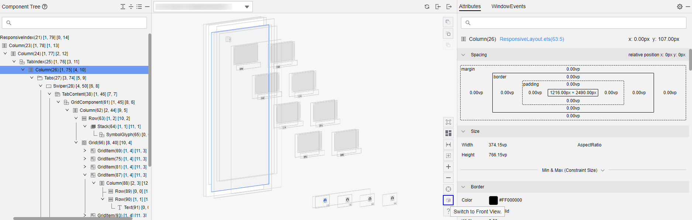

### 返回2D视图

点击2D View按钮，可切换至2D视图。

