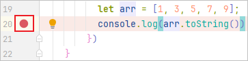
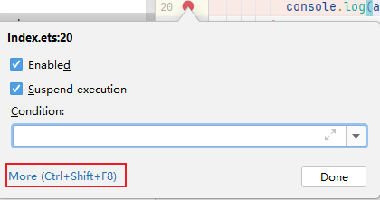
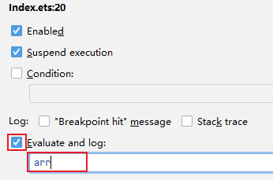
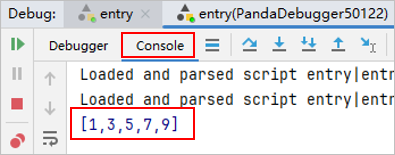

# 打印表达式

开发者可以通过Evaluate and log能力在代码执行到断点行时打印开发者指定的表达式。

1. 在需要打印表达式结果的地方设置断点。

   
2. 右键断点，然后点击****More****按钮。

   
3. 勾选****Evaluate and log****复选框，并在下方输入框输入要打印的表达式。

   
4. 启动调试，程序运行到断点时，切换到调试的Console窗口，表达式的打印结果将在这里展示。

   
