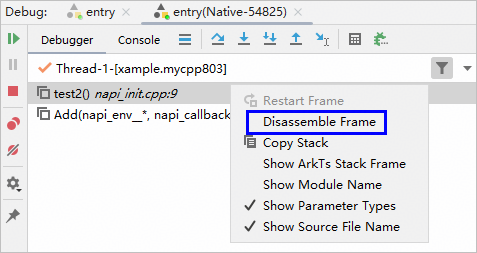
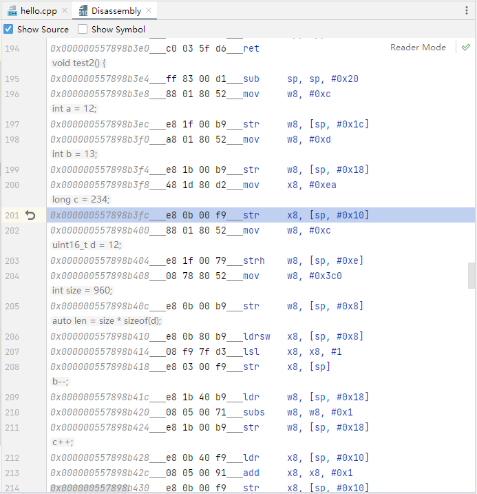
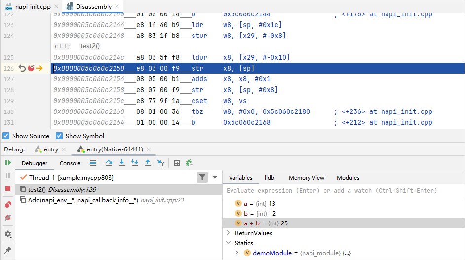

# 汇编调试

DevEco Studio支持查看汇编和汇编代码调试，此外，当程序中断到没有源码的位置时（如step into到一个没有调试信息的函数中），DevEco Studio会打开汇编视图，让您了解程序当前停住的地址及对应的汇编代码。

## 汇编视图

在某一个堆栈处右键，在弹出菜单中选择“****Disassemble Frame****”，可以查看该栈帧对应的汇编代码。

支持在汇编视图中展示源码、函数名，可以跳转到对应源代码，汇编视图如下：

## 汇编断点

可以在汇编视图设置断点，程序运行到对应地址时中断。

## 单步调试

汇编视图下，单步按钮默认以汇编指令级别进行单步调试。

