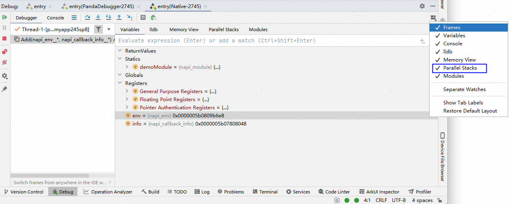
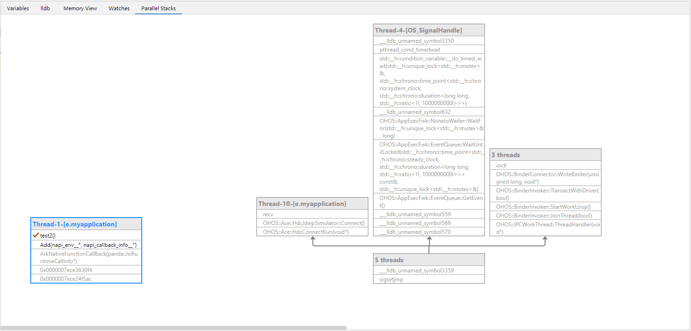
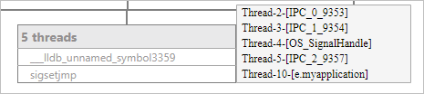

# 堆栈可视化

在native调试窗口中，点击****Layout Settings****，勾选****Parallel Stacks****，打开并行栈视图。

在程序停下时，并行栈视图可以同时展示多个线程的调用栈信息，合并重复调用栈，帮助您更好地理解程序的并发执行情况，以及发现潜在的多线程问题。

## 调用栈跳转

您可以在视图上对某一个调用栈双击来跳转到对应堆栈，Frames页签中会随之跳转，此时可以查看该堆栈的变量等信息。

## 线程信息查看

在多个线程合并的位置处悬停鼠标，可以显示这些线程的具体信息。

