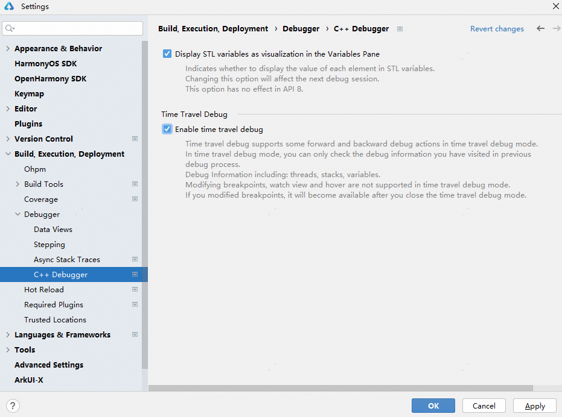
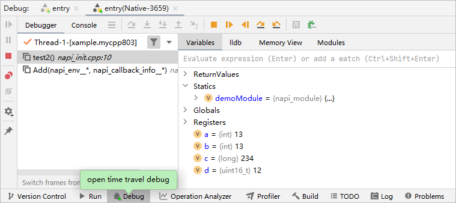

# 反向调试

针对C/C++开发场景，DevEco Studio在提供基础调试能力的基础上，同时提供反向调试能力，帮助开发者更好地理解代码和更迅速定位问题。

反向调试是指在调试过程中可以回退到历史行和历史断点，查看历史调试信息，包括线程、堆栈和变量信息。支持的调试操作为：

- 进入/退出反向调试模式
- 反向Step Over回退到历史行
- 反向Resume执行到历史断点
- 在程序执行历史的记录点上查看全局、静态、局部变量值

## 前提条件

在****File > Settings****（macOS为****DevEco Studio > Preferences/Settings****） ****> Build,Execution,Deployment > Debugger > C++ Debugger****设置界面，勾选****Enable time travel debug****开启C++反向调试开关。

## 操作步骤

1. 设置断点，进入调试模式。
2. 开启反向调试开关后，在Debugger中会出现反向调试相关按钮。

   

   需要查看历史调试信息时，点击“Open Time Travel Debug”按钮进入反向调试模式，您可以在此模式下进行调试。

   

   其中，操作按钮说明如下：

   - ：退出反向调试模式。
   - ：切换当前高亮行到下一个历史断点，并显示断点相关信息。
   - ：切换当前高亮行到上一个历史断点，并显示断点相关信息。
   - ：切换当前高亮行到下一个历史行，并显示历史行相关信息。
   - ：切换当前高亮行到上一个历史行，并显示历史行相关信息。

 

某些功能在反向调试模式下无法使用，此时会根据您的行为进行对应提示。
