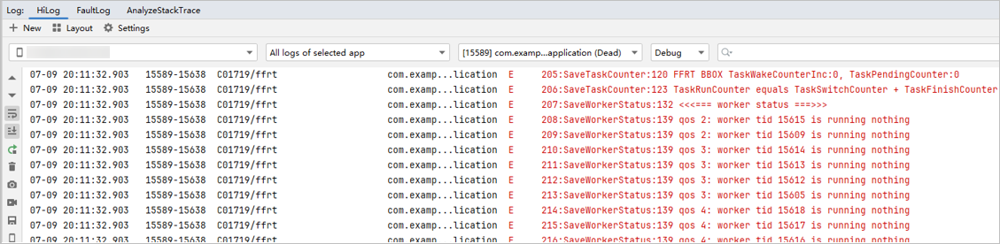
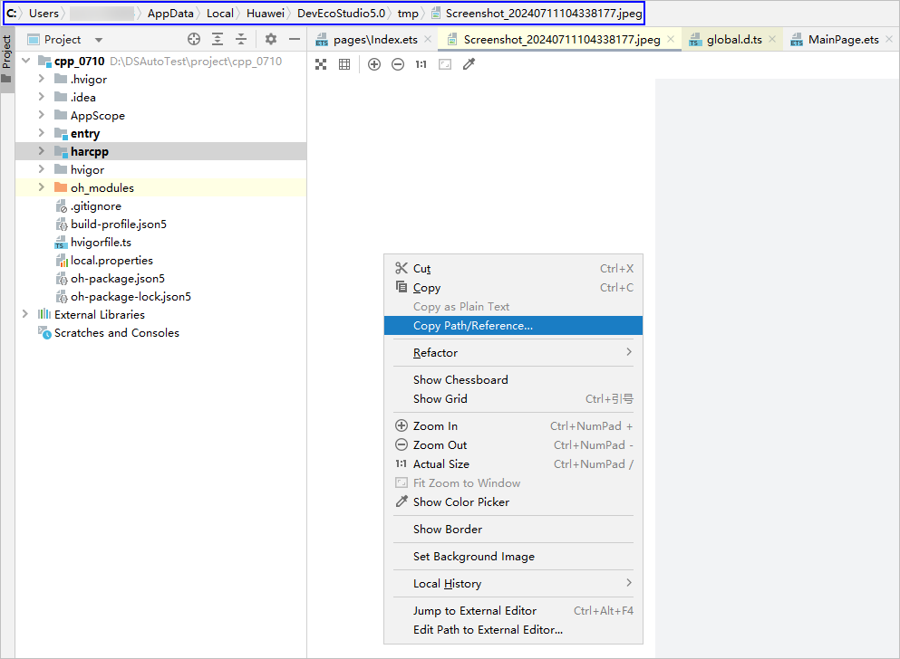
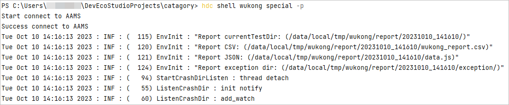

# 截屏

在调试过程中，可以通过多种方式截取屏幕截图。

## 通过DevEco Studio截屏

1. 连接真机设备或模拟器，并在其中运行应用。
2. 在DevEco Studio底部切换到****Log****页签。
3. 点击左侧工具栏中，即可截取屏幕截图。

   截图的图片将直接显示在DevEco Studio中。

   
4. （可选）在图片显示区域右击，选择****Copy Path/Reference...****可以查看截屏的本地存储路径或者在菜单栏下方查看本地存储路径。

   

## 通过命令行方式截屏

hdc是可以用于调试的命令行工具，通过该工具可以实现截屏功能。更多关于命令行工具hdc的说明请参见[hdc工具使用指导](/system-debug-optimize/debugging-commands/hdc)。

### 方式一：hdc shell snapshot\_display

```
hdc shell snapshot_display -f /data/local/tmp/0.jpeg  // -f参数指定图片在设备上的存储路径，如不指定，会在命令执行完成后显示图片默认存储路径。
hdc file recv /data/local/tmp/0.jpeg  // 将图片从设备发送到本地目录，本示例将图片发送到当前执行hdc命令的目录。
```

### 方式二：hdc shell wukong special -p

wukong是系统稳定性测试工具，通过指定参数-p可以实现截图功能。更多关于稳定性测试工具wukong的说明请参见[wukong工具使用指导](/test-service/indev_cmd/wukong-guidelines)。

```
hdc shell wukong special -p
```

命令执行效果如下图所示，其中Report currentTestDir为结果存储路径，包含截屏图片。



通过hdc命令可以将该路径文件发送到本地，例如发送到当前执行hdc命令的目录。

```
hdc file recv /data/local/tmp/wukong/report/20231010_141610/
```
