# FaultLog

当应用运行发生错误导致应用进程终止时，应用将会抛出错误日志以通知应用崩溃的原因，开发者可通过查看错误日志分析应用崩溃的原因及引起崩溃的代码位置。

FaultLog由系统自动从设备进行收集，包括如下几类故障信息：

- App Freeze
- CPP Crash
- JS Crash
- System Freeze
- [ASan](/ide-log-and-fault-analysis/ide-fault-analysis/ide-asan)
- [HWASan](/ide-log-and-fault-analysis/ide-fault-analysis/ide-hwasan)
- [TSan](/ide-log-and-fault-analysis/ide-fault-analysis/ide-tsan)
- [UBSan](/ide-log-and-fault-analysis/ide-fault-analysis/ide-ubsan)

 

调试模式（debug和attach）下，DevEco Studio会屏蔽当前工程的App Freeze和System Freeze等超时检测，避免调试过程出现超时检测影响开发者调试。

当前支持屏蔽的App Freeze故障类型：

- THREAD\_BLOCK\_3S/THREAD\_BLOCK\_6S：应用主线程卡死检测，卡住3秒/6秒。
- APP\_INPUT\_BLOCK：输入响应超时。

当前支持屏蔽的System Freeze故障类型：

- LIFECYCLE\_TIMEOUT：app、ability生命周期切换超时。

## 查看FaultLog日志

### 查看设备历史抛出的FaultLog日志

打开FaultLog窗口，将显示当前选中设备抛出的所有FaultLog日志。

FaultLog故障信息左侧按照****应用/元服务包名 > 故障类型 > 故障时间****结构组成，选中具体的故障日期，则会在右侧展示详细的故障信息，并对部分关键信息进行高亮展示，便于开发者进行故障定位。

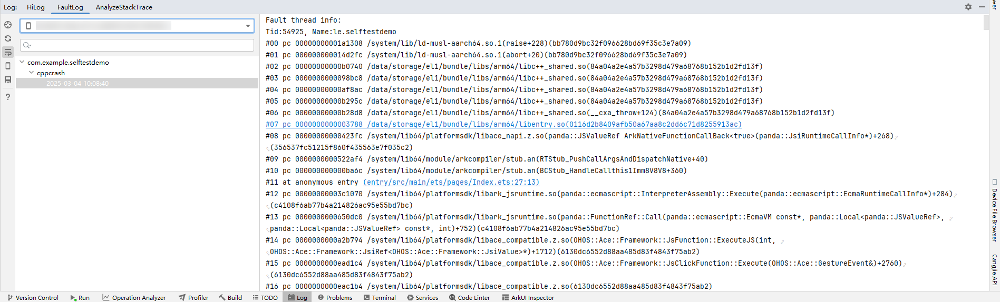

### 查看设备实时抛出的FaultLog日志

当设备抛出FaultLog日志时，DevEco Studio将会弹出消息提示框，开发者点击****Jump to Log****即可跳转至FaultLog窗口查看日志信息。

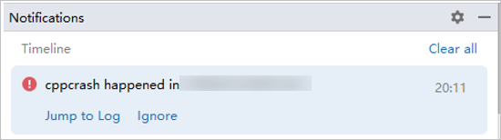

### 跳转至引起错误的代码行

若抛出的FaultLog中的堆栈信息中的链接或偏移地址指向的是当前工程中的某行代码，该段信息将会被转换为超链接形式，点击后可跳转至对应代码行。

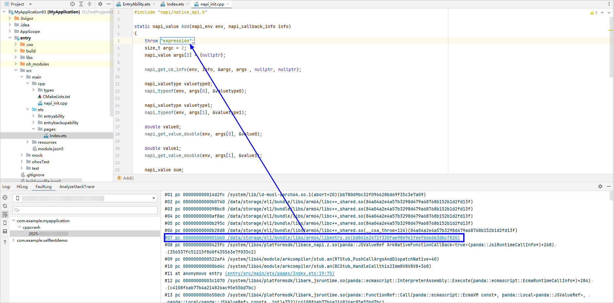

## 导出日志

开发者可将当前显示的日志信息保存到本地，以便后续的进一步分析。开发者可根据需要选择保存当前选中节点的日志或保存所有日志。

- 保存当前选中节点的日志：
  - 在当前选中节点右键点击****Export FaultLog****。

    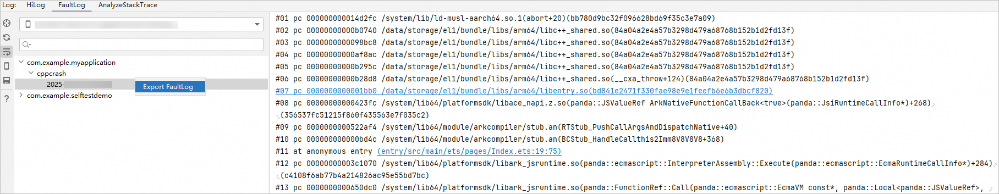
  - 点击Export FaultLog按钮，弹出子选项后进一步点击****Export Selected FaultLog****。

    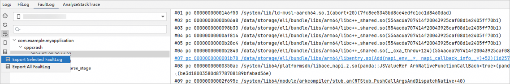
- 保存所有日志：点击Export FaultLog按钮，弹出子选项后进一步点击****Export All FaultLog****。

## 查看cppcrash结构化日志

从DevEco Studio 6.0.0 Beta1版本开始，支持对Cpp Crash类型的FaultLog，进行结构化展示和日志过滤。

1. 双击cppcrash日志，****Fault Info****右侧会出现****Fault Analysis****页签。

   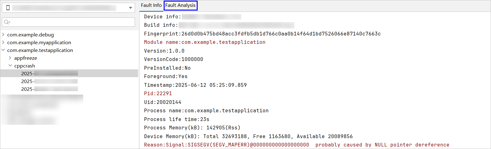
2. 点击****Fault Analysis****页签，会展示结构化的日志信息。
   - 页面上方的字段对应了FaultLog中的字段，具体对应关系请查看[字段说明](#section1983219211210)。
   - 页面下方包含Stacks和Logs两个页签。
     - ****Stacks****：展示线程的堆栈信息，具体请参考[查看堆栈信息](#section459581010138)。
     - ****Logs****：展示FaultLog中的HiLog日志，具体请查看[查看HiLog日志](#section13361239195113)。

   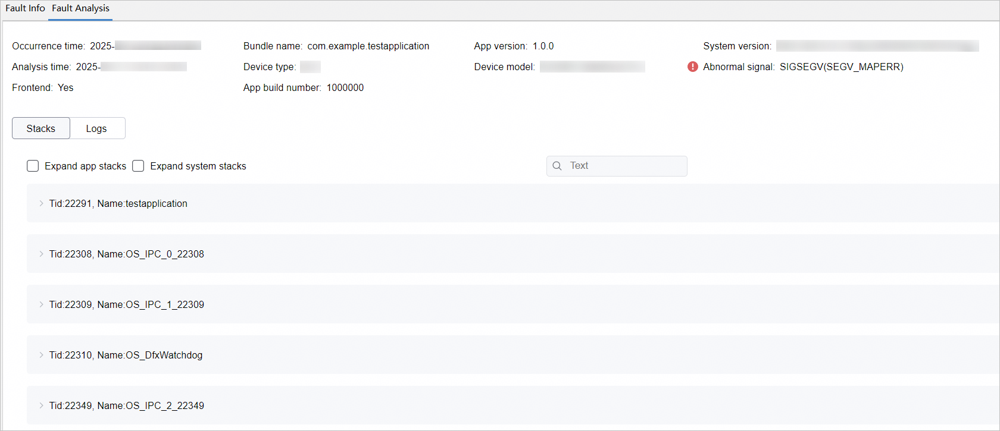

### 字段说明

****Fault Analysis****页签中的字段和FaultLog的字段对应关系如下。

****表1****

| ****Fault Analysis****的字段 | 说明 |
| --- | --- |
| Occurrence time | FaultLog发生的时间，对应FaultLog中的Timestamp字段 |
| Analysis time | 触发日志结构化展示的时间，即双击日志文件的时间 |
| Frontend | 是否是前台应用，对应FaultLog中的Foreground字段 |
| Bundle name | 包名，对应FaultLog中的Module name字段 |
| Device type | 设备类型 |
| App build number | 应用构建号，对应FaultLog中的VersionCode字段 |
| App version | 应用版本，对应FaultLog中的Version字段 |
| Device model | 设备信息，对应FaultLog中的Device info字段 |
| System version | 系统镜像版本，对应FaultLog中的Build info字段 |
| Abnormal signal | 异常信号，对应FaultLog中的Reason字段 |

### 查看堆栈信息

Stacks页面包含了FaultLog中的堆栈信息，并以线程为单元进行折叠，点击展开按钮，可以展开对应线程。

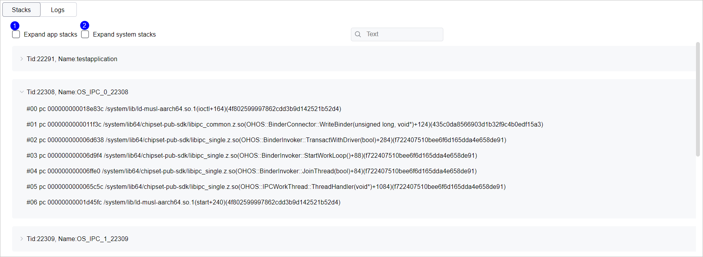

图中标注1的勾选框是展开应用堆栈，标注2的勾选框是展开系统堆栈，两个勾选框一共组成了四种状态，具体如下表。

****表2****

| 勾选框勾选状态 | 说明 |
| --- | --- |
| 1、2都不勾选 | 展示所有线程，线程处于折叠状态。 |
| 1、2都勾选 | 展示所有线程，线程处于展开状态。 |
| 只勾选1 | 只展示应用线程，线程处于展开状态。 |
| 只勾选2 | 只展示系统线程，线程处于展开状态。 |

### 查看HiLog日志

Logs页面展示了FaultLog中的HiLog日志，支持日志级别的过滤和搜索。

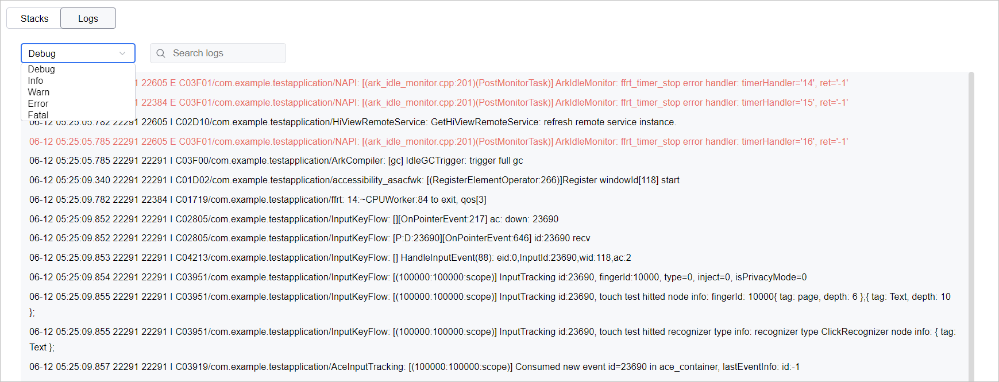

## 查看appfreeze结构化日志

从DevEco Studio 6.0.0 Beta2版本开始，支持对AppFreeze类型的FaultLog，进行结构化展示和日志过滤。

1. 双击appfreeze日志，****Fault Info****右侧会出现****Fault Analysis****页签。

   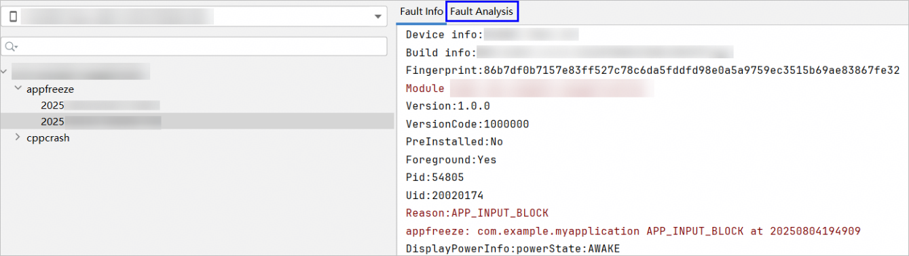
2. 点击****Fault Analysis****页签，会展示结构化的日志信息。
   - 页面上方的字段对应了FaultLog中的字段，具体对应关系请查看[字段说明](#section15864144624712)。
   - 页面下方包含Stacks、Logs、System、3s/6s Compare四个页签。
     - ****Stacks****：展示线程的堆栈信息，使用方式和cppcrash日志相同，具体请参考[查看堆栈信息](#section459581010138)。
     - ****Logs****：展示FaultLog中的HiLog日志，使用方式和cppcrash日志相同，具体请参考[查看HiLog日志](#section13361239195113)。
     - ****System****：从DevEco Studio 6.0.0 Beta3版本开始，新增System页签，用于在高负载场景下，展示设备CPU/内存的日志信息，具体请参考[查看高负载CPU/内存日志信息](#section179717814915)。
     - ****3s/6s Compare****：从DevEco Studio 6.0.2 Beta1版本开始，新增3s/6s Compare页签，用于对[THREAD\_BLOCK\_6S](/system-debug-optimize/performance-analysis-kit/fault-analysis/appfreeze-guidelines#thread_block_6s-应用主线程卡死超时)类型的AppFreeze问题，展示3s和6s时间点的主线程堆栈日志，具体请参考[查看3s/6s堆栈日志](#section76467955514)。

   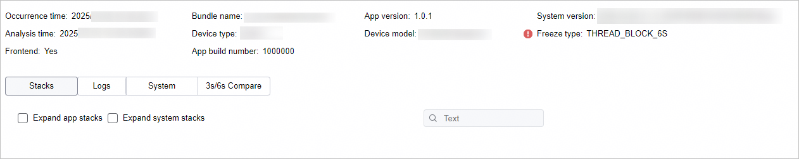

### 字段说明

****Fault Analysis****页签中的字段和FaultLog的字段对应关系如下。

****表3****

| ****Fault Analysis****的字段 | 说明 |
| --- | --- |
| Occurrence time | FaultLog发生的时间，对应FaultLog中的Timestamp字段 |
| Analysis time | 触发日志结构化展示的时间，即双击日志文件的时间 |
| Frontend | 是否是前台应用，对应FaultLog中的Foreground字段 |
| Bundle name | 包名，对应FaultLog中的Module name字段 |
| Device type | 设备类型 |
| App build number | 应用构建号，对应FaultLog中的VersionCode字段 |
| App version | 应用版本，对应FaultLog中的Version字段 |
| Device model | 设备信息，对应FaultLog中的Device info字段 |
| System version | 系统镜像版本，对应FaultLog中的Build info字段 |
| Freeze type | 冻结类型，对应FaultLog中的Reason字段 |

### 查看堆栈信息

Stacks页签用于查看appfreeze中的堆栈信息，使用方式和cppcrash日志相同，具体请参考[查看堆栈信息](#section459581010138)。

### 查看HiLog日志

Logs页签用于查看appfreeze中的HiLog，使用方式和cppcrash日志相同，具体请参考[查看HiLog日志](#section13361239195113)。

### 查看高负载CPU/内存日志信息

从DevEco Studio 6.0.0 Beta3版本开始，新增System页签，用于在高负载场景下，展示设备CPU/内存的日志信息，有助于分析高负载和appfreeze之间的关联关系。

如下是CPU的相关日志。

①：柱状图表示对应时间点的CPU使用情况（百分比）。

②：鼠标悬浮在柱状图上，会显示CPU总使用率、CPU使用率top5的进程号（Pid）和对应的CPU使用率。

③：选中柱状图后，显示相关的日志。

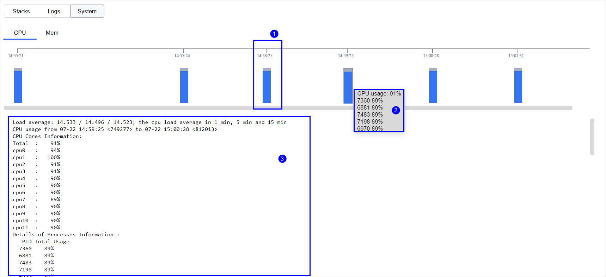

如下是内存的相关日志。

①：柱状图表示对应时间点的内存使用情况（百分比）。

②：鼠标悬浮在柱状图上，会显示内存使用率、内存占用top5的进程和对应的内存大小。

③：选中柱状图后，显示相关的日志。

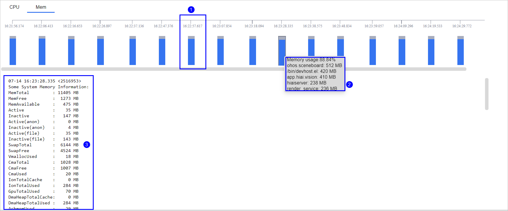

### 查看3s/6s堆栈日志

从DevEco Studio 6.0.2 Beta1版本开始，新增3s/6s Compare页签，用于对[THREAD\_BLOCK\_6S](/system-debug-optimize/performance-analysis-kit/fault-analysis/appfreeze-guidelines#thread_block_6s-应用主线程卡死超时)类型的AppFreeze问题，展示3s和6s时间点的主线程堆栈日志，并标识栈帧中可能的故障处。

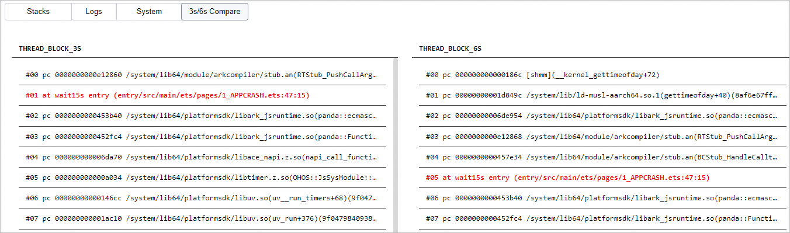

如果不是THREAD\_BLOCK\_6S类型的AppFreeze问题，不会展示3s/6s Compare页签。

## 查看应用终止日志

从DevEco Studio 6.0.2 Beta1版本开始，提供****AppKilled****窗口，用于查看设备上应用终止的相关信息，包括应用异常退出的时间、进程名、是否前台应用、异常退出原因，点击****recordId****可以查看详细的FaultLog信息。支持按设备、应用和异常原因对信息进行过滤。

AppKilled窗口中支持查看的异常退出原因请参考[reason字段说明](/system-debug-optimize/debugging-commands/hidumper-tool/hidumper#reason字段说明)，如需对问题进行排查处理，请参考[App Killed（应用终止）检测](/system-debug-optimize/performance-analysis-kit/fault-analysis/appkilled-guidelines)。

 

2in1、Tablet设备不支持查看APP\_INPUT\_BLOCK和THREAD\_BLOCK\_6S类型的数据。

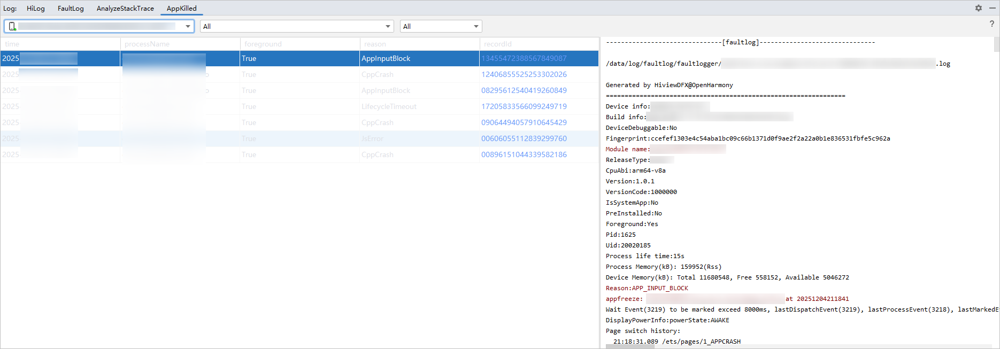
