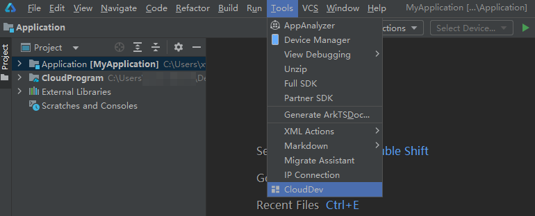
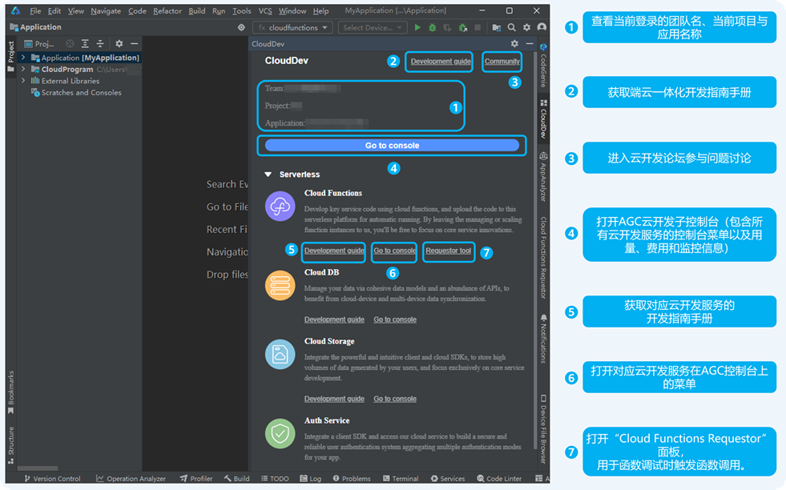
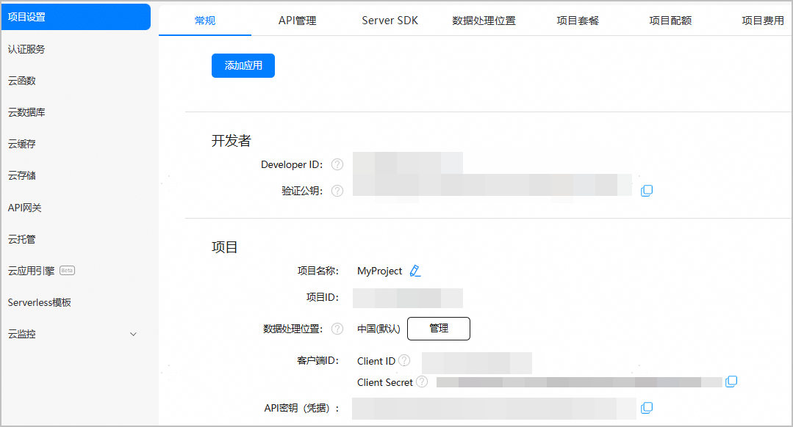

# （可选）通过CloudDev面板获取云开发资源支持

DevEco Studio为您提供了CloudDev云开发管理面板。该面板集成了AGC云开发子控制台、文档和社区入口，方便您直达AGC云开发子控制台进行服务和资源管理，并且可轻松跳转至各指导文档和社区论坛来获取技术支持，为您提供开发、调试、部署、管理与技术支持的端到端体验。

1. 在菜单栏选择“Tools > CloudDev”。

   
2. 在打开的云开发管理面板中，您可轻松获取各种云开发资源。

    

   如尚未登录，请点击“Sign in”登录您的华为开发者账号。

   

   其中，AGC云开发子控制台如下图所示，您可按需进入对应菜单进行服务或资源管理。

   
