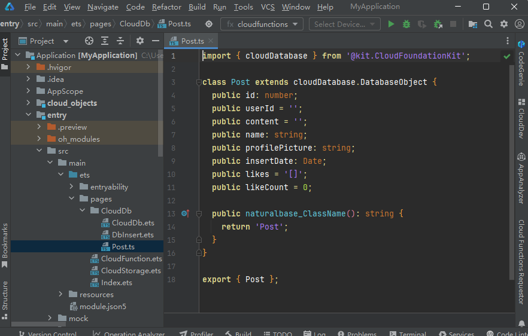

# 在端侧访问云数据库

## 前提条件

- 请确保[云数据库已正确开发并部署](/ide-project/ide-module-management/agc-harmonyos-clouddevguide/agc-harmonyos-clouddev-devprocess/agc-harmonyos-clouddev-develop/agc-harmonyos-clouddev-clouddb/agc-harmonyos-clouddev-deploydatabase)。
- 请确保“AppScope/resources/rawfile/schema.json”文件已存在。

   

  云数据库部署成功后，DevEco Studio将自动从云侧下载云数据库的schema文件至“AppScope/resources/rawfile/schema.json”路径，该文件是云数据库端侧API必须引入的配置文件。

  如果后续又在本地工程修改了对象类型，请重新部署云数据库，DevEco Studio将自动更新schema.json文件；如果后续在AGC云侧修改了对象类型，您需[手动从AGC控制台导出schema.json文件](https://developer.huawei.com/consumer/cn/doc/AppGallery-connect-Guides/agc-clouddb-agcconsole-objecttypes-0000001127675459#section1558018208151)，拷贝至本地工程的“AppScope/resources/rawfile”目录下。否则，可能导致schema.json文件中的对象类型和代码中的对象类型不一致，端侧访问云数据库时提示[1008230002](https://developer.huawei.com/consumer/cn/doc/harmonyos-references/cloudfoundation-arkts-error-code#section1008230002-云数据库schema配置错误)错误。

- 检查您的角色拥有的对象类型操作权限。如果未[配置AccessToken](/ref/cloud-foundation-api/cloudfoundation-arkts-api/cloudfoundation-cloudcommon/cloudfoundation-cloudcommon#getaccesstoken)，需要给World角色添加Upsert和Delete权限。

## 生成Client Model

在端侧通过Cloud Foundation Kit访问云数据库，需先引入对应云数据库对象类型的Client Model。

参考[生成Client Model](/ide-project/ide-module-management/agc-harmonyos-clouddevguide/agc-harmonyos-clouddev-devprocess/agc-harmonyos-clouddev-develop/agc-harmonyos-clouddev-clouddb/agc-harmonyos-clouddev-modelclass#section1037851593420)生成云数据库对象类型的端侧模型，如下图初始化代码中的Client Model示例“ets/pages/CloudDb/Post.ts”。

## 访问数据库

接下来您便可参考[初始化数据库访问](/cloud-foundation-kit-guide/cloudfoundation-database-service/cloudfoundation-database-initialize)、[查询数据](/cloud-foundation-kit-guide/cloudfoundation-database-service/cloudfoundation-database-query)、[写入数据](/cloud-foundation-kit-guide/cloudfoundation-database-service/cloudfoundation-database-upsert)、[删除数据](/cloud-foundation-kit-guide/cloudfoundation-database-service/cloudfoundation-database-delete)等访问数据库。

“src/main/ets/pages/CloudDb”目录下提供了部分示例代码，更完整的接口信息请参考[Cloud Foundation Kit API参考-云数据库模块](/ref/cloud-foundation-api/cloudfoundation-arkts-api/cloudfoundation-clouddatabase/cloudfoundation-clouddatabase)。
