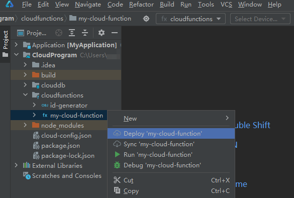
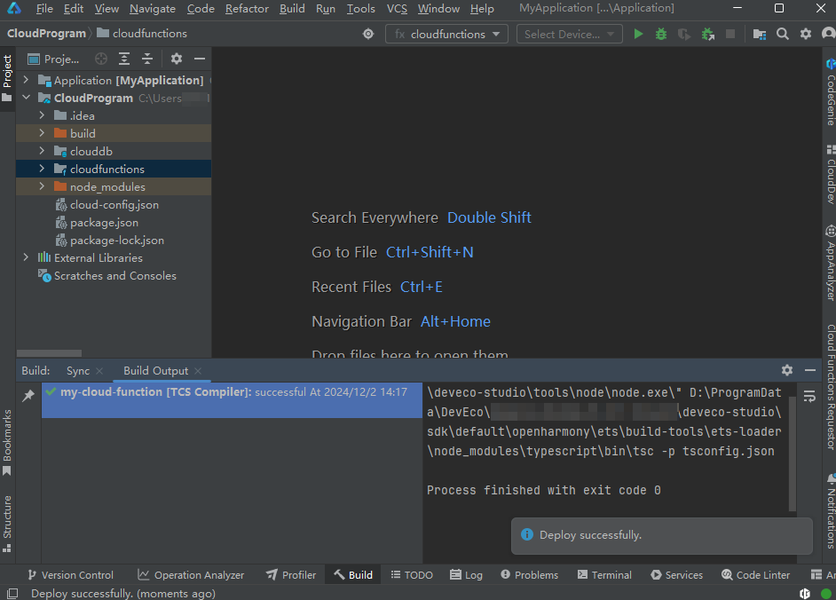
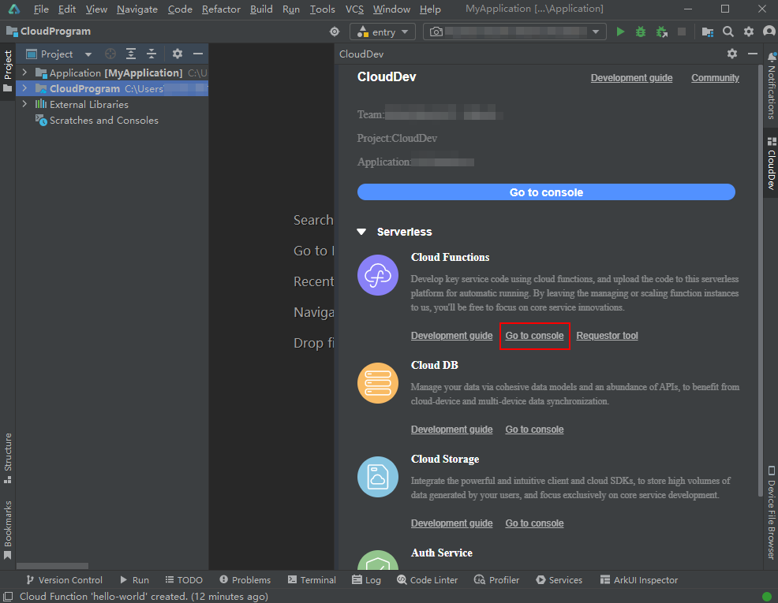
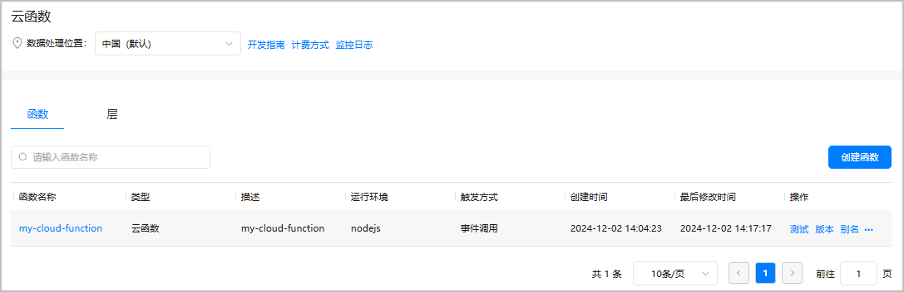

# 部署函数

完成函数代码开发后，您可将函数部署到AGC云端，支持单个部署和批量部署。

单个部署仅部署选中的函数，批量部署则会将整个“cloudfunctions”目录下的所有函数同时部署到AGC云端。

下文以部署单个函数“my-cloud-function”为例，介绍如何部署函数。

1. 右击“my-cloud-function”函数目录，选择“Deploy 'my-cloud-function'”。

    

   如需批量部署多个函数，右击“cloudfunctions”目录，选择“Deploy Cloud Functions”即可部署该目录下所有函数。如“cloudfunctions”目录下同时存在云函数和云对象，云函数和云对象将会被一起部署到AGC云端。

   
2. 您可在底部状态栏右侧查看函数打包与部署进度。

   请您耐心等待，直至出现“Deploy successfully”消息，表示当前函数已成功部署。

   
3. 在菜单栏选择“Tools > CloudDev”。

   
4. 在打开的CloudDev面板中，点击“Serverless > Cloud Functions”下的“Go to console”，进入当前项目的云函数服务页面。

   
5. 查看到“my-cloud-function”函数已成功部署至AGC云端，函数名称与本地工程的函数目录名相同。

   部署成功后，您便可以从端侧调用云函数了，具体请参见[在端侧调用云函数](/ide-project/ide-module-management/agc-harmonyos-clouddevguide/agc-harmonyos-clouddev-devprocess/agc-harmonyos-clouddev-appdevelop/agc-harmonyos-clouddev-invokecloudcode/agc-harmonyos-clouddev-invokecloudfunc)。

   
